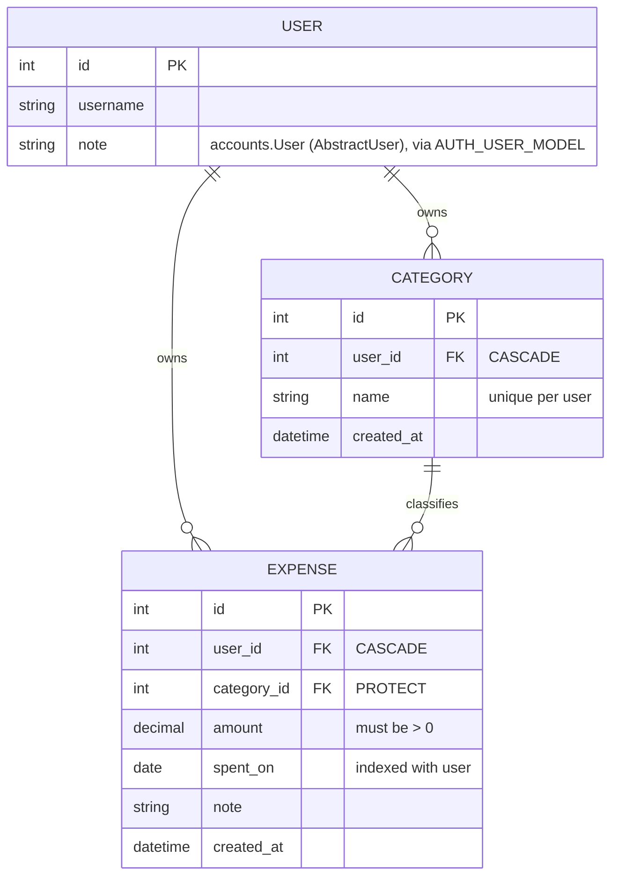

# Expense Tracker — Build Log

> Living doc. Every session appends here. Structured so a swimlane / mermaid diagram can be
> derived directly from the tables below without re-reading the code.
>
> **Companion docs:**
> [DJANGO_CHEATSHEET.md](DJANGO_CHEATSHEET.md) — commands, project-layout rationale, "signals experience" checklist.
> [COMMIT_PLAN.md](COMMIT_PLAN.md) — industry-standard build order, phase by phase, commit by commit.
>
> **Purpose of this project:** first of 11 Django projects. This one is the *reference build* —
> the goal is a mind map of a complete end-to-end Django app, deliberately including the parts
> Frappe abstracts away (background jobs, scheduling, async export). The next 10 are solo
> muscle-memory reps.

---

## 1. Current state at a glance

**Session:** 2 — Phase 1 (foundation) complete, auth next
**Last commit:** `9a48cdb` — *chore(config): move secrets and environment config out of source*
**Phase tag:** `phase-1-foundation`

### Data model

### Component status (swimlane source)

| Layer | Component | File | Status | Session |
|---|---|---|---|---|
| Config | Project scaffold (`config/`) | `config/` | ✅ stock | 1 |
| Config | App registered + timezone | `config/settings.py` | ✅ done | 1 |
| Model | `Category` | `expenses/models.py` | ✅ done | 1 |
| Model | `Expense` | `expenses/models.py` | ✅ done | 1 |
| Model | Initial migration | `expenses/migrations/0001_initial.py` | ✅ done | 1 |
| Admin | `CategoryAdmin` / `ExpenseAdmin` | `expenses/admin.py` | ✅ done | 1 |
| Repo hygiene | `.gitignore` / `requirements.txt` | `.gitignore`, `requirements.txt` | ✅ done | 2 |
| Model | **Custom user** `accounts.User` | `accounts/models.py` | ✅ done | 2 |
| Admin | `UserAdmin` (subclassed) | `accounts/admin.py` | ✅ done | 2 |
| Config | Env-based secrets + `DATABASE_URL` | `config/settings.py`, `.env.example` | ✅ done | 2 |
| Auth | login / logout / signup | `accounts/` | 🔜 **next** | phase 2 |
| URL | App URLConf | `expenses/urls.py` | ⬜ not started | phase 3 |
| Template | base template | `templates/base.html` | ⬜ not started | phase 3 |
| View | Category CRUD (user-scoped) | `expenses/views.py` | ⬜ not started | phase 3 |
| View | Expense CRUD (user-scoped) | `expenses/views.py` | ⬜ stock stub | phase 3 |
| Form | `ExpenseForm` / `CategoryForm` | `expenses/forms.py` | ⬜ not started | phase 3 |
| Test | Models, views, ownership boundaries | `expenses/tests/` | ⬜ stock stub | phase 4 |
| View | Dashboard aggregation query | `expenses/views.py` | ⬜ not started | phase 5 |
| Infra | CSV export via Celery *(request-triggered)* | — | 🅿️ parked | phase 6 |
| Infra | Monthly digest via cron + mgmt command | — | 🅿️ parked | phase 6 |

Legend: ✅ done · 🔜 next · ⬜ not started · 🅿️ deliberately parked · ❌ problem

Phase numbers map to the tagged phases in [COMMIT_PLAN.md](COMMIT_PLAN.md).

---

## 2. Session log

### Session 1 — models + admin

**Written by hand (the actual work):**

| File | Lines | What |
|---|---|---|
| `expenses/models.py` | 54 | `Category` and `Expense` models |
| `expenses/admin.py` | 18 | Two `ModelAdmin` classes with `list_display`, filters, `date_hierarchy` |

**Generated (not hand-written):**

| File | Lines | How |
|---|---|---|
| `expenses/migrations/0001_initial.py` | 57 | `makemigrations` |

**Still untouched stock boilerplate:** `views.py`, `tests.py`, `apps.py`, `config/urls.py`,
`asgi.py`, `wsgi.py`, `manage.py`.

**Django concepts exercised this session** (the Frappe-gap list — see §4):
`ForeignKey` + `on_delete` semantics · `related_name` · `Meta.ordering` ·
`Meta.constraints` (`UniqueConstraint`, `CheckConstraint`) · `Meta.indexes` ·
`verbose_name_plural` · `settings.AUTH_USER_MODEL` indirection · `__str__` ·
migrations as version-controlled schema · `@admin.register` + `list_select_related`.

---

### Session 2 — Phase 1: foundation → tag `phase-1-foundation`

Three commits, one idea each.

| Commit | Message | What changed |
|---|---|---|
| `986a3fd` | `chore: add gitignore and requirements, untrack venv and db` | `.gitignore`, `requirements.txt`; untracked 5982 venv files + `db.sqlite3` + all `__pycache__` (index only, disk untouched) |
| `1293192` | `feat(accounts): add custom user model` | New `accounts` app: `User(AbstractUser)`, `UserAdmin` subclass, `AUTH_USER_MODEL`, DB rebuilt |
| `9a48cdb` | `chore(config): move secrets and environment config out of source` | `django-environ`; `SECRET_KEY`/`DEBUG`/`ALLOWED_HOSTS`/`DATABASE_URL` from env; `.env.example` |

**The payoff moment:** switching `AUTH_USER_MODEL` required **zero changes** to
`expenses/models.py` *and* zero changes to `expenses/migrations/0001_initial.py` — the model already
used `settings.AUTH_USER_MODEL` instead of importing `User`, and the generated migration uses
`migrations.swappable_dependency()`. Only the SQLite file had to be rebuilt. That is the entire
argument for the indirection, and it's a good interview story.

**Process note:** the first attempt bundled the 5982 venv deletions into the docs commit. Fixed with
`git reset --soft HEAD~1` and re-staged into two commits. Worth remembering — `git add <path>`
commits the *whole staged index*, not just that path.

**Django concepts exercised:** `AbstractUser` vs `AbstractBaseUser` · `AUTH_USER_MODEL` swappable
dependency · why `UserAdmin` must be subclassed (plain `ModelAdmin` stores clear-text passwords) ·
`django-environ` typed casting · fail-loud vs fail-safe config defaults · `DATABASE_URL` ·
`makemigrations --check --dry-run` · `git rm --cached` vs `git rm`.

**Verified:** `manage.py check` clean · all migrations applied · unset `SECRET_KEY` raises
`ImproperlyConfigured` · no pending migrations.

⚠️ **Superuser was destroyed** with the old DB. Recreate: `python manage.py createsuperuser`

---

## 3. Boilerplate / config change ledger

Every deviation from what `django-admin startproject` and `startapp` generated. Keep appending —
this is the file set that silently drifts and is worth being able to reconstruct from memory.

### `config/settings.py`

| Session | Setting | From | To | Why |
|---|---|---|---|---|
| 1 | `INSTALLED_APPS` | — | `+ "expenses"` | Register the app so models/migrations are discovered |
| 1 | `TIME_ZONE` | `'UTC'` | `'Asia/Kolkata'` | Local timezone; matters later for `spent_on` date boundaries and the monthly digest |
| 2 | `INSTALLED_APPS` | — | `+ "accounts"` | Custom user app; listed before `expenses` |
| 2 | `AUTH_USER_MODEL` | *(implicit `auth.User`)* | `"accounts.User"` | Custom user model — must precede first migration |
| 2 | `SECRET_KEY` | hardcoded literal | `env("SECRET_KEY")` | Secret out of source. **No default** → unset key crashes at startup rather than falling back |
| 2 | `DEBUG` | `True` | `env("DEBUG")`, default `False` | Fails safe when unset; typed cast stops `"False"` being truthy |
| 2 | `ALLOWED_HOSTS` | `[]` | `env("ALLOWED_HOSTS")`, default `[]` | Config, not code |
| 2 | `DATABASES` | inline SQLite dict | `env.db_url("DATABASE_URL", default=sqlite)` | Postgres later becomes a config change, not a code change |
| 2 | *(new import)* | — | `import environ` + `read_env(BASE_DIR / ".env")` | Loads `.env` when present |

> The old `SECRET_KEY` is in git history (commit `60fb810`) and is permanently compromised. A fresh
> key was generated rather than reused. Lesson: once a secret is committed, rotating is the only
> fix — removing it from the working tree does nothing.

### `config/urls.py`

| Session | Change |
|---|---|
| 1 | *(none — still stock, only `admin/` routed)* |

### Other config files

| File | Session | Change |
|---|---|---|
| `expenses/apps.py` | — | none (stock `ExpensesConfig`) |
| `config/asgi.py`, `config/wsgi.py`, `manage.py` | — | none |

---

## 4. Django concepts encountered (Frappe-gap tracker)

Things Django makes explicit that Frappe abstracts away. Append as they come up — this is the
interview-gap list.

| Concept | Frappe equivalent / why it's a gap | First seen |
|---|---|---|
| `on_delete=CASCADE` vs `PROTECT` | Frappe link fields handle deletion policy via Link/Dynamic Link config | S1 `models.py` |
| `related_name` for reverse access | Frappe gives you `frappe.get_all` on the child doctype | S1 `models.py` |
| `Meta.constraints` (DB-level) | Frappe validates in `validate()` hooks, not DB constraints | S1 `models.py` |
| `Meta.indexes` | Frappe: `search_index` flag on a DocField | S1 `models.py` |
| Migrations as code | Frappe auto-syncs schema from DocType JSON on `bench migrate` | S1 `0001_initial.py` |
| `settings.AUTH_USER_MODEL` | Frappe has a fixed `User` doctype | S1 `models.py` |
| Custom user model / `AbstractUser` | Frappe's `User` doctype is extended with custom fields, never swapped | S2 `accounts/models.py` |
| `swappable_dependency` in migrations | No equivalent — Frappe has no migration files to depend on | S2 `0001_initial.py` |
| Settings as a Python module, env-injected | Frappe uses `site_config.json` / `common_site_config.json` | S2 `settings.py` |
| Admin must subclass `UserAdmin` for hashing | Frappe handles password hashing in the User doctype controller | S2 `accounts/admin.py` |
| Explicit user-scoping in querysets | Frappe applies permissions/`User Permission` automatically | S2 (upcoming) |
| ModelForm + `clean_<field>` | Frappe: client scripts + server `validate()` | S2 (upcoming) |
| `get_object_or_404` + ownership check | Frappe: `frappe.has_permission` is implicit | S2 (upcoming) |

---

## 5. Parked / roadmap decisions

| Item | Decision | Rationale |
|---|---|---|
| Monthly digest email | **Management command + cron**, *not* Celery | Scheduled, not request-triggered; single-tenant scale. Idempotency via `MonthlyDigest(user, month)` unique constraint |
| CSV export button | **Celery** — this is the one that earns it | Request-triggered: view fires task, returns immediately, task emails a link. This is the pattern interviewers probe |
| Both | Build in session 5–6, after CRUD exists | No dashboard aggregation query to reuse and no user-scoping to hang "export *my* expenses" on until then |

---

## 6. Known issues

### Resolved

| # | Issue | Resolved in |
|---|---|---|
| 1 | No custom user model | `1293192` (session 2) |
| 2 | No `.gitignore`; venv/db/pycache tracked | `986a3fd` (session 2) |
| 3 | No `requirements.txt` | `986a3fd` (session 2) |
| 4 | `SECRET_KEY` hardcoded in source | `9a48cdb` (session 2) |

### Open

| # | Issue | Impact | Fix |
|---|---|---|---|
| 5 | `.venv/` remains in git *history* (commit `60fb810`) | Repo is heavier than it should be; the old `SECRET_KEY` is permanently in history | Only fixable by rewriting history (`git filter-repo`). **Not worth it here** — no remote, no real secret at risk since the key was rotated. Worth knowing the cost for a real project |
| 6 | No superuser (DB was rebuilt) | Can't reach `/admin` | `python manage.py createsuperuser` |
| 7 | Settings not split base/dev/prod | Single file with env injection is fine at this size | Revisit in phase 7 if prod config grows |
