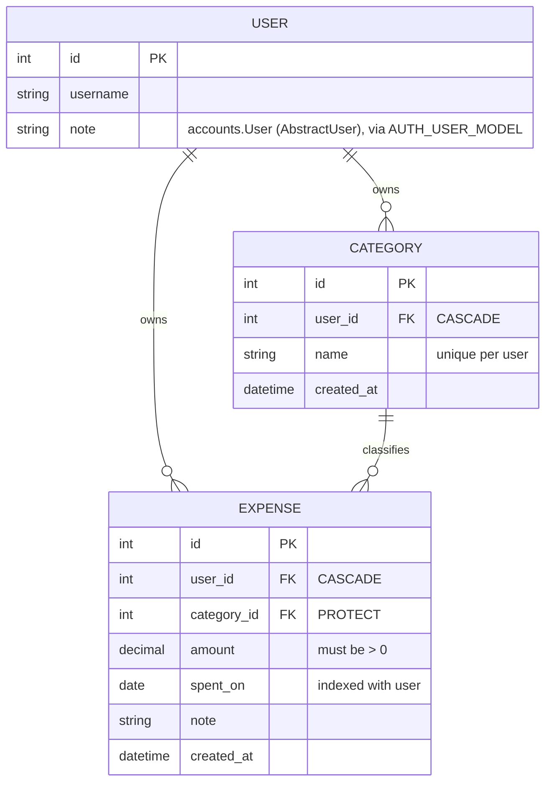

# Expense Tracker — Build Log

> Living doc. Every session appends here. Structured so a swimlane / mermaid diagram can be
> derived directly from the tables below without re-reading the code.
>
> **Companion docs:**
> [DJANGO_CHEATSHEET.md](DJANGO_CHEATSHEET.md) — commands, project-layout rationale, "signals experience" checklist.
> [COMMIT_PLAN.md](COMMIT_PLAN.md) — industry-standard build order, phase by phase, commit by commit.
>
> **Purpose of this project:** first of 11 Django projects. This one is the *reference build* —
> the goal is a mind map of a complete end-to-end Django app, deliberately including the parts
> Frappe abstracts away (background jobs, scheduling, async export). The next 10 are solo
> muscle-memory reps.

---

## 1. Current state at a glance

**Session:** 4 — Phases 4 and 4.5 complete. Phase 2 (auth) deferred by choice, see below
**Last commit:** `0950afe` — *docs: add README*
**Phase tags:** `phase-1-foundation`, `phase-3-crud`, `phase-4-tests`, `phase-4.5-tooling`
**Suite:** 61 tests, 100% statement coverage, green in CI

> **Phases run out of order on purpose.** Auth was deferred so it can be studied properly rather
> than pattern-matched. The original "auth before CRUD" rule was really about *not writing views
> that ignore `request.user`* — so the views were written fully user-scoped from the start, and
> `LOGIN_URL` points at the admin login as a temporary door. Phase 2 changes one setting and adds
> templates; **no view code changes.**

### Data model

### Component status (swimlane source)

| Layer | Component | File | Status | Session |
|---|---|---|---|---|
| Config | Project scaffold (`config/`) | `config/` | ✅ stock | 1 |
| Config | App registered + timezone | `config/settings.py` | ✅ done | 1 |
| Model | `Category` | `expenses/models.py` | ✅ done | 1 |
| Model | `Expense` | `expenses/models.py` | ✅ done | 1 |
| Model | Initial migration | `expenses/migrations/0001_initial.py` | ✅ done | 1 |
| Admin | `CategoryAdmin` / `ExpenseAdmin` | `expenses/admin.py` | ✅ done | 1 |
| Repo hygiene | `.gitignore` / `requirements.txt` | `.gitignore`, `requirements.txt` | ✅ done | 2 |
| Model | **Custom user** `accounts.User` | `accounts/models.py` | ✅ done | 2 |
| Admin | `UserAdmin` (subclassed) | `accounts/admin.py` | ✅ done | 2 |
| Config | Env-based secrets + `DATABASE_URL` | `config/settings.py`, `.env.example` | ✅ done | 2 |
| URL | Namespaced app URLConf | `expenses/urls.py` | ✅ done | 3 |
| Template | base template + nav | `templates/base.html` | ✅ done | 3 |
| Form | `CategoryForm` / `ExpenseForm` | `expenses/forms.py` | ✅ done | 3 |
| View | Category CRUD (user-scoped) | `expenses/views.py` | ✅ done | 3 |
| View | Expense CRUD (user-scoped) | `expenses/views.py` | ✅ done | 3 |
| View | Owner-scoping mixins | `expenses/mixins.py` | ✅ done | 3 |
| Test | Model constraints | `expenses/tests/test_models.py` | ✅ 14 tests | 4 |
| Test | Forms | `expenses/tests/test_forms.py` | ✅ 15 tests | 4 |
| Test | CRUD views + auth redirects | `expenses/tests/test_views.py` | ✅ 17 tests | 4 |
| Test | Ownership boundaries | `expenses/tests/test_permissions.py` | ✅ 13 tests | 4 |
| Tooling | Ruff lint + format | `pyproject.toml` | ✅ done | 4.5 |
| Tooling | Coverage, threshold 95% | `pyproject.toml` | ✅ 100% | 4.5 |
| Tooling | pre-commit hooks | `.pre-commit-config.yaml` | ✅ done | 4.5 |
| Tooling | GitHub Actions CI | `.github/workflows/ci.yml` | ✅ done | 4.5 |
| Docs | README | `README.md` | ✅ done | 4.5 |
| Auth | login / logout / signup | `accounts/` | 🔜 **next** (deferred) | phase 2 |
| View | Dashboard aggregation query | `expenses/views.py` | ⬜ not started | phase 5 |
| Infra | CSV export via Celery *(request-triggered)* | — | 🅿️ parked | phase 6 |
| Infra | Monthly digest via cron + mgmt command | — | 🅿️ parked | phase 6 |

Legend: ✅ done · 🔜 next · ⬜ not started · 🅿️ deliberately parked · ❌ problem

Phase numbers map to the tagged phases in [COMMIT_PLAN.md](COMMIT_PLAN.md).

---

## 2. Session log

### Session 1 — models + admin

**Written by hand (the actual work):**

| File | Lines | What |
|---|---|---|
| `expenses/models.py` | 54 | `Category` and `Expense` models |
| `expenses/admin.py` | 18 | Two `ModelAdmin` classes with `list_display`, filters, `date_hierarchy` |

**Generated (not hand-written):**

| File | Lines | How |
|---|---|---|
| `expenses/migrations/0001_initial.py` | 57 | `makemigrations` |

**Still untouched stock boilerplate:** `views.py`, `tests.py`, `apps.py`, `config/urls.py`,
`asgi.py`, `wsgi.py`, `manage.py`.

**Django concepts exercised this session** (the Frappe-gap list — see §4):
`ForeignKey` + `on_delete` semantics · `related_name` · `Meta.ordering` ·
`Meta.constraints` (`UniqueConstraint`, `CheckConstraint`) · `Meta.indexes` ·
`verbose_name_plural` · `settings.AUTH_USER_MODEL` indirection · `__str__` ·
migrations as version-controlled schema · `@admin.register` + `list_select_related`.

---

### Session 2 — Phase 1: foundation → tag `phase-1-foundation`

Three commits, one idea each.

| Commit | Message | What changed |
|---|---|---|
| `986a3fd` | `chore: add gitignore and requirements, untrack venv and db` | `.gitignore`, `requirements.txt`; untracked 5982 venv files + `db.sqlite3` + all `__pycache__` (index only, disk untouched) |
| `1293192` | `feat(accounts): add custom user model` | New `accounts` app: `User(AbstractUser)`, `UserAdmin` subclass, `AUTH_USER_MODEL`, DB rebuilt |
| `9a48cdb` | `chore(config): move secrets and environment config out of source` | `django-environ`; `SECRET_KEY`/`DEBUG`/`ALLOWED_HOSTS`/`DATABASE_URL` from env; `.env.example` |

**The payoff moment:** switching `AUTH_USER_MODEL` required **zero changes** to
`expenses/models.py` *and* zero changes to `expenses/migrations/0001_initial.py` — the model already
used `settings.AUTH_USER_MODEL` instead of importing `User`, and the generated migration uses
`migrations.swappable_dependency()`. Only the SQLite file had to be rebuilt. That is the entire
argument for the indirection, and it's a good interview story.

**Process note:** the first attempt bundled the 5982 venv deletions into the docs commit. Fixed with
`git reset --soft HEAD~1` and re-staged into two commits. Worth remembering — `git add <path>`
commits the *whole staged index*, not just that path.

**Django concepts exercised:** `AbstractUser` vs `AbstractBaseUser` · `AUTH_USER_MODEL` swappable
dependency · why `UserAdmin` must be subclassed (plain `ModelAdmin` stores clear-text passwords) ·
`django-environ` typed casting · fail-loud vs fail-safe config defaults · `DATABASE_URL` ·
`makemigrations --check --dry-run` · `git rm --cached` vs `git rm`.

**Verified:** `manage.py check` clean · all migrations applied · unset `SECRET_KEY` raises
`ImproperlyConfigured` · no pending migrations.

⚠️ **Superuser was destroyed** with the old DB. Recreate: `python manage.py createsuperuser`

---

### Session 3 — Phase 3: CRUD → tag `phase-3-crud`

| Commit | Message | What changed |
|---|---|---|
| `03b3cff` | `feat(expenses): add user-scoped category CRUD` | urlconf, base template, `CategoryForm`, 4 category views, 3 templates |
| `f67f2ee` | `feat(expenses): add user-scoped expense CRUD` | `ExpenseForm`, 4 expense views, 3 templates, pagination |
| `d28d166` | `refactor(expenses): extract owner-scoping mixins` | `mixins.py`; `views.py` 147 → 101 lines |

**Plan deviation:** commit 3.1 ("app urlconf and base template") was folded into the Category slice.
A urlconf pointing at views that don't exist yet won't import, so it can't be its own working
commit. The vertical-slice principle already implied this — a slice carries its own plumbing.

**The four things that matter here** (all verified with a two-user script, not just `check`):

| Boundary | Mechanism | Failure if missed |
|---|---|---|
| Who can see the page | `LoginRequiredMixin` | anonymous access |
| Whose rows are listed | `get_queryset().filter(user=...)` | other users' data in the list |
| Whose row can be edited | same — scoping `get_queryset`, not `get_object` | **IDOR**: `/expenses/3/edit/` edits someone else's row |
| What the dropdown offers | `ModelChoiceField.queryset` scoped in the form | leaks other users' category names, **and** a crafted POST files an expense against one |

That last one is the subtle one. A `ModelChoiceField` defaults to *every row in the table*.

**Two-layer validation.** DB constraints and form `clean_*` methods do different jobs:
`UniqueConstraint(user, name)` and `CheckConstraint(amount > 0)` **guarantee** correctness;
`clean_name()` and `clean_amount()` **explain** it. Without the form layer a duplicate is an
`IntegrityError` 500 instead of a field error. Note a `ModelForm` *cannot* validate
`UniqueConstraint(user, name)` on its own — Django skips constraints touching fields absent from
the form, and `user` is absent by design.

**Refactor timing:** the mixins were extracted *after* the duplication existed (6 × `get_queryset`,
4 × `get_form_kwargs`), not in anticipation of it.

**Django concepts exercised:** CBVs (`ListView`/`CreateView`/`UpdateView`/`DeleteView`) · MRO and
mixin ordering · `get_queryset` vs `get_object` · `get_form_kwargs` · `form_valid` ·
`reverse_lazy` vs `reverse` · `app_name` URL namespacing · `include()` · CBV template-name
conventions (`<model>_list/_form/_confirm_delete.html`) · `ModelChoiceField.queryset` ·
`clean_<field>` · `` · `select_related` and the N+1 · `paginate_by` ·
`django.contrib.messages` · `ProtectedError` · template inheritance.

**Verified:** anonymous → 302 · cross-user GET/POST → 404 on both models · foreign category id
rejected as a field error · negative amount rejected · duplicate name rejected case-insensitively ·
`PROTECT` surfaces a message not a 500 · empty category deletes · 11-row list = **4 queries**.

---

### Session 4 — Phase 4: tests → tag `phase-4-tests`

| Commit | Message | Tests |
|---|---|---|
| `ad1273e` | `test(expenses): cover model constraints` | 14 |
| `3f0eb14` | `test(expenses): cover forms and CRUD views` | 32 |
| `3393334` | `test(expenses): cover ownership boundaries` | 13 |

`expenses/tests.py` became the package `expenses/tests/`. Split by *what fails when it breaks*:

| File | Question it answers |
|---|---|
| `test_models.py` | What does the **database** guarantee, even if app code is wrong? |
| `test_forms.py` | What does the **application explain** instead of 500-ing? |
| `test_views.py` | Does the **request/response cycle** work for the happy paths? |
| `test_permissions.py` | Can Alice touch Bob's data? *(the file that must never go red)* |

**Two bugs found by writing the tests.** Both documented, neither silently fixed — see Known Issues.

1. **Account deletion is broken.** `Expense.category` is `PROTECT` while the user FKs are `CASCADE`.
   Deleting a user cascades to their categories, which are still referenced by their expenses, so
   `PROTECT` fires — even though those expenses would have cascaded away too. Django refuses rather
   than ordering the deletes. `test_deleting_user_with_expenses_currently_fails` is a tripwire: it
   asserts the current failure and will itself fail once fixed.
2. **Case-sensitivity mismatch.** `UniqueConstraint(user, name)` is exact-match; `clean_name` uses
   `__iexact`. The form is stricter than the DB, so the **admin** (which doesn't use our form) can
   create both `Food` and `food` for one user.

**Proving the suite has teeth.** A passing test proves nothing until it has been seen to fail, so
each safeguard was sabotaged in turn:

| Sabotage | Tests that went red |
|---|---|
| Remove `.filter(user=...)` from `OwnerScopedMixin` | **11** |
| Unscope the category dropdown to `Category.objects.all()` | **4** |
| Drop `select_related("category")` | **1** |

**Design choices worth knowing:** 404 not 403 on forbidden rows — a 403 confirms the row exists,
leaking what scoping hides, and a test pins that a forbidden id and a nonexistent id are
indistinguishable. Write tests assert the victim's row is *unchanged*, not just the status code.
`assertNumQueries(4)` pins the `select_related` win so an N+1 regression fails loudly.

**Django concepts exercised:** `TestCase` transaction rollback · `setUpTestData` vs `setUp` ·
`assertRaises(IntegrityError)` needing its own `transaction.atomic()` savepoint · `subTest` ·
`force_login` · `assertRedirects` / `assertTemplateUsed` / `assertContains` / `assertFormError` ·
`assertNumQueries` · `refresh_from_db` · test DB creation and teardown · mutation testing as a
sanity check on coverage.

---

## 3. Boilerplate / config change ledger

Every deviation from what `django-admin startproject` and `startapp` generated. Keep appending —
this is the file set that silently drifts and is worth being able to reconstruct from memory.

### `config/settings.py`

| Session | Setting | From | To | Why |
|---|---|---|---|---|
| 1 | `INSTALLED_APPS` | — | `+ "expenses"` | Register the app so models/migrations are discovered |
| 1 | `TIME_ZONE` | `'UTC'` | `'Asia/Kolkata'` | Local timezone; matters later for `spent_on` date boundaries and the monthly digest |
| 2 | `INSTALLED_APPS` | — | `+ "accounts"` | Custom user app; listed before `expenses` |
| 2 | `AUTH_USER_MODEL` | *(implicit `auth.User`)* | `"accounts.User"` | Custom user model — must precede first migration |
| 2 | `SECRET_KEY` | hardcoded literal | `env("SECRET_KEY")` | Secret out of source. **No default** → unset key crashes at startup rather than falling back |
| 2 | `DEBUG` | `True` | `env("DEBUG")`, default `False` | Fails safe when unset; typed cast stops `"False"` being truthy |
| 2 | `ALLOWED_HOSTS` | `[]` | `env("ALLOWED_HOSTS")`, default `[]` | Config, not code |
| 2 | `DATABASES` | inline SQLite dict | `env.db_url("DATABASE_URL", default=sqlite)` | Postgres later becomes a config change, not a code change |
| 2 | *(new import)* | — | `import environ` + `read_env(BASE_DIR / ".env")` | Loads `.env` when present |
| 3 | `TEMPLATES[0]["DIRS"]` | `[]` | `[BASE_DIR / "templates"]` | Project-wide templates; searched before app dirs, which is also how you override a third-party template |
| 3 | `LOGIN_URL` | — | `"/admin/login/"` | ⏳ **Temporary.** Phase 2 replaces with `"accounts:login"`. Views need no change — session auth is identical |
| 3 | `LOGIN_REDIRECT_URL` | — | `"expenses:expense_list"` | Where login lands |
| 3 | `LOGOUT_REDIRECT_URL` | — | `"expenses:expense_list"` | Where logout lands |

> The old `SECRET_KEY` is in git history (commit `60fb810`) and is permanently compromised. A fresh
> key was generated rather than reused. Lesson: once a secret is committed, rotating is the only
> fix — removing it from the working tree does nothing.

### `config/urls.py`

| Session | Change |
|---|---|
| 1 | *(none — still stock, only `admin/` routed)* |

### Other config files

| File | Session | Change |
|---|---|---|
| `expenses/apps.py` | — | none (stock `ExpensesConfig`) |
| `config/asgi.py`, `config/wsgi.py`, `manage.py` | — | none |

---

## 4. Django concepts encountered (Frappe-gap tracker)

Things Django makes explicit that Frappe abstracts away. Append as they come up — this is the
interview-gap list.

| Concept | Frappe equivalent / why it's a gap | First seen |
|---|---|---|
| `on_delete=CASCADE` vs `PROTECT` | Frappe link fields handle deletion policy via Link/Dynamic Link config | S1 `models.py` |
| `related_name` for reverse access | Frappe gives you `frappe.get_all` on the child doctype | S1 `models.py` |
| `Meta.constraints` (DB-level) | Frappe validates in `validate()` hooks, not DB constraints | S1 `models.py` |
| `Meta.indexes` | Frappe: `search_index` flag on a DocField | S1 `models.py` |
| Migrations as code | Frappe auto-syncs schema from DocType JSON on `bench migrate` | S1 `0001_initial.py` |
| `settings.AUTH_USER_MODEL` | Frappe has a fixed `User` doctype | S1 `models.py` |
| Custom user model / `AbstractUser` | Frappe's `User` doctype is extended with custom fields, never swapped | S2 `accounts/models.py` |
| `swappable_dependency` in migrations | No equivalent — Frappe has no migration files to depend on | S2 `0001_initial.py` |
| Settings as a Python module, env-injected | Frappe uses `site_config.json` / `common_site_config.json` | S2 `settings.py` |
| Admin must subclass `UserAdmin` for hashing | Frappe handles password hashing in the User doctype controller | S2 `accounts/admin.py` |
| **Explicit user-scoping in querysets** | Frappe applies `User Permission` / role permissions automatically. Django gives you **nothing** — an unscoped `Model.objects.all()` in a view is a data leak | S3 `mixins.py` |
| ModelForm + `clean_<field>` | Frappe: client scripts + server `validate()` in the controller | S3 `forms.py` |
| Ownership check via scoped `get_queryset` | Frappe: `frappe.has_permission` is implicit in `get_doc` | S3 `mixins.py` |
| `ModelChoiceField.queryset` must be scoped | Frappe Link fields filter by permission automatically | S3 `forms.py` |
| CBVs and mixin MRO | No equivalent — Frappe's list/form views are generated from the DocType | S3 `views.py` |
| `select_related` / N+1 | Frappe's `get_list` with `fields` does the join for you | S3 `views.py` |
| URL routing is explicit | Frappe derives routes from DocType names | S3 `urls.py` |
| CSRF token per form | Frappe injects it in its own form framework | S3 templates |
| Tests as a first-class deliverable | Frappe has `bench run-tests`, but DocType CRUD is framework-tested, so app tests are rarer | S4 `tests/` |
| Test DB created and destroyed per run | Frappe tests run against the site DB inside a rollback | S4 |
| `assertNumQueries` for N+1 regressions | No direct equivalent; Frappe's query count is mostly framework-controlled | S4 `test_views.py` |
| `on_delete` interactions (`CASCADE` meeting `PROTECT`) | Frappe link validation is per-link, so this cross-cascade conflict doesn't arise the same way | S4 — found a real bug |

---

## 5. Parked / roadmap decisions

| Item | Decision | Rationale |
|---|---|---|
| Monthly digest email | **Management command + cron**, *not* Celery | Scheduled, not request-triggered; single-tenant scale. Idempotency via `MonthlyDigest(user, month)` unique constraint |
| CSV export button | **Celery** — this is the one that earns it | Request-triggered: view fires task, returns immediately, task emails a link. This is the pattern interviewers probe |
| Both | Build in session 5–6, after CRUD exists | No dashboard aggregation query to reuse and no user-scoping to hang "export *my* expenses" on until then |

---

## 6. Known issues

### Resolved

| # | Issue | Resolved in |
|---|---|---|
| 1 | No custom user model | `1293192` (session 2) |
| 2 | No `.gitignore`; venv/db/pycache tracked | `986a3fd` (session 2) |
| 3 | No `requirements.txt` | `986a3fd` (session 2) |
| 4 | `SECRET_KEY` hardcoded in source | `9a48cdb` (session 2) |

### Open

| # | Issue | Impact | Fix |
|---|---|---|---|
| 5 | `.venv/` remains in git *history* (commit `60fb810`) | Repo is heavier than it should be; the old `SECRET_KEY` is permanently in history | Only fixable by rewriting history (`git filter-repo`). **Not worth it here** — no remote, no real secret at risk since the key was rotated. Worth knowing the cost for a real project |
| 6 | No superuser (DB was rebuilt) | Can't log in at all — **`LOGIN_URL` is the admin login right now**, so this blocks using the app | `python manage.py createsuperuser` |
| 7 | Settings not split base/dev/prod | Single file with env injection is fine at this size | Revisit in phase 7 if prod config grows |
| 9 | `LOGIN_URL` points at the admin login | Users would see the Django admin's login page | Phase 2 |
| 10 | **Account deletion is broken** | `user.delete()` raises `ProtectedError` for any user with expenses. A "delete my account" feature would 500 today | Decide between: (a) an ordered delete — expenses, then categories, then user — in a `User.delete()` override or a service function; (b) `SET_NULL` on `Expense.category` with `null=True`; (c) keep `PROTECT` and expose only the ordered path. **(a) is the usual production answer** — it keeps `PROTECT` protecting against accidental category deletion while making account closure explicit |
| 11 | Case-sensitivity mismatch on category names | `UniqueConstraint` is exact-match, `clean_name` is `__iexact`. The admin can create `Food` and `food` for one user; the app cannot | Make the DB agree with the form: `UniqueConstraint(Lower("name"), "user", name=...)`. Needs a migration |
| 13 | `check --deploy` reports 5 warnings | HSTS, SSL redirect, secure session and CSRF cookies, weak dev `SECRET_KEY`. The CI job is `continue-on-error` until these are fixed | Phase 7 — then remove the flag so it becomes a real gate |
| 14 | No settings split, no Docker | Fine at this size; both are phase 7 candidates | Phase 7 |
