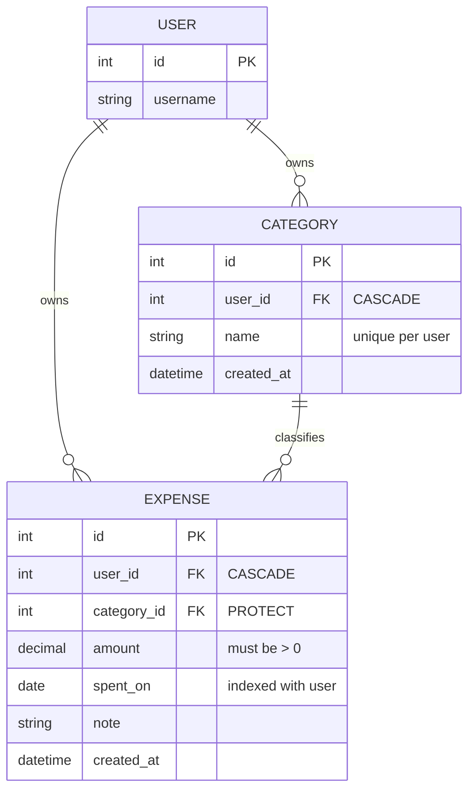

# Expense Tracker — Build Log

> Living doc. Every session appends here. Structured so a swimlane / mermaid diagram can be
> derived directly from the tables below without re-reading the code.
>
> **Companion docs:**
> [DJANGO_CHEATSHEET.md](DJANGO_CHEATSHEET.md) — commands, project-layout rationale, "signals experience" checklist.
> [COMMIT_PLAN.md](COMMIT_PLAN.md) — industry-standard build order, phase by phase, commit by commit.
>
> **Purpose of this project:** first of 11 Django projects. This one is the *reference build* —
> the goal is a mind map of a complete end-to-end Django app, deliberately including the parts
> Frappe abstracts away (background jobs, scheduling, async export). The next 10 are solo
> muscle-memory reps.

---

## 1. Current state at a glance

**Session:** 1 (models done, CRUD not started)
**Last commit:** `89c3a82` — *first model built and commit*

### Data model

### Component status (swimlane source)

| Layer | Component | File | Status | Session |
|---|---|---|---|---|
| Config | Project scaffold (`config/`) | `config/` | ✅ stock | 1 |
| Config | App registered + timezone | `config/settings.py` | ✅ done | 1 |
| Model | `Category` | `expenses/models.py` | ✅ done | 1 |
| Model | `Expense` | `expenses/models.py` | ✅ done | 1 |
| Model | Initial migration | `expenses/migrations/0001_initial.py` | ✅ done | 1 |
| Admin | `CategoryAdmin` / `ExpenseAdmin` | `expenses/admin.py` | ✅ done | 1 |
| Repo hygiene | `.gitignore` / `requirements.txt` | — | ❌ **missing** | 1 |
| URL | App URLConf | `expenses/urls.py` | ⬜ not started | 2 |
| View | Expense CRUD (user-scoped) | `expenses/views.py` | ⬜ stock stub | 2 |
| View | Category CRUD (user-scoped) | `expenses/views.py` | ⬜ not started | 2 |
| Form | `ExpenseForm` / `CategoryForm` | `expenses/forms.py` | ⬜ not started | 2 |
| Template | base + list + form templates | `templates/` | ⬜ not started | 2 |
| Auth | login / logout / signup | — | ⬜ not started | 3 |
| View | Dashboard aggregation query | `expenses/views.py` | ⬜ not started | 4 |
| Test | Model + view tests | `expenses/tests.py` | ⬜ stock stub | 4 |
| Infra | CSV export via Celery *(request-triggered)* | — | 🅿️ parked | 5–6 |
| Infra | Monthly digest via cron + mgmt command | — | 🅿️ parked | 5–6 |

Legend: ✅ done · ⬜ not started · 🅿️ deliberately parked · ❌ problem

---

## 2. Session log

### Session 1 — models + admin

**Written by hand (the actual work):**

| File | Lines | What |
|---|---|---|
| `expenses/models.py` | 54 | `Category` and `Expense` models |
| `expenses/admin.py` | 18 | Two `ModelAdmin` classes with `list_display`, filters, `date_hierarchy` |

**Generated (not hand-written):**

| File | Lines | How |
|---|---|---|
| `expenses/migrations/0001_initial.py` | 57 | `makemigrations` |

**Still untouched stock boilerplate:** `views.py`, `tests.py`, `apps.py`, `config/urls.py`,
`asgi.py`, `wsgi.py`, `manage.py`.

**Django concepts exercised this session** (the Frappe-gap list — see §4):
`ForeignKey` + `on_delete` semantics · `related_name` · `Meta.ordering` ·
`Meta.constraints` (`UniqueConstraint`, `CheckConstraint`) · `Meta.indexes` ·
`verbose_name_plural` · `settings.AUTH_USER_MODEL` indirection · `__str__` ·
migrations as version-controlled schema · `@admin.register` + `list_select_related`.

---

## 3. Boilerplate / config change ledger

Every deviation from what `django-admin startproject` and `startapp` generated. Keep appending —
this is the file set that silently drifts and is worth being able to reconstruct from memory.

### `config/settings.py`

| Session | Setting | From | To | Why |
|---|---|---|---|---|
| 1 | `INSTALLED_APPS` | — | `+ "expenses"` | Register the app so models/migrations are discovered |
| 1 | `TIME_ZONE` | `'UTC'` | `'Asia/Kolkata'` | Local timezone; matters later for `spent_on` date boundaries and the monthly digest |

### `config/urls.py`

| Session | Change |
|---|---|
| 1 | *(none — still stock, only `admin/` routed)* |

### Other config files

| File | Session | Change |
|---|---|---|
| `expenses/apps.py` | — | none (stock `ExpensesConfig`) |
| `config/asgi.py`, `config/wsgi.py`, `manage.py` | — | none |

---

## 4. Django concepts encountered (Frappe-gap tracker)

Things Django makes explicit that Frappe abstracts away. Append as they come up — this is the
interview-gap list.

| Concept | Frappe equivalent / why it's a gap | First seen |
|---|---|---|
| `on_delete=CASCADE` vs `PROTECT` | Frappe link fields handle deletion policy via Link/Dynamic Link config | S1 `models.py` |
| `related_name` for reverse access | Frappe gives you `frappe.get_all` on the child doctype | S1 `models.py` |
| `Meta.constraints` (DB-level) | Frappe validates in `validate()` hooks, not DB constraints | S1 `models.py` |
| `Meta.indexes` | Frappe: `search_index` flag on a DocField | S1 `models.py` |
| Migrations as code | Frappe auto-syncs schema from DocType JSON on `bench migrate` | S1 `0001_initial.py` |
| `settings.AUTH_USER_MODEL` | Frappe has a fixed `User` doctype | S1 `models.py` |
| Explicit user-scoping in querysets | Frappe applies permissions/`User Permission` automatically | S2 (upcoming) |
| ModelForm + `clean_<field>` | Frappe: client scripts + server `validate()` | S2 (upcoming) |
| `get_object_or_404` + ownership check | Frappe: `frappe.has_permission` is implicit | S2 (upcoming) |

---

## 5. Parked / roadmap decisions

| Item | Decision | Rationale |
|---|---|---|
| Monthly digest email | **Management command + cron**, *not* Celery | Scheduled, not request-triggered; single-tenant scale. Idempotency via `MonthlyDigest(user, month)` unique constraint |
| CSV export button | **Celery** — this is the one that earns it | Request-triggered: view fires task, returns immediately, task emails a link. This is the pattern interviewers probe |
| Both | Build in session 5–6, after CRUD exists | No dashboard aggregation query to reuse and no user-scoping to hang "export *my* expenses" on until then |

---

## 6. Known issues

| # | Issue | Impact | Fix |
|---|---|---|---|
| 1 | **No custom user model** | Swapping `AUTH_USER_MODEL` later is one of Django's genuinely painful migrations. Cost is ~zero *now* (throwaway SQLite), high by session 4 | See [DJANGO_CHEATSHEET.md §6](DJANGO_CHEATSHEET.md#6--decision-that-is-cheap-now-and-expensive-later-custom-user-model) — models.py needs **no** changes because it already uses `settings.AUTH_USER_MODEL` |
| 2 | No `.gitignore`; `.venv/`, `db.sqlite3`, `__pycache__/` are all tracked | Thousands of vendored files in history; a reviewer will notice immediately | Add `.gitignore`, then `git rm -r --cached .venv db.sqlite3 '**/__pycache__'` |
| 3 | No `requirements.txt` | The venv is committed *instead of* a dependency manifest — backwards | `pip freeze > requirements.txt` |
