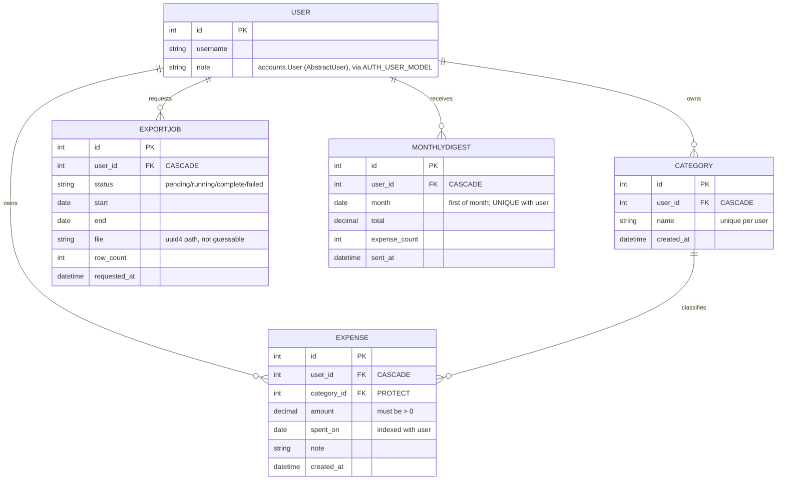

# Expense Tracker — Build Log

> Living doc. Every session appends here. Structured so a swimlane / mermaid diagram can be
> derived directly from the tables below without re-reading the code.
>
> **Companion docs:**
> [DJANGO_CHEATSHEET.md](DJANGO_CHEATSHEET.md) — commands, project-layout rationale, "signals experience" checklist.
> [COMMIT_PLAN.md](COMMIT_PLAN.md) — industry-standard build order, phase by phase, commit by commit.
> [STUDY_MAP.md](STUDY_MAP.md) — what must be *understood*, ranked by interview risk. The Frappe-gap
> table in §4 below feeds it.
> [RUNNING_ASYNC.md](RUNNING_ASYNC.md) — how to run the worker, the digest, and cron/systemd.
>
> **Purpose of this project:** first of 11 Django projects. This one is the *reference build* —
> the goal is a mind map of a complete end-to-end Django app, deliberately including the parts
> Frappe abstracts away (background jobs, scheduling, async export). The next 10 are solo
> muscle-memory reps.

---

## 1. Current state at a glance

**Session:** 7 — Phase 6 (async) complete. Only phase 7 (production readiness) remains
**Last commit:** `92cb1e5` — *feat(expenses): add monthly digest command with idempotency*
**Phase tags:** `phase-1-foundation`, `phase-2-auth`, `phase-3-crud`, `phase-4-tests`, `phase-4.5-tooling`, `phase-5-dashboard`, `phase-6-async`
**Suite:** 169 tests, 1.7s, green in CI

> **Phases ran out of order on purpose, and the bet paid off.** Auth was deferred past CRUD so it
> could be studied properly. That was safe because phase 3's views were written fully user-scoped
> from the start. **Landing phase 2 changed `LOGIN_URL` and nothing else in `expenses/` —
> zero view code touched**, exactly as predicted.

### Data model

### Component status (swimlane source)

| Layer | Component | File | Status | Session |
|---|---|---|---|---|
| Config | Project scaffold (`config/`) | `config/` | ✅ stock | 1 |
| Config | App registered + timezone | `config/settings.py` | ✅ done | 1 |
| Model | `Category` | `expenses/models.py` | ✅ done | 1 |
| Model | `Expense` | `expenses/models.py` | ✅ done | 1 |
| Model | Initial migration | `expenses/migrations/0001_initial.py` | ✅ done | 1 |
| Admin | `CategoryAdmin` / `ExpenseAdmin` | `expenses/admin.py` | ✅ done | 1 |
| Repo hygiene | `.gitignore` / `requirements.txt` | `.gitignore`, `requirements.txt` | ✅ done | 2 |
| Model | **Custom user** `accounts.User` | `accounts/models.py` | ✅ done | 2 |
| Admin | `UserAdmin` (subclassed) | `accounts/admin.py` | ✅ done | 2 |
| Config | Env-based secrets + `DATABASE_URL` | `config/settings.py`, `.env.example` | ✅ done | 2 |
| URL | Namespaced app URLConf | `expenses/urls.py` | ✅ done | 3 |
| Template | base template + nav | `templates/base.html` | ✅ done | 3 |
| Form | `CategoryForm` / `ExpenseForm` | `expenses/forms.py` | ✅ done | 3 |
| View | Category CRUD (user-scoped) | `expenses/views.py` | ✅ done | 3 |
| View | Expense CRUD (user-scoped) | `expenses/views.py` | ✅ done | 3 |
| View | Owner-scoping mixins | `expenses/mixins.py` | ✅ done | 3 |
| Test | Model constraints | `expenses/tests/test_models.py` | ✅ 14 tests | 4 |
| Test | Forms | `expenses/tests/test_forms.py` | ✅ 15 tests | 4 |
| Test | CRUD views + auth redirects | `expenses/tests/test_views.py` | ✅ 17 tests | 4 |
| Test | Ownership boundaries | `expenses/tests/test_permissions.py` | ✅ 13 tests | 4 |
| Tooling | Ruff lint + format | `pyproject.toml` | ✅ done | 4.5 |
| Tooling | Coverage, threshold 95% | `pyproject.toml` | ✅ 100% | 4.5 |
| Tooling | pre-commit hooks | `.pre-commit-config.yaml` | ✅ done | 4.5 |
| Tooling | GitHub Actions CI | `.github/workflows/ci.yml` | ✅ done | 4.5 |
| Docs | README | `README.md` | ✅ done | 4.5 |
| Auth | Login / logout | `accounts/urls.py` | ✅ done | 5 |
| Auth | Signup | `accounts/views.py`, `forms.py` | ✅ done | 5 |
| Auth | Password change + reset | `accounts/urls.py` | ✅ done | 5 |
| Auth | Unique, required email | `accounts/models.py` | ✅ done | 5 |
| Test | Auth flows | `accounts/tests/` | ✅ 28 tests | 5 |
| Query | Reusable aggregation | `expenses/managers.py`, `summaries.py` | ✅ done | 6 |
| View | Dashboard (date range) | `expenses/views.py` | ✅ done | 6 |
| Form | Date range + filter forms | `expenses/filters.py` | ✅ done | 6 |
| Test | Aggregation, dashboard, filters | `expenses/tests/` | ✅ 46 tests | 6 |
| Test | Template render guards | `expenses/tests/test_templates.py` | ✅ done | 6 |
| Infra | Celery + Redis broker | `config/celery.py` | ✅ done | 7 |
| Model | `ExportJob`, `MonthlyDigest` | `expenses/models.py` | ✅ done | 7 |
| Infra | **CSV export** *(request-triggered → Celery)* | `expenses/tasks.py` | ✅ done | 7 |
| Infra | **Monthly digest** *(clock-triggered → cron)* | `expenses/management/commands/` | ✅ done | 7 |
| Test | Exports and digests | `expenses/tests/` | ✅ 34 tests | 7 |
| Tooling | Fast password hasher in tests | `config/test_runner.py` | ✅ 40× faster | 5 |

Legend: ✅ done · 🔜 next · ⬜ not started · 🅿️ deliberately parked · ❌ problem

Phase numbers map to the tagged phases in [COMMIT_PLAN.md](COMMIT_PLAN.md).

---

## 2. Session log

### Session 1 — models + admin

**Written by hand (the actual work):**

| File | Lines | What |
|---|---|---|
| `expenses/models.py` | 54 | `Category` and `Expense` models |
| `expenses/admin.py` | 18 | Two `ModelAdmin` classes with `list_display`, filters, `date_hierarchy` |

**Generated (not hand-written):**

| File | Lines | How |
|---|---|---|
| `expenses/migrations/0001_initial.py` | 57 | `makemigrations` |

**Still untouched stock boilerplate:** `views.py`, `tests.py`, `apps.py`, `config/urls.py`,
`asgi.py`, `wsgi.py`, `manage.py`.

**Django concepts exercised this session** (the Frappe-gap list — see §4):
`ForeignKey` + `on_delete` semantics · `related_name` · `Meta.ordering` ·
`Meta.constraints` (`UniqueConstraint`, `CheckConstraint`) · `Meta.indexes` ·
`verbose_name_plural` · `settings.AUTH_USER_MODEL` indirection · `__str__` ·
migrations as version-controlled schema · `@admin.register` + `list_select_related`.

---

### Session 2 — Phase 1: foundation → tag `phase-1-foundation`

Three commits, one idea each.

| Commit | Message | What changed |
|---|---|---|
| `986a3fd` | `chore: add gitignore and requirements, untrack venv and db` | `.gitignore`, `requirements.txt`; untracked 5982 venv files + `db.sqlite3` + all `__pycache__` (index only, disk untouched) |
| `1293192` | `feat(accounts): add custom user model` | New `accounts` app: `User(AbstractUser)`, `UserAdmin` subclass, `AUTH_USER_MODEL`, DB rebuilt |
| `9a48cdb` | `chore(config): move secrets and environment config out of source` | `django-environ`; `SECRET_KEY`/`DEBUG`/`ALLOWED_HOSTS`/`DATABASE_URL` from env; `.env.example` |

**The payoff moment:** switching `AUTH_USER_MODEL` required **zero changes** to
`expenses/models.py` *and* zero changes to `expenses/migrations/0001_initial.py` — the model already
used `settings.AUTH_USER_MODEL` instead of importing `User`, and the generated migration uses
`migrations.swappable_dependency()`. Only the SQLite file had to be rebuilt. That is the entire
argument for the indirection, and it's a good interview story.

**Process note:** the first attempt bundled the 5982 venv deletions into the docs commit. Fixed with
`git reset --soft HEAD~1` and re-staged into two commits. Worth remembering — `git add <path>`
commits the *whole staged index*, not just that path.

**Django concepts exercised:** `AbstractUser` vs `AbstractBaseUser` · `AUTH_USER_MODEL` swappable
dependency · why `UserAdmin` must be subclassed (plain `ModelAdmin` stores clear-text passwords) ·
`django-environ` typed casting · fail-loud vs fail-safe config defaults · `DATABASE_URL` ·
`makemigrations --check --dry-run` · `git rm --cached` vs `git rm`.

**Verified:** `manage.py check` clean · all migrations applied · unset `SECRET_KEY` raises
`ImproperlyConfigured` · no pending migrations.

⚠️ **Superuser was destroyed** with the old DB. Recreate: `python manage.py createsuperuser`

---

### Session 3 — Phase 3: CRUD → tag `phase-3-crud`

| Commit | Message | What changed |
|---|---|---|
| `03b3cff` | `feat(expenses): add user-scoped category CRUD` | urlconf, base template, `CategoryForm`, 4 category views, 3 templates |
| `f67f2ee` | `feat(expenses): add user-scoped expense CRUD` | `ExpenseForm`, 4 expense views, 3 templates, pagination |
| `d28d166` | `refactor(expenses): extract owner-scoping mixins` | `mixins.py`; `views.py` 147 → 101 lines |

**Plan deviation:** commit 3.1 ("app urlconf and base template") was folded into the Category slice.
A urlconf pointing at views that don't exist yet won't import, so it can't be its own working
commit. The vertical-slice principle already implied this — a slice carries its own plumbing.

**The four things that matter here** (all verified with a two-user script, not just `check`):

| Boundary | Mechanism | Failure if missed |
|---|---|---|
| Who can see the page | `LoginRequiredMixin` | anonymous access |
| Whose rows are listed | `get_queryset().filter(user=...)` | other users' data in the list |
| Whose row can be edited | same — scoping `get_queryset`, not `get_object` | **IDOR**: `/expenses/3/edit/` edits someone else's row |
| What the dropdown offers | `ModelChoiceField.queryset` scoped in the form | leaks other users' category names, **and** a crafted POST files an expense against one |

That last one is the subtle one. A `ModelChoiceField` defaults to *every row in the table*.

**Two-layer validation.** DB constraints and form `clean_*` methods do different jobs:
`UniqueConstraint(user, name)` and `CheckConstraint(amount > 0)` **guarantee** correctness;
`clean_name()` and `clean_amount()` **explain** it. Without the form layer a duplicate is an
`IntegrityError` 500 instead of a field error. Note a `ModelForm` *cannot* validate
`UniqueConstraint(user, name)` on its own — Django skips constraints touching fields absent from
the form, and `user` is absent by design.

**Refactor timing:** the mixins were extracted *after* the duplication existed (6 × `get_queryset`,
4 × `get_form_kwargs`), not in anticipation of it.

**Django concepts exercised:** CBVs (`ListView`/`CreateView`/`UpdateView`/`DeleteView`) · MRO and
mixin ordering · `get_queryset` vs `get_object` · `get_form_kwargs` · `form_valid` ·
`reverse_lazy` vs `reverse` · `app_name` URL namespacing · `include()` · CBV template-name
conventions (`<model>_list/_form/_confirm_delete.html`) · `ModelChoiceField.queryset` ·
`clean_<field>` · `` · `select_related` and the N+1 · `paginate_by` ·
`django.contrib.messages` · `ProtectedError` · template inheritance.

**Verified:** anonymous → 302 · cross-user GET/POST → 404 on both models · foreign category id
rejected as a field error · negative amount rejected · duplicate name rejected case-insensitively ·
`PROTECT` surfaces a message not a 500 · empty category deletes · 11-row list = **4 queries**.

---

### Session 7 — Phase 6: async → tag `phase-6-async`

| Commit | Message |
|---|---|
| `a970a57` | `chore: add celery with a redis broker` |
| `cda81e5` | `feat(expenses): add async CSV export` |
| `92cb1e5` | `feat(expenses): add monthly digest command with idempotency` |

**The whole point of the phase, in one table:**

| | CSV export | Monthly digest |
|---|---|---|
| Trigger | A user clicks a button | The 1st of the month |
| Machinery | **Celery task** | **Management command + cron** |
| Why | Request-triggered; building inline holds the connection open for an unbounded time | Clock-triggered; nobody is waiting, so there is nothing to unblock |
| Runs twice? | Yes, `acks_late` redelivers | Yes, cron re-fires after a restart |
| Guard | `status == COMPLETE` early return | `UniqueConstraint(user, month)`, claimed *before* sending |

The rule worth saying out loud in an interview: **reach for a queue when the trigger is a request.
When the trigger is a clock, a command plus cron is usually the honest answer.**

**Celery settings, each with a failure mode behind it:** JSON-only serialisation (pickle turns broker
write access into RCE on every worker) · `acks_late` (a killed worker redelivers rather than losing
the task — the price is that tasks must be idempotent) · `prefetch_multiplier = 1` (with `acks_late`,
a worker holding ten prefetched tasks redelivers all ten when it dies) · soft and hard time limits ·
`autodiscover_tasks` (without it the worker starts fine and reports "unregistered task" at call time).

**Tasks take primary keys, never model instances.** Arguments are JSON on the broker, so an instance
either fails to serialise or arrives as a stale snapshot. Re-reading is also what lets a redelivered
task see current state.

**`transaction.on_commit`, not `.delay()` directly.** Dispatching inside an open transaction is a
real race — the worker is fast enough to query for a row the web process has not committed yet.

**🐛 A bug no `TestCase` could have caught.** The digest command iterated users with
`queryset.iterator()`, which holds a server-side cursor open, while committing inside the loop. The
commit invalidates the cursor and the second user raises `InterfaceError`.

**All sixteen tests passed with the bug present.** `TestCase` wraps each test in a transaction, so
`transaction.atomic()` is only a savepoint and never really commits. It surfaced only when the
command was run for real against a live database.

Fixed by materialising ids before the loop. `DigestCursorTests` uses **`TransactionTestCase`** to pin
it, and reintroducing the bug leaves all sixteen `TestCase` tests green while failing
`TransactionTestCase` alone. That is the clearest demonstration in this project of *why the two base
classes exist* — and the second time this phase-by-phase build has found a bug by running the thing
rather than asserting about it.

**Verified against real infrastructure**, not just eager mode: a live Redis and a real worker,
`inspect ping` answering, a dispatched export producing the correct CSV and emailing a link, and a
second delivery of the same task returning without redoing the work.

**Mutation results:** reordering the digest to send-then-record fails 4 tests · reintroducing the
cursor bug fails `TransactionTestCase` only.

**Django concepts exercised:** Celery app setup and `config_from_object` with a namespace ·
`shared_task` vs `@app.task` · `bind=True`, `autoretry_for`, `retry_backoff`, jitter, `max_retries` ·
`acks_late` and idempotency · `transaction.on_commit` · `FileField` with a callable `upload_to` ·
`ContentFile` · `queryset.iterator()` and cursor lifetime · `TestCase` vs `TransactionTestCase` ·
`BaseCommand`, `add_arguments`, `CommandError`, `self.style` · `call_command` in tests ·
`IntegrityError` as a concurrency primitive · `FileResponse` · `MEDIA_ROOT`.

---

### Session 8 — Phase 7: production readiness → tag `phase-7-production`

| Commit | Message |
|---|---|
| `65639bf` | `chore(config): harden production settings and add logging` |
| `17134ea` | `feat: add error page templates` |
| `c675726` | `ci: make the deploy check a gate` |

**Every security setting is gated on `if not DEBUG`, and that gate is the phase's whole story.**
Each one breaks local development: an SSL redirect makes `http://localhost` unreachable, and secure
cookies are never sent over plain HTTP, so you cannot stay logged in. Gating them is correct. The
cost is that the block is evaluated at *import* time, which has two consequences nobody expects
until they bite.

**Consequence one: the CI suite went red.** The test job runs with `DEBUG=False` so error templates
and production behaviour are exercised. That switched on `SECURE_SSL_REDIRECT`, and every test
client request became a `301` before it reached a view — 106 of 180 tests failing, none of them
because of the code under test. The fix is `SECURE_SSL_REDIRECT: "False"` in the test job only; the
separate `deploy-checks` job keeps the real setting honest. **There was no git remote, so CI had
never run and never caught it.**

**Consequence two: `override_settings` cannot test this.** By the time any test executes, the
`if not DEBUG` block has already run or already been skipped. Flipping `DEBUG` in a decorator
changes the flag and nothing else. The only honest assertion is a **subprocess** started without
`DEBUG`, which is exactly what CI does. `DeploySettingsTests` does that, in both directions: the
production config must pass `check --deploy`, and the development config must deliberately fail it.
That subprocess must also *drop* the inherited `SECURE_SSL_REDIRECT=False`, or the test asserts the
production config is clean while measuring the relaxed one.

**The 500 page could not render, and the comment explaining why caused it.**
`templates/500.html` is deliberately standalone — no parent template, no URL reversing, no context —
because Django renders it with an empty context and no context processors, so extending
`base.html` would let an error in the base template turn a handled 500 into an unhandled one. The
file documented that rule in an HTML comment that spelled the tags out in their real syntax. **An
HTML comment is not a template comment.** Django parsed those tags like any other, and the file
raised `TemplateSyntaxError` on load. The 500 page would itself have 500'd, in production only.

This is the **second** time this exact gap has drawn blood — session 6 hit the ``
variant. The rule to carry forward: *Django's parser does not care what wrapper your text is in.*

**The test that missed it** read `500.html` as a string and asserted `"{% extends"` was absent. It
matched the file's own documentation and failed for the wrong reason, and it would have passed a
genuinely broken file whose comment was phrased differently. It now asserts against the **compiled
nodelist** and renders the template with an empty context — testing behaviour, not text.

**`SILENCED_SYSTEM_CHECKS = ["security.W021"]`** is a deliberate answer, not a suppression. HSTS
preload submits the domain to a list baked into browser binaries; it takes months to leave and
breaks any subdomain that cannot serve HTTPS. Silencing it with a written reason is more honest
than flipping a flag to quiet a checker.

### Session 6 — Phase 5: read layer → tag `phase-5-dashboard`

| Commit | Message |
|---|---|
| `34c5a4b` | `feat(expenses): add reusable aggregation layer` |
| `5005cba` | `feat(expenses): add dashboard and expense filtering` |

**The architectural decision of this phase:** the aggregation lives on a custom `QuerySet` plus a
plain `summaries.py` module — **not in the view**. Phase 6's digest runs inside a Celery task where
there is no request and no view to call into. Had it lived in `get_context_data`, phase 6 would
have copy-pasted it. This is "fat models, thin views" with a concrete reason attached.

**Design decisions worth defending:**

| Decision | Why |
|---|---|
| `TemplateView`, not `ListView`, for the dashboard | The page is aggregates, not objects. `ListView` would mean a queryset that exists only to be ignored |
| A `Form` for GET parameters | `?start=banana` becomes a field error, not a 500, and the view receives real `date` objects |
| Filters via GET, not POST | Bookmarkable, shareable, back-button safe; POST would need a redirect to dodge the resubmit prompt |
| `` (Django 5.1+) for pagination | Hand-rolling this is exactly where filters silently vanish on page 2 |
| Total sums the *filtered set*, not the page | Answers "how much did I spend on this", not "what is on screen" |
| `change_from()` returns `None`, not `0` | "Nothing to compare" is a different state from "no change"; "up 100% from zero" is meaningless |
| Whole months compare to whole previous months | September has 30 days, August 31. A naive equal-length rule would compare against 2–31 Aug and silently drop a day |
| Category share computed in `summarise()` | The digest email gets identical numbers without reimplementing the arithmetic |
| CSS bar, no charting library | A JS dependency and a CSP exception, for one rectangle |

**Three queries per period, by design** — aggregates, grouping, biggest. Not one clever query:
these are different shapes, and three indexed reads beat the joins needed to force them together.
Pinned with `assertNumQueries`, and asserted *flat* as row counts grow rather than as a magic number.

**🐛 A bug that shipped in phase 3 and survived four phases.** Eleven multi-line `{# ... #}`
template comments were **rendering as visible text in the page**. Django's `{# #}` only strips
comments that fit on a single line; anything longer is not a comment at all. Every test passed
throughout — views returned 200, contexts were correct — because nothing had ever *read the HTML*.

Found by rendering a page and looking at it. Fixed by converting to ``, and
`expenses/tests/test_templates.py` now fetches every page and asserts no `{#`, `{%` or `{{` reaches
the browser. **The lesson: 100% coverage measured that those lines ran, not that their output was
correct.**

**Django concepts exercised:** custom `QuerySet` + `as_manager()` · `values()` before `annotate()`
as the GROUP BY switch · `Sum`/`Count` aggregation and `Sum` returning `None` when empty ·
`aggregate()` vs `annotate()` · `TemplateView` · forms over GET parameters · `ModelChoiceField`
scoping (again) · `icontains` and why it cannot use a btree index · `` ·
`` vs `{# #}` · `assertNumQueries` as a flatness property · `unittest.mock.patch` for
deterministic dates · frozen dataclasses as view-model.

---

### Session 5 — Phase 2: authentication → tag `phase-2-auth`

| Commit | Message |
|---|---|
| `eb84d02` | `feat(accounts): make user email required and unique` |
| `dadf826` | `feat(accounts): add login and logout` |
| `9b78c59` | `feat(accounts): add signup` |
| `d853ab0` | `feat(accounts): add password change and reset flows` |
| `149aa25` | `test(accounts): cover authentication flows` |

**The deferral bet paid off.** Phase 2 landed after phase 3 and 4. The only change outside
`accounts/` and `templates/registration/` was `LOGIN_URL`, plus one test asserting the new redirect
target. **No view code in `expenses/` was touched.** Writing views user-scoped from the start is
what made reordering safe.

**What Django gives you, and what it doesn't.** Login, logout, password change and the four-step
password reset are all shipped views — you supply templates and URLs. **Signup is the one it does
not ship**, because what happens after registration (auto-login, email confirmation, an approval
queue) is a product decision. It gives you `UserCreationForm` and `login()`; joining them is yours.

**Security properties, and why each exists:**

| Property | Mechanism | Attack it prevents |
|---|---|---|
| Login error is identical for wrong password vs unknown user | Django's default message, kept vague | Username enumeration |
| Reset form responds identically for unknown addresses | Redirect regardless; page text says "if an account exists" | Account enumeration |
| Session key rotates on login | `login()` | Session fixation |
| Logout is POST-only (405 on GET) | Django 5.0 default | Logout triggered by a prefetch, scanner or `` |
| Off-site `?next=` refused | `LoginView` host validation | Open redirect / phishing |
| Password change requires current password | `PasswordChangeForm` | Unattended session used to lock out the owner |
| Reset token single-use, dies on password change | Token derived from password hash + `last_login` | Replayed reset link |
| Reset link expires in 24h | `PASSWORD_RESET_TIMEOUT`, lowered from Django's 3 days | Credential URL lingering in an inbox |

**`AbstractUser.email` is blank and non-unique by default**, which quietly breaks password reset —
the reset form looks users up by email, so a blank address matches nothing and a duplicate is
ambiguous. Overriding it to required + unique is a precondition for a reliable reset flow. Free
here because the DB held zero users; it also immediately broke four test classes whose fixtures
made two users with blank emails, which is the suite doing its job.

**A test was found to be lying.** `test_duplicate_email_check_ignores_case` passed even with
`__iexact` replaced by `=`. `clean_email` lowercases the incoming value, so with a lowercase row in
the DB the two lookups are identical and the test could not distinguish them. Rewritten to store a
**mixed-case** address first — the shape that actually arises from `createsuperuser` and the admin,
neither of which uses `SignUpForm`. This is the argument for mutation testing: coverage said 100%
and the assertion still proved nothing.

**Test suite is now 40× faster.** PBKDF2's slowness is a security property in production and pure
cost in tests. `config/test_runner.py` swaps in MD5 for the test run only: **20.5s → 0.5s** across
89 tests, and the gap grows with every test that touches a user.

**Mutation results:** dropping `Meta.model` from the signup form fails 8 tests · removing the
post-signup `login()` fails 1 · removing `redirect_authenticated_user` fails 1 · `__iexact` → `=`
fails 1 (after the fix above).

**Django concepts exercised:** `LoginView` / `LogoutView` / `PasswordChangeView` /
`PasswordResetView` and its four steps · `UserCreationForm` and why `Meta.model` must be overridden
for a custom user model · `set_password` and `PASSWORD_HASHERS` · `AUTH_PASSWORD_VALIDATORS` ·
session fixation and key rotation · `uidb64` + token generation · `PASSWORD_RESET_TIMEOUT` ·
email backends and `mail.outbox` · `LOGIN_URL` / `LOGIN_REDIRECT_URL` / `LOGOUT_REDIRECT_URL` ·
`redirect_authenticated_user` · open-redirect protection on `?next=` · custom `TEST_RUNNER`.

---

### Session 4 — Phase 4: tests → tag `phase-4-tests`

| Commit | Message | Tests |
|---|---|---|
| `ad1273e` | `test(expenses): cover model constraints` | 14 |
| `3f0eb14` | `test(expenses): cover forms and CRUD views` | 32 |
| `3393334` | `test(expenses): cover ownership boundaries` | 13 |

`expenses/tests.py` became the package `expenses/tests/`. Split by *what fails when it breaks*:

| File | Question it answers |
|---|---|
| `test_models.py` | What does the **database** guarantee, even if app code is wrong? |
| `test_forms.py` | What does the **application explain** instead of 500-ing? |
| `test_views.py` | Does the **request/response cycle** work for the happy paths? |
| `test_permissions.py` | Can Alice touch Bob's data? *(the file that must never go red)* |

**Two bugs found by writing the tests.** Both documented, neither silently fixed — see Known Issues.

1. **Account deletion is broken.** `Expense.category` is `PROTECT` while the user FKs are `CASCADE`.
   Deleting a user cascades to their categories, which are still referenced by their expenses, so
   `PROTECT` fires — even though those expenses would have cascaded away too. Django refuses rather
   than ordering the deletes. `test_deleting_user_with_expenses_currently_fails` is a tripwire: it
   asserts the current failure and will itself fail once fixed.
2. **Case-sensitivity mismatch.** `UniqueConstraint(user, name)` is exact-match; `clean_name` uses
   `__iexact`. The form is stricter than the DB, so the **admin** (which doesn't use our form) can
   create both `Food` and `food` for one user.

**Proving the suite has teeth.** A passing test proves nothing until it has been seen to fail, so
each safeguard was sabotaged in turn:

| Sabotage | Tests that went red |
|---|---|
| Remove `.filter(user=...)` from `OwnerScopedMixin` | **11** |
| Unscope the category dropdown to `Category.objects.all()` | **4** |
| Drop `select_related("category")` | **1** |

**Design choices worth knowing:** 404 not 403 on forbidden rows — a 403 confirms the row exists,
leaking what scoping hides, and a test pins that a forbidden id and a nonexistent id are
indistinguishable. Write tests assert the victim's row is *unchanged*, not just the status code.
`assertNumQueries(4)` pins the `select_related` win so an N+1 regression fails loudly.

**Django concepts exercised:** `TestCase` transaction rollback · `setUpTestData` vs `setUp` ·
`assertRaises(IntegrityError)` needing its own `transaction.atomic()` savepoint · `subTest` ·
`force_login` · `assertRedirects` / `assertTemplateUsed` / `assertContains` / `assertFormError` ·
`assertNumQueries` · `refresh_from_db` · test DB creation and teardown · mutation testing as a
sanity check on coverage.

---

## 3. Boilerplate / config change ledger

Every deviation from what `django-admin startproject` and `startapp` generated. Keep appending —
this is the file set that silently drifts and is worth being able to reconstruct from memory.

### `config/settings.py`

| Session | Setting | From | To | Why |
|---|---|---|---|---|
| 1 | `INSTALLED_APPS` | — | `+ "expenses"` | Register the app so models/migrations are discovered |
| 1 | `TIME_ZONE` | `'UTC'` | `'Asia/Kolkata'` | Local timezone; matters later for `spent_on` date boundaries and the monthly digest |
| 2 | `INSTALLED_APPS` | — | `+ "accounts"` | Custom user app; listed before `expenses` |
| 2 | `AUTH_USER_MODEL` | *(implicit `auth.User`)* | `"accounts.User"` | Custom user model — must precede first migration |
| 2 | `SECRET_KEY` | hardcoded literal | `env("SECRET_KEY")` | Secret out of source. **No default** → unset key crashes at startup rather than falling back |
| 2 | `DEBUG` | `True` | `env("DEBUG")`, default `False` | Fails safe when unset; typed cast stops `"False"` being truthy |
| 8 | `SECURE_HSTS_SECONDS` | — | `env`, default `3600` | HSTS. One hour, not a year: browsers cache it and a wrong value is close to irreversible |
| 8 | `SECURE_HSTS_PRELOAD` | — | `env`, default `False` | Opt-in. Preload is a browser-baked list that is slow and painful to leave |
| 8 | `SECURE_SSL_REDIRECT` | — | `env`, default `True` | Overridden to `False` in the CI **test** job only, or every test client request 301s |
| 8 | `SESSION_COOKIE_SECURE` / `CSRF_COOKIE_SECURE` | — | `True` | Cookies never travel over plain HTTP |
| 8 | `SESSION_COOKIE_HTTPONLY` | — | `True` | Limits what an XSS can steal. `CSRF_COOKIE_HTTPONLY` stays `False` for future AJAX |
| 8 | `SESSION_COOKIE_SAMESITE` / `CSRF_COOKIE_SAMESITE` | — | `"Lax"` | Blocks cross-site POSTs while letting email links keep you signed in |
| 8 | `SECURE_CONTENT_TYPE_NOSNIFF` | — | `True` | Stops MIME sniffing |
| 8 | `SECURE_REFERRER_POLICY` | — | `"same-origin"` | Referrer not leaked to third parties |
| 8 | `SECURE_PROXY_SSL_HEADER` | — | `env`-gated | Only when a trusted proxy strips the client-supplied header, or HTTPS is forgeable |
| 8 | `SILENCED_SYSTEM_CHECKS` | — | `["security.W021"]` | Preload is a per-deployment decision, answered with a reason |
| 8 | `LOGGING` | *(Django default)* | explicit dict | The default only logs to console when `DEBUG` is on; production exceptions were otherwise silent |
| 2 | `ALLOWED_HOSTS` | `[]` | `env("ALLOWED_HOSTS")`, default `[]` | Config, not code |
| 2 | `DATABASES` | inline SQLite dict | `env.db_url("DATABASE_URL", default=sqlite)` | Postgres later becomes a config change, not a code change |
| 2 | *(new import)* | — | `import environ` + `read_env(BASE_DIR / ".env")` | Loads `.env` when present |
| 3 | `TEMPLATES[0]["DIRS"]` | `[]` | `[BASE_DIR / "templates"]` | Project-wide templates; searched before app dirs, which is also how you override a third-party template |
| 3 | `LOGIN_URL` | — | `"/admin/login/"` | ⏳ **Temporary.** Phase 2 replaces with `"accounts:login"`. Views need no change — session auth is identical |
| 3 | `LOGIN_REDIRECT_URL` | — | `"expenses:expense_list"` | Where login lands |
| 3 | `LOGOUT_REDIRECT_URL` | — | `"expenses:expense_list"` | Where logout lands |
| 5 | `LOGIN_URL` | `"/admin/login/"` | `"accounts:login"` | ⏳ resolved — the app's own login. **The only settings change phase 2 required** |
| 5 | `EMAIL_BACKEND` | *(smtp default)* | `env(...)`, default console | Console prints mail to stdout, making reset testable without SMTP |
| 5 | `DEFAULT_FROM_EMAIL` | — | `env(...)` | Sender for reset mail |
| 5 | `PASSWORD_RESET_TIMEOUT` | *(3 days)* | `60*60*24` | A credential-bearing URL should not sit valid in an inbox for three days |
| 5 | `TEST_RUNNER` | *(default)* | `config.test_runner.FastTestRunner` | Fast hasher in tests only: 20.5s → 0.5s |
| 6 | `LOGIN_REDIRECT_URL` | `expenses:expense_list` | `expenses:dashboard` | Dashboard is now the site root |
| 6 | `LOGOUT_REDIRECT_URL` | `expenses:expense_list` | `expenses:dashboard` | Same |
| 7 | `CELERY_BROKER_URL` / `CELERY_RESULT_BACKEND` | — | Redis db 0 / db 1 | Separate databases so flushing results cannot drop the pending queue |
| 7 | `CELERY_TASK_SERIALIZER` etc. | *(pickle-capable)* | `json` only | Pickle deserialisation is arbitrary code execution |
| 7 | `CELERY_TASK_ACKS_LATE` | `False` | `True` | Redelivery on worker death instead of silent loss |
| 7 | `CELERY_WORKER_PREFETCH_MULTIPLIER` | `4` | `1` | Limits the blast radius of a redelivery |
| 7 | `CELERY_TASK_SOFT_TIME_LIMIT` / `TIME_LIMIT` | — | 5min / 10min | A hung task otherwise holds a worker forever |
| 7 | `CELERY_TASK_ALWAYS_EAGER` | — | `env.bool`, default `False` | Lets the suite run with no broker. Never true in production |
| 7 | `MEDIA_URL` / `MEDIA_ROOT` | — | `media/` | Generated exports |

> The old `SECRET_KEY` is in git history (commit `60fb810`) and is permanently compromised. A fresh
> key was generated rather than reused. Lesson: once a secret is committed, rotating is the only
> fix — removing it from the working tree does nothing.

### `config/urls.py`

| Session | Change |
|---|---|
| 1 | *(none — still stock, only `admin/` routed)* |

### Other config files

| File | Session | Change |
|---|---|---|
| `expenses/apps.py` | — | none (stock `ExpensesConfig`) |
| `config/asgi.py`, `config/wsgi.py`, `manage.py` | — | none |

---

## 4. Django concepts encountered (Frappe-gap tracker)

Things Django makes explicit that Frappe abstracts away. Append as they come up — this is the
interview-gap list.

| Concept | Frappe equivalent / why it's a gap | First seen |
|---|---|---|
| `on_delete=CASCADE` vs `PROTECT` | Frappe link fields handle deletion policy via Link/Dynamic Link config | S1 `models.py` |
| `related_name` for reverse access | Frappe gives you `frappe.get_all` on the child doctype | S1 `models.py` |
| `Meta.constraints` (DB-level) | Frappe validates in `validate()` hooks, not DB constraints | S1 `models.py` |
| `Meta.indexes` | Frappe: `search_index` flag on a DocField | S1 `models.py` |
| Migrations as code | Frappe auto-syncs schema from DocType JSON on `bench migrate` | S1 `0001_initial.py` |
| `settings.AUTH_USER_MODEL` | Frappe has a fixed `User` doctype | S1 `models.py` |
| Custom user model / `AbstractUser` | Frappe's `User` doctype is extended with custom fields, never swapped | S2 `accounts/models.py` |
| `swappable_dependency` in migrations | No equivalent — Frappe has no migration files to depend on | S2 `0001_initial.py` |
| Settings as a Python module, env-injected | Frappe uses `site_config.json` / `common_site_config.json` | S2 `settings.py` |
| Admin must subclass `UserAdmin` for hashing | Frappe handles password hashing in the User doctype controller | S2 `accounts/admin.py` |
| **Explicit user-scoping in querysets** | Frappe applies `User Permission` / role permissions automatically. Django gives you **nothing** — an unscoped `Model.objects.all()` in a view is a data leak | S3 `mixins.py` |
| ModelForm + `clean_<field>` | Frappe: client scripts + server `validate()` in the controller | S3 `forms.py` |
| Ownership check via scoped `get_queryset` | Frappe: `frappe.has_permission` is implicit in `get_doc` | S3 `mixins.py` |
| `ModelChoiceField.queryset` must be scoped | Frappe Link fields filter by permission automatically | S3 `forms.py` |
| CBVs and mixin MRO | No equivalent — Frappe's list/form views are generated from the DocType | S3 `views.py` |
| `select_related` / N+1 | Frappe's `get_list` with `fields` does the join for you | S3 `views.py` |
| URL routing is explicit | Frappe derives routes from DocType names | S3 `urls.py` |
| CSRF token per form | Frappe injects it in its own form framework | S3 templates |
| Tests as a first-class deliverable | Frappe has `bench run-tests`, but DocType CRUD is framework-tested, so app tests are rarer | S4 `tests/` |
| Test DB created and destroyed per run | Frappe tests run against the site DB inside a rollback | S4 |
| `assertNumQueries` for N+1 regressions | No direct equivalent; Frappe's query count is mostly framework-controlled | S4 `test_views.py` |
| `on_delete` interactions (`CASCADE` meeting `PROTECT`) | Frappe link validation is per-link, so this cross-cascade conflict doesn't arise the same way | S4 — found a real bug |
| Assembling auth yourself | Frappe ships login, signup, reset and roles as framework furniture. Django ships *views* but you wire URLs, templates and the signup view | S5 `accounts/` |
| Session fixation / key rotation | Never surfaces in Frappe — its login controller handles it | S5 `views.py` |
| Enumeration-safe error messages | Frappe's login messages are framework-provided | S5 templates |
| `UserCreationForm.Meta.model` must be overridden | No analogue; Frappe's User doctype is fixed | S5 `forms.py` |
| Password hashers are pluggable and deliberately slow | Frappe hashes in the User controller | S5 `test_runner.py` |
| Aggregation written by hand | Frappe's report builder and `get_all` with `group_by` do this declaratively | S6 `managers.py` |
| `values()` before `annotate()` changes the SQL | No analogue — Frappe's query builder is not lazy in this way | S6 `managers.py` |
| Template comment syntax has two forms with different rules | Frappe uses Jinja, where `{# #}` spans lines fine | S6 — caused a real bug |
| Wiring a queue by hand | Frappe ships a background job system (`frappe.enqueue`) with its own workers, and a scheduler with `scheduler_events` in hooks.py | S7 `config/celery.py` |
| Idempotency is your problem | Frappe's scheduler dedupes some events, so the failure mode rarely surfaces | S7 digest command |
| `TestCase` vs `TransactionTestCase` | Frappe tests roll back too, so the same trap exists but is rarely named | S7 — caused a real bug |
| Choosing between a queue and cron | Frappe gives one answer (`enqueue` / `scheduler_events`), so the trade-off never has to be argued | S7 |

---

## 5. Parked / roadmap decisions

| Item | Decision | Rationale |
|---|---|---|
| Monthly digest email | **Management command + cron**, *not* Celery | Scheduled, not request-triggered; single-tenant scale. Idempotency via `MonthlyDigest(user, month)` unique constraint |
| CSV export button | **Celery** — this is the one that earns it | Request-triggered: view fires task, returns immediately, task emails a link. This is the pattern interviewers probe |
| Both | Build in session 5–6, after CRUD exists | No dashboard aggregation query to reuse and no user-scoping to hang "export *my* expenses" on until then |

---

## 6. Known issues

### Resolved

| # | Issue | Resolved in |
|---|---|---|
| 1 | No custom user model | `1293192` (session 2) |
| 9 | `LOGIN_URL` pointed at the admin login | `dadf826` (session 5) |
| 2 | No `.gitignore`; venv/db/pycache tracked | `986a3fd` (session 2) |
| 3 | No `requirements.txt` | `986a3fd` (session 2) |
| 4 | `SECRET_KEY` hardcoded in source | `9a48cdb` (session 2) |
| 13 | `check --deploy` reported 5 warnings; CI was `continue-on-error` | `65639bf` / `c675726` (session 8) |
| 9 | README claimed the app had no login pages | session 8 (stale since `dadf826`) |
| 22 | `templates/500.html` was unparseable — tags spelled out in an HTML comment | `17134ea` (session 8) |
| 23 | CI test job ran with `DEBUG=False`, so the SSL redirect 301'd every request | `c675726` (session 8) |

### Open

| # | Issue | Impact | Fix |
|---|---|---|---|
| 5 | `.venv/` remains in git *history* (commit `60fb810`) | Repo is heavier than it should be; the old `SECRET_KEY` is permanently in history | Only fixable by rewriting history (`git filter-repo`). **Not worth it here** — no remote, no real secret at risk since the key was rotated. Worth knowing the cost for a real project |
| 6 | No superuser (DB was rebuilt) | Can't log in at all — **`LOGIN_URL` is the admin login right now**, so this blocks using the app | `python manage.py createsuperuser` |
| 7 | Settings not split base/dev/prod | Single file with env injection is fine at this size | Revisit in phase 7 if prod config grows |
| 15 | No rate limiting on login or password reset | Both endpoints accept unlimited attempts, so credential stuffing and reset-mail flooding are unthrottled. The single biggest remaining auth gap | `django-axes` or `django-ratelimit`. Deliberately not added yet — worth understanding the attack before installing the fix |
| 16 | No email verification on signup | An account can be registered against an address the user does not control | Send a confirmation link before activating. `django-allauth` bundles this |
| 17 | `note__icontains` search will not scale | A leading-wildcard `LIKE` cannot use a btree index, so search is a full scan | Fine at this size. At volume, Postgres full-text search (`SearchVector` + a GIN index) |
| 18 | No test reads rendered HTML beyond template-syntax markers | `test_templates.py` catches leaks, but nothing checks the page *says the right thing* | Consider a few `assertContains` on key numbers, or a snapshot test |
| 19 | Generated export files are never deleted | `media/exports/` grows without bound, holding copies of users' financial history indefinitely | A periodic cleanup job removing files older than N days, plus a retention note in any privacy policy |
| 20 | No worker supervision, monitoring or dead-letter handling | A crashed worker stays down; after `max_retries` a task is simply lost with nothing visible | systemd unit or container for the worker; Flower or event export for monitoring. See RUNNING_ASYNC.md |
| 21 | `FileResponse` streams exports through Python | Fine in development, wasteful in production | `X-Accel-Redirect` (nginx) or a signed object-storage URL |
| 10 | **Account deletion is broken** | `user.delete()` raises `ProtectedError` for any user with expenses. A "delete my account" feature would 500 today | Decide between: (a) an ordered delete — expenses, then categories, then user — in a `User.delete()` override or a service function; (b) `SET_NULL` on `Expense.category` with `null=True`; (c) keep `PROTECT` and expose only the ordered path. **(a) is the usual production answer** — it keeps `PROTECT` protecting against accidental category deletion while making account closure explicit |
| 11 | Case-sensitivity mismatch on category names | `UniqueConstraint` is exact-match, `clean_name` is `__iexact`. The admin can create `Food` and `food` for one user; the app cannot | Make the DB agree with the form: `UniqueConstraint(Lower("name"), "user", name=...)`. Needs a migration |
| 14 | No settings split, no Docker | Fine at this size | Phase 11 (containerisation) |
| 24 | **No git remote, so CI has never run** | Every workflow in `.github/` is unverified. Issue 23 sat undetected for exactly this reason | Push to a remote. Until then, run the CI env locally: `DEBUG=False SECURE_SSL_REDIRECT=False python manage.py test` |
