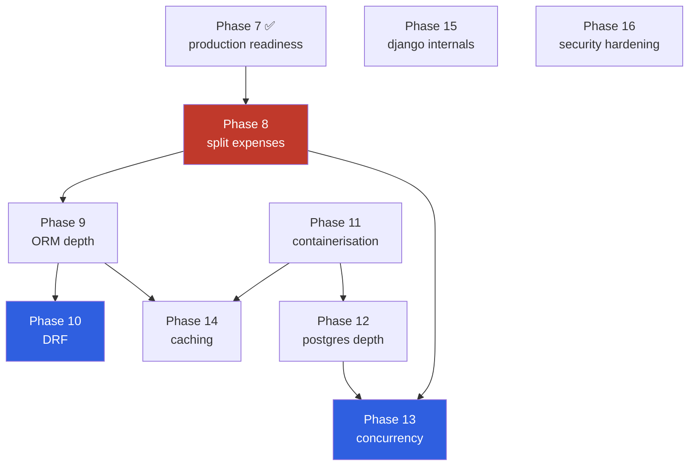

# Commit Plan — industry-standard Django build order

> Companion to [BUILD_LOG.md](BUILD_LOG.md) and [DJANGO_CHEATSHEET.md](DJANGO_CHEATSHEET.md).
>
> One commit = one reviewable idea. Each phase ends with a **git tag**, so months later you can run
> `git diff phase-2-auth phase-3-crud` and see exactly what a given step changed at code and
> architecture level. That is the whole point of this document.

---

## 0. The two rules that decide the order

Most of Django's build order is soft preference. Two things are genuinely hard constraints, and
getting them wrong costs real rework:

1. **Custom user model must land before the first migration you care about.** Everything else can
   be reordered. This one cannot.
2. **Auth must exist before user-scoped CRUD.** Views written without `request.user` get rewritten,
   not extended, when auth arrives.

Everything after that follows one principle:

> **Build vertical slices, not horizontal layers.**
> Not "all models → all views → all templates". Instead: one model end-to-end (model → url → view →
> form → template → test), then the next. You discover a modelling mistake while writing the form,
> not three weeks later. Horizontal layering is the single most common way a solo project stalls.

---

## 1. Conventions

**Commit messages** — Conventional Commits, so `git log --grep` is useful later:

```
feat(expenses): add category CRUD views
fix(expenses): scope expense queryset to request.user
chore(config): split settings into base/dev/prod
test(expenses): cover ownership boundaries
refactor(expenses): extract OwnerQuerysetMixin
docs: record phase 3 in build log
```

**Phase tags** — after the last commit of each phase:

```bash
git tag -a phase-1-foundation -m "Repo hygiene, custom user, settings split"
git tag -a phase-2-auth       -m "Login, logout, signup"
# later, to review what a phase actually changed:
git diff phase-1-foundation phase-2-auth --stat
git log phase-1-foundation..phase-2-auth --oneline
```

**Per-phase discipline:** last commit of every phase is a `docs:` commit updating
[BUILD_LOG.md](BUILD_LOG.md). That keeps the mind map current instead of reconstructed later.

---

## 2. The build order

Status: ✅ done · 🔜 next · ⬜ planned

### Phase 0 — Project scaffold ✅ *(commits `925f501`, `b3cf8d5`)*

| # | Commit | Files | Architecture note |
|---|---|---|---|
| 0.1 | `chore: bootstrap django project` | `config/`, `manage.py` | `startproject config .` — repo root layout |
| 0.2 | `feat(expenses): add category and expense models` | `models.py`, `admin.py`, `0001_initial.py` | Domain modelling with DB-level constraints |

> ⚠️ Done slightly out of order — models landed before foundation. Phase 1 corrects this while it's
> still cheap.

---

### Phase 1 — Foundation 🔜 *(do this before any view code)*

| # | Commit | Files | Architecture note |
|---|---|---|---|
| 1.1 | `chore: add gitignore and requirements, untrack venv` | `.gitignore`, `requirements.txt` | Dependency manifest replaces committed venv |
| 1.2 | `feat(accounts): add custom user model` | `accounts/`, `settings.py`, migrations reset | **The irreversible one.** `AUTH_USER_MODEL = "accounts.User"`. No change to `expenses/models.py` because it already uses the indirection |
| 1.3 | `chore(config): move secrets to environment` | `settings.py`, `.env.example` | `SECRET_KEY`/`DEBUG` out of source. Optional-but-recommended: split `settings/base.py` + `dev.py` + `prod.py` |

**Tag:** `phase-1-foundation`
**Deferrable:** 1.3 only. 1.1 and 1.2 get more expensive every session.

---

### Phase 2 — Authentication ✅ *(tag `phase-2-auth`, built after phases 3–4.5)*

> **Outcome:** the bet held. Landing this phase changed `LOGIN_URL` and one test assertion, and
> touched **no view code in `expenses/`**. As built it is five commits — `4a05ec4`, `43eb608`,
> `e640e21`, `ecef23a`, `c63bdfd` — with a model change (unique email) first, because password
> reset looks users up by email and `AbstractUser` leaves it blank and non-unique.

| # | Commit | Files | Architecture note |
|---|---|---|---|
| 2.1 | `feat(accounts): wire django.contrib.auth urls` | `config/urls.py` | `include("django.contrib.auth.urls")` — login/logout/password reset for free |
| 2.2 | `feat(accounts): add login and logout templates` | `templates/registration/` | Django looks for `registration/login.html` by convention |
| 2.3 | `feat(accounts): add signup view` | `accounts/views.py`, `forms.py` | `UserCreationForm` subclass — the one auth piece Django doesn't hand you |
| 2.4 | `chore(config): set login redirect settings` | `settings.py` | `LOGIN_REDIRECT_URL`, `LOGOUT_REDIRECT_URL`, `LOGIN_URL` |

**Tag:** `phase-2-auth`
**Why before CRUD:** every view in phase 3 uses `LoginRequiredMixin` and `request.user`. Retrofitting auth means rewriting them.

---

### Phase 3 — CRUD vertical slice ✅ *(tag `phase-3-crud`)*

> **As built**, 3.1 was folded into 3.2 — a urlconf pointing at views that don't exist yet won't
> import, so it can't stand as its own working commit. Scoping (3.4) was written *into* each slice
> rather than bolted on afterwards; the separate commit became the mixin extraction instead. Three
> commits: `ddf74ad`, `2a41c15`, `57b91d2`.

Category before Expense — `Expense.category` is a FK, so you need categories to exist before the
expense form is usable.

| # | Commit | Files | Architecture note |
|---|---|---|---|
| 3.1 | `feat(expenses): add app urlconf and base template` | `expenses/urls.py`, `templates/base.html` | `include()` from root URLConf — apps own their URL namespace |
| 3.2 | `feat(expenses): add category CRUD` | `views.py`, `forms.py`, `templates/` | First full slice. CBVs (`ListView`/`CreateView`/`UpdateView`/`DeleteView`) |
| 3.3 | `feat(expenses): add expense CRUD` | `views.py`, `forms.py`, `templates/` | Second slice. `ModelForm` with `clean_*` validation |
| 3.4 | `fix(expenses): scope querysets and forms to request.user` | `views.py`, `forms.py` | **The security boundary.** `get_queryset()` filters by user; the category dropdown must only show *my* categories |
| 3.5 | `refactor(expenses): extract owner-scoping mixin` | `expenses/mixins.py` | Once 3.4 is duplicated 6×, extract it. Refactor *after* the duplication is real |

**Tag:** `phase-3-crud`
**This is the phase that matters most for interviews** — it's where user-scoping, `get_queryset` overrides, and object-level ownership live.

---

### Phase 4 — Tests ✅ *(tag `phase-4-tests`)*

> **As built:** a fourth file, `test_forms.py`, was added — the forms carry real logic (duplicate
> checks, dropdown scoping) that belongs neither with models nor views. 59 tests across 3 commits:
> `ad9e729`, `e6da1e1`, `c95e20a`.

| # | Commit | Files | Architecture note |
|---|---|---|---|
| 4.1 | `test(expenses): cover model constraints` | `tests/test_models.py` | Assert the DB rejects `amount <= 0` and duplicate category names |
| 4.2 | `test(expenses): cover CRUD views and auth redirects` | `tests/test_views.py` | Anonymous user → redirected to login |
| 4.3 | `test(expenses): cover ownership boundaries` | `tests/test_permissions.py` | **User A must get 404 on user B's expense** — the test that proves phase 3.4 works |

**Tag:** `phase-4-tests`
**Honest note:** in a real team these are written *in the same commit as the feature*. Splitting them out is a learning-project concession so you can see the whole test surface at once. From project 2 onward, fold them into the feature commit.

---

### Phase 5 — Read layer ✅ *(tag `phase-5-dashboard`)*

> **As built:** two commits, `06ae873` and `c41b0ee`. The aggregation was extracted to
> `managers.py` + `summaries.py` up front rather than lifted out of the view later, because phase 6
> needs it from a Celery task. Dashboard took a **date range** defaulting to the current month
> rather than a month picker, so one query shape serves both the UI and the digest.

| # | Commit | Files | Architecture note |
|---|---|---|---|
| 5.1 | `feat(expenses): add dashboard with category aggregation` | `views.py`, `templates/` | `values().annotate(Sum())` — the query the digest email will reuse |
| 5.2 | `feat(expenses): add date filtering and pagination` | `views.py`, `filters.py` | `Paginator` / `ListView.paginate_by` |
| 5.3 | `perf(expenses): add select_related to list views` | `views.py` | Fix the N+1 — measure with `qs.query` / django-debug-toolbar |

**Tag:** `phase-5-dashboard`

---

### Phase 6 — Async and scheduled work ✅ *(tag `phase-6-async`)*

> **As built:** three commits — `a78713d`, `15a9d2a`, `5eedafc`. Verified against a real Redis and a
> real worker rather than eager mode alone. The digest bug (`iterator()` + commit-in-loop) is the
> clearest example in this project of why `TransactionTestCase` exists.

The phase this whole project exists to demonstrate. See BUILD_LOG §5 for the Celery-vs-cron rationale.

| # | Commit | Files | Architecture note |
|---|---|---|---|
| 6.1 | `chore: add celery and redis broker` | `config/celery.py`, `settings.py` | `app.autodiscover_tasks()`, `__init__.py` wiring |
| 6.2 | `feat(expenses): add async csv export` | `tasks.py`, `views.py` | **Request-triggered** — view returns immediately, task emails the file. The pattern interviewers probe |
| 6.3 | `feat(expenses): add monthly digest management command` | `management/commands/`, `models.py` | `MonthlyDigest(user, month)` unique constraint = idempotency |
| 6.4 | `feat: add beat/cron schedule for digest` | `settings.py` or crontab | Scheduled, not request-triggered — deliberately *not* Celery-first |

**Tag:** `phase-6-async`

---

### Phase 7 — Production readiness ✅ *(tag `phase-7-production`)*

> **As built:** three commits — `aa4fa4d`, `61f9fc1`, `80e0fb0`. The README landed earlier, so 7.4
> became a correction instead. Two bugs surfaced that neither the plan nor the tests predicted: the
> `if not DEBUG` gate runs at *import* time, which broke 106 CI tests via the SSL redirect and made
> `override_settings` useless for testing the block; and `500.html` was unparseable because the
> comment explaining "no `{%` tags here" spelled the tags out inside an **HTML** comment, which
> Django parses anyway. See BUILD_LOG session 8.

| # | Commit | Files | Architecture note |
|---|---|---|---|
| 7.1 | `chore(config): harden production settings and add logging` | `settings.py` | HSTS, secure cookies, `SILENCED_SYSTEM_CHECKS` with a reason |
| 7.2 | `feat: add error page templates` | `templates/`, `tests/` | Only render with `DEBUG=False`. 500 must be standalone |
| 7.3 | `ci: make the deploy check a gate` | `ci.yml` | `--fail-level WARNING`; test job relaxes the SSL redirect only |

**Tag:** `phase-7-production`

---

## 2b. The second half — phases 8 to 16

> **All sixteen phases are complete.** Every `⬜` below is now `✅`, and what was *planned* often
> differs from what was *built* — the deviations are recorded in BUILD_LOG and DECISIONS rather than
> quietly edited out of this file.
>
> Phases 0-7 built a correct Django app. Phases 8-16 are about **depth**: the concepts a reviewer
> probes at 2-3 years that a CRUD app never forces you to meet.
>
> The rule for this half is **utility first**. Every phase ships something a user of this app would
> actually want, and the concept rides along. No phase exists to host a concept. Where a phase
> closes a numbered issue from BUILD_LOG §6, that is noted — five of the nine do.

### The dependency graph



**The one non-obvious edge is `P12 → P13`.** `select_for_update()` is a **no-op on SQLite**, which
locks the whole database rather than individual rows. Running the concurrency phase first would
teach the API without the behaviour, and the race test would pass for the wrong reason. Postgres has
to land first, and compose is the cheapest way to get it — which is why containerisation, the phase
that looks most deferrable, sits in the middle.

### Phase 8 — Split expenses ✅ *(tag `phase-8-splitting`)*

> **The domain change the rest of the half depends on.** An expense can be shared. Participants are
> plain strings owned by you, **not** `User` rows — no invitations, no account linking, no second
> tenancy model. An expense either splits evenly across participants, or itemises, with each line
> item shared by its own subset.

| # | Commit | Files | Architecture note |
|---|---|---|---|
| 8.1 | `feat(expenses): add participants` | `models.py`, `forms.py`, `views.py` | Owner-scoped, `unique(owner, name)`. Same scoping lesson as `Category`, third time |
| 8.2 | `feat(expenses): split an expense evenly across participants` | `models.py`, `forms.py` | Plain `ManyToManyField`, auto through table. `ModelMultipleChoiceField` must be scoped or it leaks every participant |
| 8.3 | `feat(expenses): add line items` | `models.py`, `forms.py`, `templates/` | `inlineformset_factory` — the first formset in the project |
| 8.4 | `feat(expenses): share items across participants` | `models.py` | **Explicit through model** `ItemShare` carrying a weight. The half of M2M a tag list never teaches |
| 8.5 | `test(expenses): cover the split invariants` | `tests/` | Items must sum to the expense total; shares must reconstitute each item |

**Tag:** `phase-8-splitting`

**The four lessons this phase exists for:**

1. **Both halves of many-to-many, in one domain.** An even split needs no through model. A per-item
   share carries data, so it needs an explicit one. The question "when do I need `through=`" answers
   itself instead of needing a contrived example.
2. **An invariant the database cannot express.** Line items must sum to the expense total. A
   `CheckConstraint` sees one row and cannot reach across children, so this validation lives in the
   form and a transaction, not the schema. Deciding *which* invariants a database can hold is the
   real lesson.
3. **`commit=False` and `save_m2m()`.** A many-to-many cannot be written before the parent row has a
   primary key. The formset makes this unavoidable rather than academic.
4. **Decimal remainders.** Splitting `100.00` three ways gives `33.33` three times and loses a paisa.
   Someone absorbs it. Tests assert the parts always reconstitute the whole.

**Deliberately out of scope:** debt simplification — collapsing "A owes B, B owes C" into minimal
transfers. It is a graph problem and the point where this stops being bounded. Balances are shown raw.

### Phase 9 — ORM depth ✅ *(tag `phase-9-orm`)*

| # | Commit | Architecture note |
|---|---|---|
| 9.1 | `perf(expenses): prefetch items, shares and participants` | **Two levels** of N+1, not one. `Prefetch` with a filtered inner queryset |
| 9.2 | `feat(expenses): search across notes, items and participants` | `Q` objects. `.distinct()` — an M2M filter duplicates rows until you add it |
| 9.3 | `feat(expenses): show per-participant balances` | `values().annotate(Sum())` across a three-table join |
| 9.4 | `perf(expenses): annotate categories with their last spend` | `Subquery` / `OuterRef` |
| 9.5 | `test(expenses): pin query counts` | `assertNumQueries`. Also covers `only()`/`defer()` and the deferred-field N+1 |

**Tag:** `phase-9-orm` · Also: `F()` comparing two columns, `bulk_create` (and what it skips), `exists()` vs `count()`.

### Phase 10 — Django REST Framework ✅ *(tag `phase-10-api`)*

| # | Commit | Architecture note |
|---|---|---|
| 10.1 | `feat(api): add serializers and a router` | `ModelSerializer`, `validate_<field>` mirroring the existing `clean_<field>` |
| 10.2 | `feat(api): accept a full expense with items and shares` | **Writable nested serializers** — the case people get wrong |
| 10.3 | `fix(api): scope querysets, not just object permissions` | `has_object_permission` **never runs on list**. Relying on it alone ships a data leak |
| 10.4 | `feat(api): add pagination, throttling and versioning` | Cursor vs offset pagination |
| 10.5 | `perf(api): fix the serializer N+1` | Nested serializers re-query per row unless `get_queryset` prefetches |

**Tag:** `phase-10-api` · Closes nothing, but it is the Tier-1 gap STUDY_MAP §5 flagged.

### Phase 11 — Containerisation ✅ *(tag `phase-11-docker`)*

| # | Commit | Architecture note |
|---|---|---|
| 11.1 | `chore: add dockerfile and compose` | web, worker, beat, redis, postgres. Multi-stage, non-root |
| 11.2 | `chore(config): split settings into base/dev/prod` | Closes issue 7 |
| 11.3 | `chore: serve static files with whitenoise` | `STATIC_ROOT`, `collectstatic`, gunicorn replacing `runserver` |

**Tag:** `phase-11-docker` · **Closes issues 7 and 14.** Also removes the manual Redis and worker
startup documented in RUNNING_ASYNC.md — one command instead of three terminals.

### Phase 12 — Postgres depth ✅ *(tag `phase-12-postgres`)*

| # | Commit | Architecture note |
|---|---|---|
| 12.1 | `chore: move to postgres` | `DATABASE_URL` already supports it. Expect real behaviour differences to surface |
| 12.2 | `fix(expenses): make category uniqueness case-insensitive` | `UniqueConstraint(Lower("name"), "user")` — **closes issue 11**, the DB finally agreeing with `clean_name` |
| 12.3 | `perf(expenses): add composite and partial indexes` | `(user, spent_on)`. `EXPLAIN ANALYZE` before and after, recorded in the build log |
| 12.4 | `feat(expenses): replace icontains search with full-text search` | `SearchVector` + GIN — **closes issue 17**, the unindexable leading-wildcard `LIKE` |

**Tag:** `phase-12-postgres` · **Closes issues 11 and 17.**

### Phase 13 — Concurrency and transactions ✅ *(tag `phase-13-concurrency`)*

| # | Commit | Architecture note |
|---|---|---|
| 13.1 | `feat(expenses): settle up with a participant` | The feature that needs the lock |
| 13.2 | `fix(expenses): lock the balance while settling` | `select_for_update()`. Without it, two requests double-settle |
| 13.3 | `fix(expenses): fire export tasks after commit` | `transaction.on_commit`. A task queued inside an open transaction can run before the row exists — **the classic Celery bug, in the setup phase 6 already built** |
| 13.4 | `test(expenses): prove the race` | `TransactionTestCase` with concurrent writers |

**Tag:** `phase-13-concurrency` · Also: savepoints, nested `atomic`, the `get_or_create` race.

### Phase 14 — Caching ✅ *(tag `phase-14-caching`)*

| # | Commit | Architecture note |
|---|---|---|
| 14.1 | `chore(config): add redis cache backend` | A **different Redis db index** from the Celery broker |
| 14.2 | `perf(expenses): cache the dashboard aggregation` | Low-level API, key includes user id **and** date range |
| 14.3 | `fix(expenses): invalidate on write` | Any expense, item or share write busts that user's keys |
| 14.4 | `test(expenses): prove cache_page leaks` | Build it, **demonstrate one user seeing another's totals**, then reject it for the low-level API |

**Tag:** `phase-14-caching` · Also: stampede (`get_or_set` is not atomic), and clearing the cache between tests.

### Phase 15 — Django internals ✅ *(tag `phase-15-internals`)*

| # | Commit | Architecture note |
|---|---|---|
| 15.1 | `feat(config): add request id middleware` | Traces one request across log lines. Pairs with the `LOGGING` dict from phase 7. Middleware **ordering** matters and this shows why |
| 15.2 | `feat(expenses): add currency template filter` | First `templatetags/` package in the project |
| 15.3 | `refactor: move nav counts to a context processor` | Stop passing the same value from six views |
| 15.4 | `docs: signals, and why this project has none` | Implement one, then argue the case against. **Closes issue 18** via `assertContains` on rendered numbers |

**Tag:** `phase-15-internals` · **Closes issue 18.**

### Phase 16 — Security hardening ✅ *(tag `phase-16-hardening`)*

| # | Commit | Architecture note |
|---|---|---|
| 16.1 | `feat(accounts): rate limit login and password reset` | **Closes issue 15** — the largest remaining auth gap |
| 16.2 | `feat(accounts): verify email on signup` | **Closes issue 16** |
| 16.3 | `fix(accounts): make account deletion work` | Ordered delete. `user.delete()` currently raises `ProtectedError` — **closes issue 10** |
| 16.4 | `feat(expenses): expire generated exports` | Beat schedule deleting files older than N days — **closes issue 19** |

**Tag:** `phase-16-hardening` · **Closes issues 10, 15, 16 and 19.**

### Phase 17 — Paid-by and explicit splits ✅ *(built, not yet tagged — see sessions 20 and 21)*

> **Prerequisite:** none beyond master. This phase touches `Participant`, `Expense`, `balances.py`,
> forms, templates, and tests. It does **not** touch settlements, exports, or async — those are
> separate phases.

| # | Commit | Files | Architecture note |
|---|---|---|---|
| 17.1 | `feat(expenses): add is_self to Participant` | `models.py`, migration | `BooleanField(default=False)`. Reserves the name "You" |
| 17.2 | `feat(expenses): auto-create self-participant` | data migration | One `Participant(name="You", is_self=True)` per existing user |
| 17.3 | `feat(expenses): add paid_by to Expense` | `models.py`, migration | `ForeignKey(Participant, null=True, on_delete=PROTECT)` |
| 17.4 | `feat(expenses): backfill paid_by and participants` | data migration | Existing expenses get `paid_by=self_participant`. Self added to `participants` M2M and `ItemShare` where applicable |
| 17.5 | `refactor(expenses): remove implicit owner share from balance engine` | `balances.py` | `_charge_item` and `_charge_evenly` no longer hardcode a leading `1`. Consumption is explicit participants only |
| 17.6 | `feat(expenses): update forms for paid_by and explicit self` | `forms.py` | "Paid by" dropdown (default=self). "Split among" checkboxes include self. People list hides `is_self` |
| 17.7 | `feat(expenses): add split breakdown tab to expense form` | template, JS | Tab appears when `is_balanced()`. Shows who consumed, who paid, who owes whom |
| 17.8 | `feat(api): add paid_by to expense serializer` | `api/serializers.py` | `ScopedPrimaryKeyRelatedField` scoped to user's participants |
| 17.9 | `test(expenses): rewrite balance and split tests` | `tests/` | All balance tests updated for explicit self. New tests for paid-by, self-exclusion, third-party payer |
| 17.10 | `docs: record session 20 decisions and phase 17` | `docs/` | BUILD_LOG session 20, DECISIONS D19–D21, COMMIT_PLAN phase 17 |

**Tag:** `phase-17-explicit-splits` · **Closes issue 31.** Settlement direction (`inbound`/`outbound`) and the ledger system are deferred to a future phase.

**As built.** The table above was the plan. The work landed as a cheaper model's handoff run against
`docs/HANDOFF_PLAN.md`, so the commits do not map one-to-one onto its rows:

| Commit | Message | Plan rows |
|---|---|---|
| `384b3ee` | `feat(expenses): focus the first field on create forms` | handoff T1 (issue 29) |
| `682a55f` | `fix(expenses): pin ISO format and min-width for date inputs` | handoff T2 (issue 28) |
| `49c3aef` | `feat(expenses): add paid_by foreign key and explicit self participation` | 17.1–17.6 |
| `ebb1074` | `feat(expenses): add misc amount split by consumption with rounding tolerance` | handoff T4 (issue 32) |
| `2075653` | `feat(expenses): scope line-item picker to expense participants` | handoff T5 |
| `b9b6e0a` | `feat(expenses): add searchable chip-select widget for participants` | handoff T6 |
| `6c97437` | `feat(expenses): add split tab on expense edit page` | 17.7 |
| `83ebb10` | `fix(expenses): address review of the handoff implementation` | 17.8, plus review fixes |
| `bafcc68` | `docs: log session 21 review fixes and supersede T3 design` | 17.10 |

Three departures from the plan above, all deliberate:

- **17.8 was missed and fixed late.** The API `paid_by` field shipped unscoped; `83ebb10` scoped it.
- **The self participant is not named "You".** It is `FirstName (self)` with a numeric suffix,
  because a fixed name crashed the backfill for anyone with a contact already called "You".
- **Settlement direction was not deferred.** Netting per person needed it, so `83ebb10` made
  settlement amounts signed rather than adding an `inbound`/`outbound` field. See DECISIONS D23.

**Not tagged yet.** Tag once the owner has clicked through the phase:
`git tag -a phase-17-explicit-splits bafcc68 -m "Phase 17: paid-by, explicit splits"`.

---

## 3. Practice branches — re-implementing a phase by hand

The tags mark history. They are **not** where you practise: checking out a tag puts you in detached
HEAD, so you cannot commit. Branch off the tag instead.

The loop: start from the state *before* a phase, write that phase yourself from memory, then diff
your version against the reference.

```bash
# 1. Start from the state before phase 3, on a writable branch
git switch -c practice/phase-3 phase-1-foundation

# 2. Write the phase yourself. urls.py, forms.py, views.py, templates.
#    Do NOT look at the reference. Use the BUILD_LOG concept list as the spec.

# 3. Compare against the reference when you are done or stuck
git diff practice/phase-3 phase-3-crud -- expenses/ templates/ config/

# 4. One file at a time is usually more useful than the whole diff
git diff practice/phase-3 phase-3-crud -- expenses/views.py

# 5. Go back to the real line of work
git switch master
```

**Why this works here:** phase 3 added no migrations, and `.env` and `db.sqlite3` are gitignored, so
they survive the switch. The app runs on either branch with no re-migration and no re-setup. Check
this holds before practising a phase that *does* add migrations:

```bash
git diff <from-tag> <to-tag> --stat -- '*/migrations/*'   # empty = safe to switch freely
```

If a phase does add migrations, run `migrate` after switching, or keep a separate SQLite file per
branch via `DATABASE_URL` in `.env`.

**Grading yourself.** An empty diff is not the goal — naming and ordering will differ harmlessly.
What matters is whether you independently arrived at the load-bearing decisions. For phase 3 those are:

- `get_queryset()` scoped by user on **every** detail-bound view (not just the list)
- scoping in `get_queryset`, not `get_object`
- `user` excluded from the form's fields
- `ModelChoiceField.queryset` scoped in the form's `__init__`
- `select_related` on the list view
- a `clean_*` method backing each DB constraint

Miss one of those and the diff is telling you something real. Everything else is style.

---

## 4. Reviewing your own work later

```bash
git tag                                          # every phase boundary
git log --oneline phase-2-auth..phase-3-crud     # commits in the CRUD phase
git diff phase-2-auth phase-3-crud --stat        # files a phase touched
git diff phase-2-auth phase-3-crud -- config/settings.py   # settings drift only
git log --oneline --grep="^feat"                 # features only
git log -p --follow expenses/views.py            # how one file evolved
```

The `--stat` diff between two phase tags is the single most useful command here — it answers "what
did adding auth actually change?" in one line, which is exactly the question an interviewer asks
and the one you can't answer from memory six projects later.
