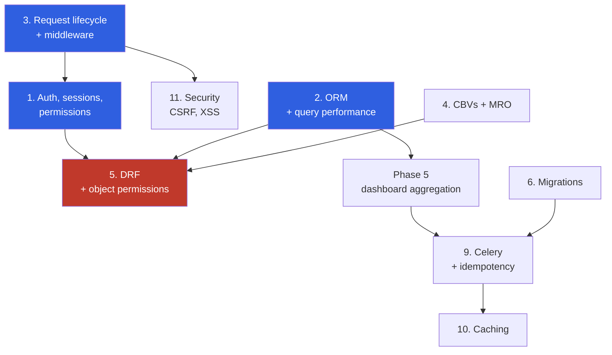

# Study Map — where depth pays, and where it doesn't

> Companion to [BUILD_LOG.md](BUILD_LOG.md). That file records what was *built*; this one records
> what must be *understood*, ranked by how likely it is to decide an interview.
>
> **Context:** ~2.8 years Frappe, switching to Django. The January 2026 interview was lost on lack
> of hands-on Django — not on theory. So the ranking below weights *"can you do it and explain why"*
> over *"can you define it"*.

**Depth legend**

| | Meaning |
|---|---|
| 🔴 **Deep** | Build it, break it, explain the internals. Expect follow-up questions three levels down. |
| 🟡 **Working** | Use it correctly and explain the trade-off. No need to know the source. |
| 🟢 **Aware** | Know it exists, what problem it solves, and when you'd reach for it. Do not sink days here. |

**Status legend:** ✅ done in this project · 🟠 touched, not deep · ⬜ not started

---

## Tier 1 — these decide interviews

### 1. Auth, sessions and permissions 🔴 ⬜

**Why it's your biggest gap:** Frappe hands you `User`, roles, `User Permission` and
`frappe.has_permission` as framework furniture. Django gives you primitives and expects you to
assemble the policy. You already flagged this as a black box — that instinct is correct, and it is
the single highest-value thing on this list.

**What "deep" means here:**

- Session auth end to end: what `login()` actually writes, where the session lives, what the cookie
  contains, how `AuthenticationMiddleware` puts `request.user` there
- `AbstractUser` vs `AbstractBaseUser` vs `PermissionsMixin` — when each is right
- `AUTHENTICATION_BACKENDS`, and writing a custom backend (email login is the classic exercise)
- Password hashing: `PASSWORD_HASHERS`, why `set_password` exists, why a plain `ModelAdmin` on a
  user model is a security bug
- `User` / `Group` / `Permission`, `user.has_perm`, `PermissionRequiredMixin`
- **Model permissions vs object-level permissions** — Django's built-in permissions are per *model*,
  not per *row*. This project's `OwnerScopedMixin` is object-level authorisation done by hand
- Session auth vs token auth vs JWT, and when each is appropriate

**Questions you should be able to answer cold:**
- "A user logs in. Walk me through what happens, from POST to the next request being authenticated."
- "How do you restrict a view to only the rows the current user owns?" *(you've built this)*
- "Why 404 rather than 403 for another user's record?" *(you've built this — know the answer)*
- "How would you add login-by-email without breaking the existing username login?"

**In this project:** phase 2, deliberately deferred so it gets proper time.

---

### 2. The ORM, and query performance 🔴 🟠

**Why:** the most-asked Django topic, by a wide margin. Also the easiest place to look junior — a
candidate who cannot spot an N+1 is filtered fast. Frappe's `get_list` hid this from you.

**What "deep" means:**

- **Querysets are lazy.** When does a query actually execute? What causes a second one?
- `select_related` (SQL JOIN, forward FK) vs `prefetch_related` (second query, M2M and reverse FK) —
  and *why* they are different mechanisms rather than one flag
- `annotate` vs `aggregate`; annotating across a reverse relation
- `F()` for referencing a column in an update (and dodging a race condition), `Q()` for OR/NOT
- `values()` / `values_list()` and when dropping to dicts is right
- `Subquery` / `OuterRef` / `Exists` — the step up from basic filtering
- `only()` / `defer()`; `exists()` vs `count()` vs truthiness
- `select_for_update()`, `transaction.atomic()`, and what actually rolls back
- Reading `print(qs.query)` and an `EXPLAIN` plan
- Where indexes help, and why `Meta.indexes` on `(user, spent_on)` is the right shape here

**Questions:**
- "This page makes 200 queries. Find out why and fix it." *(the single most common practical task)*
- "Difference between `select_related` and `prefetch_related`?"
- "Increment a counter safely under concurrency." → `F()`, not read-modify-write
- "`filter().exclude()` vs `filter(Q(...) & ~Q(...))` — same result?"

**In this project:** `select_related` and `assertNumQueries(4)` in phase 3–4; aggregation lands in
phase 5. **Go deeper than the project requires.**

---

### 3. Request/response lifecycle and middleware 🔴 ⬜

**Why:** Frappe hides the whole pipeline. Interviewers use this to separate people who *use* a
framework from people who *understand* one. It's also the frame that makes auth, CSRF and sessions
click, so studying it before topic 1 pays off.

**What "deep" means:** WSGI/ASGI entry → middleware chain → URL resolution → view → template →
response, and back out through middleware in reverse. Writing a custom middleware. Why
`AuthenticationMiddleware` must come after `SessionMiddleware`. What `CsrfViewMiddleware` checks and
why the token is per-session. Where exceptions are caught.

**Questions:**
- "What happens between the browser sending a request and your view function running?"
- "Write middleware that logs slow requests."
- "Why does middleware order matter? Give an example of a wrong order."

---

### 4. Class-based views and the MRO 🔴 🟠

**Why:** you *use* these already, so it's fair game for deep follow-ups. "I used `ListView`" invites
"what does it do?" — and not having an answer is worse than having used a function view.

**What "deep" means:** `as_view()` → `dispatch()` → `get`/`post`. Where `get_queryset`,
`get_context_data`, `get_form_kwargs`, `form_valid` sit in the chain. Why mixin order matters and
how Python's MRO resolves it. **When a CBV is the wrong choice** — a strong answer names cases where
a function view is clearer.

**Questions:**
- "Walk me through what `ListView` does between the URL match and the template rendering."
- "Why does `LoginRequiredMixin` have to come first?" *(you've hit this — `OwnerScopedMixin` bundles
  it deliberately)*
- "When would you not use a CBV?"

---

### 5. Django REST Framework 🔴 ⬜ — **the gap you haven't noticed**

**Why I'm flagging this unprompted:** a large share of Django job postings are API roles, and this
project is server-rendered templates only. You could do everything else on this list well and still
be filtered by a JD that says "Django + DRF". Frappe gave you REST endpoints for free from the
DocType, so you have never hand-built a serializer.

**What "deep" means:** `Serializer` vs `ModelSerializer`, validation and `validate_<field>`,
`APIView` vs `GenericAPIView` vs `ViewSet`, routers, permission classes (and object-level
`has_object_permission` — the DRF mirror of your `OwnerScopedMixin`), authentication classes,
pagination, throttling, versioning, `select_related` inside serializers to avoid N+1.

**Recommendation:** add a DRF phase to this project — the same two models exposed as a JSON API.
The scoping lessons transfer directly, which makes it cheap to build and a strong talking point.

---

## Tier 2 — solid working knowledge

### 6. Migrations, beyond `makemigrations` 🟡 🟠

Data migrations with `RunPython` and a reverse function. Why migrations are committed. Squashing.
Resolving conflicting migrations on a shared branch. **Zero-downtime schema change** — add nullable,
backfill, then make non-null, as three deploys. Frappe's auto-sync from DocType JSON means you have
never had to think about ordering.

*Question:* "Add a non-nullable column to a table with 10 million rows, no downtime. How?"

### 7. Forms and validation 🟡 ✅

`clean_<field>` vs `clean()` vs model `full_clean()`. What `_post_clean` does. **Why a `ModelForm`
cannot validate a `UniqueConstraint` on a field the form excludes** — you hit this for real; it's a
genuinely good story. Formsets. Widgets. `initial` vs `instance` vs `data`.

### 8. Testing, past what you have 🟡 ✅

You now have 61 tests, so the follow-ups get sharper: `TestCase` vs `TransactionTestCase` (and *why*
`assertRaises(IntegrityError)` needs `atomic()` — you have this), `override_settings`, mocking
external calls, freezing time, fixtures vs factories, what coverage does and does not prove.
Testing Celery tasks with `CELERY_TASK_ALWAYS_EAGER` and why that is a partial lie.

### 9. Celery and background work 🟡 ⬜

Phase 6. Broker vs result backend. **Idempotency** — the `MonthlyDigest(user, month)` unique
constraint. Retries, `acks_late`, visibility timeout, what happens when a worker dies mid-task.
Why passing a model *instance* to a task is a bug and you pass the pk. Beat vs cron.

*Question:* "Your task ran twice. Why, and how do you make that harmless?"

### 10. Caching 🟡 ⬜

Per-site / per-view / template fragment / low-level API. Redis as backend. **Invalidation** —
the actual hard part. Cache stampede. What is safe to cache in a multi-user app (hint: your
user-scoped querysets are exactly what you must be careful with).

### 11. Security 🟡 🟠

CSRF: what the token is, why every POST form needs it, why it's per-session. XSS and Django's
autoescaping (and what `|safe` costs you). SQL injection and why the ORM protects you until you
use `.raw()` or `.extra()`. Clickjacking middleware. `check --deploy` and each warning it raises —
**you currently have 5 open**, which makes them concrete study material rather than trivia.

---

## Tier 3 — awareness only, do not sink days

| Topic | What's enough |
|---|---|
| **Signals** 🟢 | What they are, and *why many teams avoid them* — implicit control flow that makes debugging hard. Having an opinion beats having used them. |
| **Static/media files** 🟢 | `collectstatic`, WhiteNoise vs S3/CDN, why `DEBUG=False` stops serving them |
| **Deployment** 🟢 | gunicorn/uvicorn behind nginx, WSGI vs ASGI, why `runserver` is not production |
| **Django admin** 🟢 | You've done the useful 80%. Know `list_select_related`, `readonly_fields`, and that admin is not a customer-facing UI |
| **Async Django** 🟢 | `async def` views exist, ASGI, `sync_to_async`. Rising in interviews but rarely decisive yet |
| **Postgres specifics** 🟢 | Index types, `EXPLAIN`, connection pooling, `JSONField` |
| **Channels/WebSockets** 🟢 | Only if a JD mentions it |
| **GraphQL** 🟢 | Only if a JD mentions it |

---

## Suggested order

Dependencies matter more than difficulty — some topics make others click.

1. **Request lifecycle** first — it's the frame everything else hangs on, and it's cheap.
2. **Auth** next, on that frame. This is phase 2 of the build.
3. **ORM depth** in parallel, continuously. It never stops paying.
4. **CBV internals** — you already use them; close the gap between using and explaining.
5. **DRF** — the unnoticed gap. Consider a dedicated phase in this project.
6. Then Celery, caching, migrations depth as the build reaches them.

---

## The meta-point

You lost an interview on *lack of hands-on*, not lack of theory. So for every topic here, the
question to rehearse is not "what is X" but **"tell me about a time you used X, and what went
wrong."** This project is being built to generate exactly those stories:

| Story you can already tell | From |
|---|---|
| Swapping `AUTH_USER_MODEL` cost nothing because the model used the indirection | Phase 1 |
| A `ModelChoiceField` leaks every row unless you scope its queryset | Phase 3 |
| A `ModelForm` cannot validate a `UniqueConstraint` over a field it excludes | Phase 3 |
| 404 over 403, because a 403 confirms the row exists | Phase 3 |
| `CASCADE` meeting `PROTECT` broke account deletion — found by writing the test | Phase 4 |
| Isolating a reformat commit so `git blame` stays useful | Phase 4.5 |

Those are worth more in an interview than reciting the ORM API. Keep adding to this table.
