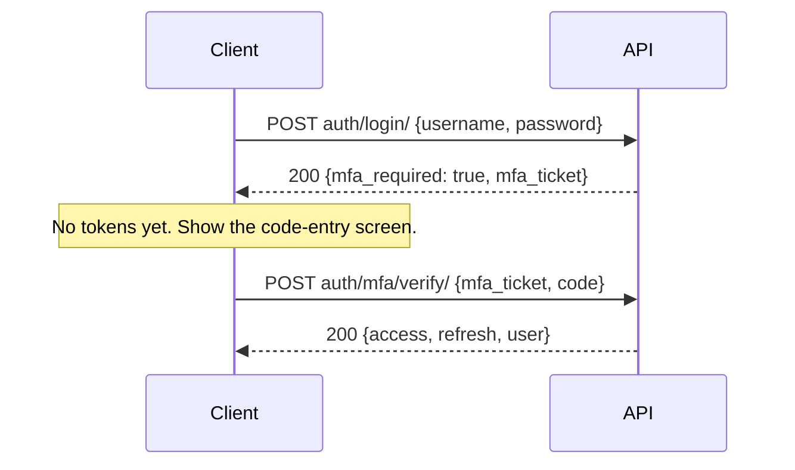
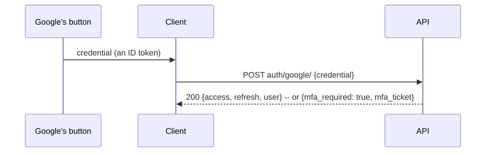

# Expense Tracker API v1 — Integration Guide

| | |
|---|---|
| **For** | Developers building a client (web or mobile) on the Expense Tracker API |
| **API version** | v1 — every path starts with `/api/v1/` |
| **Version / date** | 1.0 · 24 September 2026 |
| **Companions** | [BRD.md](BRD.md) (what to build) · [API_REFERENCE.md](API_REFERENCE.md) (every endpoint, with real examples) · [postman/](postman/) · [openapi.yaml](openapi.yaml) |

This guide covers what applies to **every** endpoint: environments, authentication, errors,
pagination, formats, uploads, downloads and background jobs. Each endpoint's own request and
response are in the [API reference](API_REFERENCE.md), recorded from a real run of the API.

---

## Contents

1. [Environments](#1-environments)
2. [Five-minute tour](#2-five-minute-tour)
3. [Authentication](#3-authentication)
4. [Cross-origin requests (CORS)](#4-cross-origin-requests-cors)
5. [Requests and responses](#5-requests-and-responses)
6. [Errors](#6-errors)
7. [Pagination](#7-pagination)
8. [Filtering and dates](#8-filtering-and-dates)
9. [Writing expenses](#9-writing-expenses)
10. [Background jobs: exports and bill scans](#10-background-jobs-exports-and-bill-scans)
11. [Rate limits](#11-rate-limits)
12. [Links in emails](#12-links-in-emails)
13. [Typed clients from the schema](#13-typed-clients-from-the-schema)
14. [Using the Postman collection](#14-using-the-postman-collection)

---

## 1. Environments

| Environment | API base URL | Interactive docs |
|---|---|---|
| Local (the Docker stack, `make up`) | `http://127.0.0.1:8765/api/v1` | `http://127.0.0.1:8765/api/v1/docs/` |
| Hosted | `https://<server>/api/v1`, supplied by the product owner | `https://<server>/api/v1/docs/` |

- **`/api/v1/docs/`** is Swagger UI: every endpoint with its fields, runnable in the browser. Use
  **Authorize** with `Bearer <access token>`.
- **`/api/v1/schema/`** is the OpenAPI 3 schema, the same file as [openapi.yaml](openapi.yaml) at
  the matching commit.
- **`/api/v1/health/`** answers `{"status": "ok"}` without sign-in, or 503 when the database is
  down.

Keep the base URL in configuration, for example `VITE_API_BASE_URL=http://127.0.0.1:8765/api/v1`.
Never hard-code it.

---

## 2. Five-minute tour

```bash
BASE=http://127.0.0.1:8765/api/v1

# 1. Log in: returns an access token, a refresh token and the profile
curl -s -X POST $BASE/auth/login/ \
  -H 'Content-Type: application/json' \
  -d '{"username": "priya", "password": "…"}'

# 2. Use the access token on every other request
ACCESS=eyJhbGciOi…
curl -s $BASE/categories/ -H "Authorization: Bearer $ACCESS"

# 3. Create something
curl -s -X POST $BASE/categories/ \
  -H "Authorization: Bearer $ACCESS" -H 'Content-Type: application/json' \
  -d '{"name": "Food"}'
```

---

## 3. Authentication

### 3.1 Tokens

The API uses **JSON Web Tokens** in the `Authorization` header. Cookies are not used.

| Token | Lifetime | Used for |
|---|---|---|
| **Access** | 30 minutes | Every request: `Authorization: Bearer <access>` |
| **Refresh** | 14 days | Only `auth/refresh/`, to get a new pair; and `auth/logout/` |

`auth/login/`, `auth/verify-email/` and `auth/password/change/` answer with a **token pair and the
profile**:

```json
{
  "access": "eyJhbGciOiJIUzI1NiIsInR5cCI6IkpXVCJ9…",
  "refresh": "eyJhbGciOiJIUzI1NiIsInR5cCI6IkpXVCJ9…",
  "user": {
    "id": 1,
    "username": "priya",
    "email": "priya@example.com",
    "first_name": "Priya",
    "last_name": "Sharma",
    "is_staff": false,
    "date_joined": "2026-09-24T09:18:18.465911+05:30",
    "last_login": "2026-09-24T09:18:18.472005+05:30",
    "self_participant": { "id": 1, "name": "priya (self)" },
    "has_password": true
  }
}
```

`self_participant.id` stands for the user in splits: it is what to send as `paid_by`, and among
`participants` and line-item `shares`, to mean "me". Keep it with the session.

`has_password` is `false` for an account created through Sign in with Google that has never set
one (§3.8) -- it has no current password to give `auth/password/change/`, so offer "set a
password" (`auth/password/reset/`) instead of a change form when it is `false`.

### 3.2 The lifecycle

```mermaid
sequenceDiagram
    participant C as Client
    participant A as API
    C->>A: POST auth/login/ {username, password}
    A-->>C: 200 {access, refresh, user}
    C->>A: GET expenses/  (Bearer access)
    A-->>C: 200
    Note over C,A: 30 minutes later the access token has expired
    C->>A: GET expenses/  (Bearer access)
    A-->>C: 401 token_not_valid
    C->>A: POST auth/refresh/ {refresh}
    A-->>C: 200 {access, refresh}  (a NEW refresh token; the old one is now dead)
    C->>A: GET expenses/  (Bearer new access), retried once
    A-->>C: 200
    C->>A: POST auth/logout/ {refresh}
    A-->>C: 204
```

**Refresh tokens rotate.** Every successful refresh returns a **new** refresh token and
**revokes the old one**. Always store the new one. A client that keeps using the old token will be
signed out on its next refresh (401 `token_not_valid`, "Token is blacklisted").

### 3.3 Refresh and retry, done once

Several requests may fail with 401 at the same moment. They must share **one** refresh: a second
refresh with the same token fails, because the first one revoked it. A minimal axios version:

```js
import axios from "axios";

export const api = axios.create({ baseURL: import.meta.env.VITE_API_BASE_URL });

let accessToken = null;                        // in memory only (§3.4)
const refreshStore = {
  get: () => localStorage.getItem("refresh"),  // or your chosen store
  set: (t) => localStorage.setItem("refresh", t),
  clear: () => localStorage.removeItem("refresh"),
};

export function setSession({ access, refresh }) {
  accessToken = access;
  refreshStore.set(refresh);
}

api.interceptors.request.use((config) => {
  if (accessToken) config.headers.Authorization = `Bearer ${accessToken}`;
  return config;
});

let refreshing = null;                         // one refresh shared by every caller

async function refreshTokens() {
  const refresh = refreshStore.get();
  if (!refresh) throw new Error("no session");
  // A bare axios call, so this request never goes through the interceptor.
  const { data } = await axios.post(
    `${import.meta.env.VITE_API_BASE_URL}/auth/refresh/`, { refresh });
  setSession(data);                            // store BOTH new tokens
  return data.access;
}

api.interceptors.response.use(undefined, async (error) => {
  const { response, config } = error;
  const isAuthCall = config.url.includes("/auth/");
  if (response?.status !== 401 || config._retried || isAuthCall) throw error;

  config._retried = true;
  try {
    refreshing ??= refreshTokens().finally(() => { refreshing = null; });
    await refreshing;
    return api(config);                        // retry the original request once
  } catch {
    accessToken = null;
    refreshStore.clear();
    window.location.assign("/login?expired=1");
    throw error;
  }
});
```

On application start with a stored refresh token, call `auth/refresh/` first to obtain an access
token, then `GET me/`.

### 3.4 Where to keep the tokens

| Token | Keep it | Why |
|---|---|---|
| Access | **In memory** (a module variable or React state) | It is short-lived, and memory is the hardest place for injected script to read from |
| Refresh | In memory **and** `localStorage` or `sessionStorage`, if sessions must survive a reload | `sessionStorage` ends with the tab, `localStorage` survives restarts. Either is readable by script on the page, so never render untrusted HTML (BRD NFR-07). Clear it on logout |

Never put a token in a URL, a query string, a log line or an error report.

### 3.5 Events that end a session

| Event | What happens to tokens |
|---|---|
| `POST auth/logout/` | That device's refresh token is revoked. Its access token still works until it expires (at most 30 minutes), so discard it on the client. |
| `POST auth/password/change/` | Every token of the user stops working, on every device. The response carries a fresh pair for the calling device — store it. |
| Password reset (`auth/password/reset/confirm/`) | Every token stops working. The user signs in again. |
| A password changed on the server's own pages | Every access token stops working (`401 password_changed`), and refreshing fails. |
| `DELETE me/` | The account is gone; every token answers 401 `user_not_found`. |

### 3.6 Signing up and verifying

`POST auth/signup/` creates an **inactive** account and emails a link to the frontend route
`/verify-email/<uid>/<token>` (§12). That page sends both parts to `POST auth/verify-email/`, which
activates the account and returns a token pair, so the user is signed in. Until then, logging in
answers 403 `email_not_verified` (only when the password was right).

### 3.7 Two-step sign-in (MFA)

Once a user turns it on, **every** sign-in asks for a code from an authenticator app (or a
recovery code) after the password — this API and the web pages alike. (The admin site has no
second-step form of its own: its login page redirects to the web login, so a staff account with
MFA on gets the same challenge there too.)



If `auth/login/`'s answer has `mfa_required: true`, there is **no `access` or `refresh` token in
it** — show a code-entry screen and send the `mfa_ticket` it carries, with the code the user typed,
to `POST auth/mfa/verify/`. That answers exactly like a plain login: a token pair and the profile.
The ticket is short-lived (5 minutes) and single-use in spirit — wrong codes count against a limit
of 5 per 15 minutes for that account (§11) — so a client should not cache or retry it silently; if
`auth/mfa/verify/` answers 400 `invalid_ticket`, send the user back to the login form.

**Managing it**, once signed in (all under `Bearer` auth):

| Request | Does |
|---|---|
| `GET auth/mfa/` | `{enabled, recovery_codes_left}` |
| `POST auth/mfa/setup/` | Starts enrolment: `{secret, otpauth_uri}`. Build a QR code from `otpauth_uri` (e.g. with a JS QR library) and also show `secret` for manual entry. Calling it again before confirming replaces the pending secret. 400 `mfa_already_enabled` if already on. |
| `POST auth/mfa/confirm/ {code}` | Confirms the pending device with a code from the app. Returns `{recovery_codes: [...ten strings], access, refresh, user}` — **the only time the codes are shown**; tell the user to save them. Every other refresh token is revoked. |
| `POST auth/mfa/disable/ {password, code}` | Turns it off. Needs the **current password and a current code** (or a recovery code) — neither alone is enough. Revokes every other refresh token. Wrong passwords and wrong codes count against the account's limits (429 `rate_limited`). |
| `POST auth/mfa/recovery-codes/ {code}` | A fresh set of ten, replacing the old one. Needs a current **authenticator** code — a recovery code does not work here, so spending the last one cannot itself mint ten more. Wrong codes count against the sign-in code limit (429). |

### 3.8 Sign in with Google

`POST auth/google/ {credential}` — an alternative to `auth/login/`, not a replacement for it: an
account can have a password, Google, or both. `credential` is the ID token Google Identity
Services hands back after someone picks an account with its own button
([docs](https://developers.google.com/identity/gsi/web)):



The server verifies `credential` with Google (signature, audience, expiry, issuer, and that the
email is Google-verified) and answers **exactly like `auth/login/`**: a token pair and the profile,
or — for an account with two-step sign-in on — `{mfa_required: true, mfa_ticket}` instead, sent to
`auth/mfa/verify/` the same way (§3.7). No separate MFA flow for Google: the same ticket, the same
code screen.

Matching is by the token's own email, case-insensitively:

* An existing, active account signs in.
* An account that signed up but never verified its email is **replaced** by a fresh account, which
  is signed in. (Its password was set by whoever signed up, which might not be the address's owner.)
* An account an admin deactivated after it was verified is **refused**, 400 `google_failed` —
  Google proving the address again does not undo that.
* No match creates a new account: active immediately, with `has_password: false` (§3.1) until it
  sets one through `auth/password/reset/`.

`404` when the server has not configured a Google OAuth client id — the feature does not exist at
all then, so hide the button rather than show one that always fails. Rate-limited by the same
per-address cap as `auth/login/`, since there is no username to key an early attempt on: `429
rate_limited`.

Building the button: load `https://accounts.google.com/gsi/client`, initialise it with the app's
client id in **callback mode** (`ux_mode: "popup"` or the default, never `"redirect"`), and send
whatever `credential` its callback receives straight to `auth/google/` — nothing else about the
token needs inspecting on the client.

---

## 4. Cross-origin requests (CORS)

A browser app served from a different origin than the API — for example a Vite dev server on
`http://localhost:5173` calling `https://api.example.com` — is allowed only if its **exact origin**
(scheme, host and port) is on the server's list, `CORS_ALLOWED_ORIGINS`. Ask the product owner to
add yours. Symptoms of a missing origin: requests fail in the browser with a CORS error, while the
same request works in Postman or curl.

- Only `/api/` paths are cross-origin enabled.
- Credentials (cookies) are not sent cross-origin and not needed: tokens travel in the
  `Authorization` header. So cross-origin requests need **no CSRF token**.
- The `Content-Disposition` response header is exposed, so downloads can read their file name.

**Alternative in development:** proxy through the dev server, so the browser sees one origin:

```js
// vite.config.js
export default {
  server: { proxy: { "/api": "http://127.0.0.1:8765" } },
};
// then VITE_API_BASE_URL=/api/v1
```

---

## 5. Requests and responses

| Topic | Rule |
|---|---|
| Format | JSON in and out: `Content-Type: application/json`. The one exception is the bill upload, which is `multipart/form-data`. |
| **Trailing slash** | **Every path ends with `/`**: `auth/login/`, `expenses/5/`. Without it, a GET is redirected and a POST, PUT, PATCH or DELETE fails. |
| Ids | Positive integers. |
| **Money** | **Strings** with two decimals: `"1450.00"`. Send strings too. Never parse amounts into binary floats for arithmetic (BRD NFR-12). |
| Dates | `YYYY-MM-DD` strings: `"2026-09-18"`. They are calendar dates, with no time zone. |
| Date-times | ISO 8601 with offset: `"2026-09-24T09:18:18.465911+05:30"`. Parse with the offset and show in local time. |
| Null | Means "none" or "not applicable", as distinct from zero. For example `unaccounted_amount` is `null` for an expense without line items. Show `null` amounts as "—". |
| Read-only fields | Sent back by the API but ignored if you send them: `id`, `created_at`, `category_name`, `paid_by_name`, `items_total`, `unaccounted_amount`, `is_balanced`, usage counts. |
| PUT vs PATCH | `PUT` replaces the whole resource, so send every writable field. `PATCH` changes only the fields sent. |
| Status codes | 200 OK, 201 created, 202 accepted (a job was queued), 204 done with no body. Errors are in §6. |

Formatting money for display:

```js
const rupees = new Intl.NumberFormat("en-IN", { style: "currency", currency: "INR" });
export const formatMoney = (value) => (value == null ? "—" : rupees.format(Number(value)));
// formatMoney("123456.78") -> "₹1,23,456.78"   (Number() is fine for display, not for arithmetic)
```

---

## 6. Errors

### 6.1 Shapes

Every error body is one of three shapes.

**A message**, for authentication, permission, not-found, conflict and rate-limit errors. `detail`
is for people and may be reworded; `code`, when present, is for programs and will not change.

```json
{ "detail": "Wrong username or password.", "code": "invalid_credentials" }
```

**Field errors**, for 400 validation failures: each field maps to a list of messages. Errors that
belong to no single field are under `non_field_errors`.

```json
{
  "amount": ["Amount must be greater than zero."],
  "spent_on": ["Date has wrong format. Use one of these formats instead: YYYY-MM-DD."]
}
```

**Errors inside lists** follow the list's shape: one entry per line item, empty for lines that are
fine.

```json
{
  "items": [
    {},
    { "shares": ["You're not part of this expense, so choose who had this item."] }
  ]
}
```

A robust client handles all three: show `detail` as a message, map field keys onto form fields
(including `items[i].field`), and show `non_field_errors` at the top of the form.

### 6.2 Status codes

| Status | Meaning | What the UI does |
|---|---|---|
| 400 | Invalid input | Show the field errors beside their fields, and keep everything the user typed |
| 401 | Not signed in, or the token is invalid or expired | Refresh and retry once (§3.3). If that fails, go to login |
| 403 | Signed in but not allowed; or the email is not verified at login | Show `detail`; never retry |
| 404 | Not found, **or not yours** — the two are indistinguishable on purpose | "Not found" page or message |
| 409 | The action conflicts with the current state | Show `detail`, which explains why. See the codes below |
| 429 | Too many requests | Show a gentle message; wait for `Retry-After` seconds when the header is present |
| 5xx | Server error | "Something went wrong. Please try again." with Retry; never a blank page |

### 6.3 Error codes

| `code` | Status | Endpoint | Meaning | UI response |
|---|---|---|---|---|
| `invalid_credentials` | 401 | `auth/login/` | Wrong username or password | "Wrong username or password." |
| `email_not_verified` | 403 | `auth/login/` | Right password; account not activated | Tell them to use the emailed link |
| `rate_limited` | 429 | `auth/login/`, `auth/password/reset/`, `auth/mfa/verify/` | Too many attempts (§11) | "Too many attempts. Try again in a few minutes." |
| `invalid_ticket` | 400 | `auth/mfa/verify/` | The `mfa_ticket` is missing, tampered with, expired (5 min), or the password changed since | Send back to the login form |
| `google_failed` | 400 | `auth/google/` | The Google ID token failed verification, or named a deactivated account | "Google sign-in failed. Try again, or use your password." |
| `mfa_already_enabled` | 400 | `auth/mfa/setup/` | Two-step sign-in is already on | Send to the manage screen instead |
| `mfa_setup_not_started` | 400 | `auth/mfa/confirm/` | No pending enrolment to confirm | Send back to `auth/mfa/setup/` |
| `mfa_not_enabled` | 400 | `auth/mfa/disable/`, `auth/mfa/recovery-codes/` | Two-step sign-in is not on | Send to the setup screen |
| `token_not_valid` | 401 | any | Access token expired or malformed; or refresh token revoked or expired | Refresh once; if it fails, sign out |
| `password_changed` | 401 | any | The password changed after this token was issued | Sign out; ask them to sign in again |
| `user_not_found` | 401 | any | The account no longer exists | Sign out |
| `token_invalid` | 400 | `auth/logout/` | That refresh token is already revoked | Treat as signed out |
| `invalid_link` | 400 | `auth/verify-email/`, `auth/password/reset/confirm/` | The link is wrong, used, or expired (24 h) | Explain; offer to start again |
| `password_breached` | 400 | `auth/signup/`, `auth/password/change/`, `auth/password/reset/confirm/` | The password has appeared in a known data breach (Have I Been Pwned) | "Choose a different password." beside the password field |
| `verification_sent` | 201 | `auth/signup/` | Account created, email sent | "Check your email" page |
| `reset_sent` | 200 | `auth/password/reset/` | Always the answer, whatever the address | Same confirmation for everyone |
| `password_set` | 200 | `auth/password/reset/confirm/` | New password saved | Go to login |
| `confirm_mismatch` | 400 | `DELETE me/` | `confirm` is not the username | Keep the dialog open, with the message |
| `protected` | 409 | `DELETE categories/{id}/`, `DELETE participants/{id}/` | Still in use; `blocking` counts what is in the way, e.g. `{"expenses": 3}` | Explain, using the counts |
| `self_participant` | 403 | `PUT/PATCH/DELETE participants/{id}/` | That person is the user themself | Should never happen if the UI hides `is_self` |
| `settled` | 201 | `balances/{id}/settle/` | A settlement was recorded | Refresh balances |
| `nothing_outstanding` | 200 | `balances/{id}/settle/` | Already even; nothing recorded | Say so; refresh |
| `not_found` | 404 | `balances/{id}/settle/` | No such person | Not found |
| `not_ready` | 409 | `exports/{id}/download/`, `bill-scans/{id}/prefill/` | The job has not finished | Keep polling (§10) |
| `failed` | 409 | `bill-scans/{id}/prefill/` | The scan could not read the bill | Show the scan's `error`; offer another photo |
| `already_saved` | 409 | `bill-scans/{id}/prefill/` | That scan is already an expense; `expense` holds its id | Open that expense |

Field-level 400s carry no `code`: the field name is the key.

---

## 7. Pagination

List endpoints return one page at a time with **cursor** links:

```json
{
  "next": "http://127.0.0.1:8765/api/v1/expenses/?cursor=cD0yMDI2LTA5LTEy",
  "previous": null,
  "results": [ … up to 25 items … ]
}
```

- Follow `next` exactly as given until it is `null`. Do not build cursors yourself.
- `page_size` sets the page length, from 1 to 100 (default 25).
- There are **no page numbers** and no "page 3 of 7". Design for infinite scroll or **Load more**.
- The **expense list** also returns `count` and `total_amount` for **everything matching the
  filters**, not only the current page. Use them for "12 expenses · ₹14,520.00".
- Order: expenses by date, newest first; categories and people alphabetically; exports, scans and
  settlements newest first.

With TanStack Query:

```js
const expenses = useInfiniteQuery({
  queryKey: ["expenses", filters],
  queryFn: ({ pageParam }) =>
    api.get(pageParam ?? "/expenses/", { params: pageParam ? undefined : filters })
       .then((response) => response.data),
  getNextPageParam: (last) => last.next ?? undefined,
});
// axios uses an absolute `next` URL as it is, ignoring baseURL.
```

---

## 8. Filtering and dates

| Endpoint | Parameters | Default when absent |
|---|---|---|
| `GET expenses/` | `start`, `end` (inclusive), `category` (id), `search` (note, line items, people), `page_size` | **All time** |
| `GET summary/` | `start`, `end` | The **current month** |
| `GET balances/` | `start`, `end` | **All time** |
| `POST exports/` (body) | `start`, `end` | The current month |
| `GET settlements/` | `participant` (id) | All |

Invalid values are a 400 naming the parameter (`{"start": ["Enter a valid date."]}`), and so is a
`start` after `end` (under `non_field_errors`). The search matches whole words in notes
(`dinner` finds "Dinner with Rahul" and "dinners") and fragments in line-item and people names.

---

## 9. Writing expenses

### 9.1 The three kinds

Nothing on an expense says which kind it is. What you send decides it (BRD BR-10):

| Send | Kind | Split |
|---|---|---|
| No `items`, and `participants` empty or only you | Yours alone | None |
| No `items`, several `participants` | Even split | Equal parts |
| `items` | Itemised | Each line between its `shares`; `misc_amount` in proportion to what each person had |

### 9.2 `include_self`: send exactly what the form shows

`include_self` is a write-only flag, and it **defaults to `true`**. When it is true, the server adds
you to `participants` whenever the list names others, **and adds you to every line that has
shares**. That default suits a quick script, but not a form with checkboxes: "only Rahul had the
drinks" would come back as a line shared 50/50 with you.

**A form must send `include_self: false`, with the exact lists it shows, including your own
`self_participant.id` wherever you are selected:**

```json
{
  "category": 1,
  "amount": "1200.00",
  "spent_on": "2026-09-18",
  "note": "Team lunch",
  "paid_by": 1,
  "include_self": false,
  "participants": [1, 2, 3],
  "misc_amount": "120.00",
  "misc_note": "GST and tip",
  "items": [
    { "name": "Pizza",   "amount": "600.00", "shares": [{"participant": 1}, {"participant": 2}, {"participant": 3}] },
    { "name": "Drinks",  "amount": "300.00", "shares": [{"participant": 2}, {"participant": 3}] },
    { "name": "Dessert", "amount": "180.00", "shares": [{"participant": 1}] }
  ]
}
```

`weight` may be left out; it defaults to 1 (equal parts), which is all this UI uses.

### 9.3 Rules the server applies

| Rule | Result when broken |
|---|---|
| `amount` > 0; `misc_amount` > 0 when sent | 400 on the field |
| `misc_amount` needs `misc_note` | 400 on `misc_note` |
| `misc_amount` needs at least one line | 400 on `misc_amount` |
| When you are not among the participants, every line needs `shares` | 400 on `items[i].shares` |
| `category`, `paid_by`, `participants` and `shares[].participant` must be your own records | 400 on the field ("Invalid pk") |
| Anyone named on a line is added to `participants` | Applied silently; the response shows it |
| Lines plus misc should equal `amount` (within ₹1) | **Saved anyway**: `is_balanced: false` and `unaccounted_amount` set; the expense is left out of balances |

### 9.4 Updating lines

- `PATCH` **without** `items` leaves the lines alone. `PATCH` with `"items": []` removes them all.
- `PUT`, or `PATCH` with `items`, **replaces** every line with what you send. Lines have ids in
  responses, but updates do not match on them: send the full list the form shows.

### 9.5 Reading a saved expense

The response adds read-only fields for display: `category_name`; `paid_by_name`; `items_total`
(null without lines); `unaccounted_amount` (null without lines — a number always means "does not
add up by this much"); and `is_balanced`. For who owes what on one expense, call
`GET expenses/{id}/split/`. Its rows are empty while `is_balanced` is false.

---

## 10. Background jobs: exports and bill scans

Both start with a request that answers **202 Accepted** at once, with a job whose `status` starts at
`pending`. A background worker does the slow part; the client polls the job.

| Job | Create | Poll | Finished when | Then |
|---|---|---|---|---|
| Export | `POST exports/` | `GET exports/{id}/` | `status` is `complete` or `failed` | `GET exports/{id}/download/` |
| Bill scan | `POST bill-scans/` (multipart, field `image`) | `GET bill-scans/{id}/` | `status` is `done` or `failed` | `GET bill-scans/{id}/prefill/`, then `POST expenses/` with `bill_scan` |

Poll every 2 seconds, and stop after 2 minutes with a "taking longer than expected" message that
leaves the job listed. Stop polling when the screen is closed.

```js
async function waitFor(path, finished, { every = 2000, timeout = 120000 } = {}) {
  const giveUp = Date.now() + timeout;
  while (Date.now() < giveUp) {
    const { data } = await api.get(path);
    if (finished.includes(data.status)) return data;
    await new Promise((resolve) => setTimeout(resolve, every));
  }
  throw new Error("still working");
}
// const job = await waitFor(`/exports/${id}/`, ["complete", "failed"]);
```

### 10.1 Uploading a bill

```js
const form = new FormData();
form.append("image", file);                 // a File from <input type="file" accept="image/*">
const { data: scan } = await api.post("/bill-scans/", form);  // the browser sets the multipart header
```

JPEG, PNG or WebP, at most 5 MB. Check both before uploading. Anything else is a 400 on `image`.

### 10.2 Downloads and images need the token

`exports/{id}/download/` and `bill-scans/{id}/image/` need the `Authorization` header like any other
endpoint, so **a plain `<a href>` or `` cannot fetch them**. Fetch them as a blob and hand
the blob to the browser:

```js
export async function downloadExport(id) {
  const response = await api.get(`/exports/${id}/download/`, { responseType: "blob" });
  const name = /filename="?([^"]+)"?/.exec(response.headers["content-disposition"] ?? "")?.[1]
    ?? `expenses-${id}.csv`;
  const url = URL.createObjectURL(response.data);
  const link = Object.assign(document.createElement("a"), { href: url, download: name });
  link.click();
  URL.revokeObjectURL(url);
}

export async function imageUrl(scanId) {       // for ; revoke it when unmounted
  const response = await api.get(`/bill-scans/${scanId}/image/`, { responseType: "blob" });
  return URL.createObjectURL(response.data);
}
```

### 10.3 Saving a scan

`GET bill-scans/{id}/prefill/` returns a draft already shaped for `POST expenses/`, including
`bill_scan`. Put it in the expense form, let the user correct it, and send it back. Each scan saves
once: a second save is a 400 on `bill_scan`. The scan's `expense` then holds the new expense's id.
When the draft endpoint answers 409 `already_saved`, open that expense instead.

---

## 11. Rate limits

| Limit | Scope | Answer |
|---|---|---|
| 3,000 requests per hour | Per signed-in user | 429 with `Retry-After` |
| 60 requests per hour | Per address, for requests without a token (login, sign-up, refresh, reset) | 429 with `Retry-After` |
| 10 failed logins per 15 minutes | Per username per address | 429 `rate_limited` |
| 50 failed logins per 15 minutes | Per address, across all usernames | 429 `rate_limited` |
| (shares the limit above) | `auth/google/` attempts, per address -- there is no username to key one on before the token is verified | 429 `rate_limited` |
| 10 sign-up attempts per hour | Per address (the web page and the API share it) | 429 `rate_limited` |
| 5 wrong current passwords per 15 minutes | Per account, on password change (page and API share it) | 429 `rate_limited` |
| 5 wrong two-step codes per 15 minutes | Per account, verifying the login ticket (`auth/mfa/verify/`) | 429 `rate_limited` |
| 5 reset requests per hour | Per email address per address | 429 `rate_limited` |
| 30 bill scans per hour | Per account (the web page and the API share it) | 429 `rate_limited` |
| 20 CSV exports per hour | Per account (the web page and the API share it) | 429 `rate_limited` |

The login limits apply to every way in (this API, the web page and the admin site), so attempts
through one count towards the others. "Address" is the caller's network address as the server's
trusted proxy reports it. Headers the client sends itself do not change it.

The scan and export limits (security pass 2) are the one exception: they are keyed on the signed-in
account, not the address, since a scan or an export ties up a worker -- and a scan spends money with
a real vision provider -- no matter which device or network the account uses.

The figures are server settings and may differ per environment. A well-behaved client polls no more
often than §10 suggests, and refreshes tokens only when a request fails with 401.

---

## 12. Links in emails

With `FRONTEND_URL` set on the server, emails triggered through the API link to these **frontend**
routes, which the frontend must implement:

| Email | Link | The page must |
|---|---|---|
| Confirm your email | `{FRONTEND_URL}/verify-email/<uid>/<token>` | `POST auth/verify-email/` with `{uid, token}`; on 200 store the tokens and go to the app |
| Reset your password | `{FRONTEND_URL}/reset-password/<uid>/<token>` | Ask for the new password twice; `POST auth/password/reset/confirm/` with `{uid, token, new_password, new_password_confirm}` |
| Your export is ready | `{FRONTEND_URL}/exports/<id>` | Show that export with a download button (signing in first if needed) |

`uid` and `token` are opaque strings: pass them on exactly as they appear in the URL.

---

## 13. Typed clients from the schema

[openapi.yaml](openapi.yaml) describes every request and response. Request and response types are
separate components, so a generated client knows that `id` is never sent and `category_name` is
never accepted. To generate TypeScript types:

```bash
npx openapi-typescript docs/frontend/openapi.yaml -o src/api/schema.d.ts
```

```ts
import type { components } from "./schema";
type Expense = components["schemas"]["Expense"];            // what the API returns
type ExpenseRequest = components["schemas"]["ExpenseRequest"]; // what you send
```

Regenerate the types whenever the schema in the repository changes.

---

## 14. Using the Postman collection

[postman/expense-tracker.postman_collection.json](postman/expense-tracker.postman_collection.json)
holds every endpoint as a runnable journey. Under each request, the responses the API actually
returned are saved as examples, both successes and errors.

1. Import the collection and an environment: [local](postman/local.postman_environment.json) or
   [hosted](postman/hosted.postman_environment.json).
2. In the environment, set `username` and `password`; for hosted, also `baseUrl`.
3. Run folder **0 · Start here**: it logs in and stores the tokens.
4. Run the other folders in order, or the whole collection in the **Runner** with folder 9
   unticked. Ids pass from request to request through collection variables, and every request
   checks its status code.
5. Folder **9** (sign-up, verification, password change and reset, account deletion) is run **by
   hand**: paste the `uid` and `token` from the emailed links into the collection variables
   `verify_uid`, `verify_token`, `reset_uid` and `reset_token`.

From the command line, with Postman's runner:

```bash
npx newman run docs/frontend/postman/expense-tracker.postman_collection.json \
  -e docs/frontend/postman/local.postman_environment.json \
  --env-var username=priya --env-var password=… \
  --working-dir docs/frontend/postman \
  --folder "0 · Start here" --folder "1 · Categories" --folder "2 · People" \
  --folder "3 · Expenses" --folder "4 · Dashboard" --folder "5 · Balances" \
  --folder "6 · Exports" --folder "7 · Bill scans" --folder "8 · Tokens and signing out"
```

The collection, the reference and the schema are **generated**: `python manage.py build_api_docs`
(or `make api-docs`) records them from a real run. Never edit them by hand.
