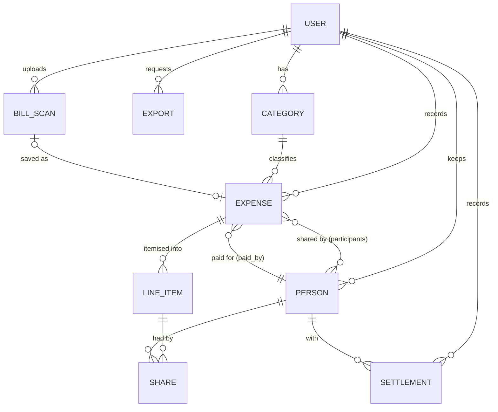
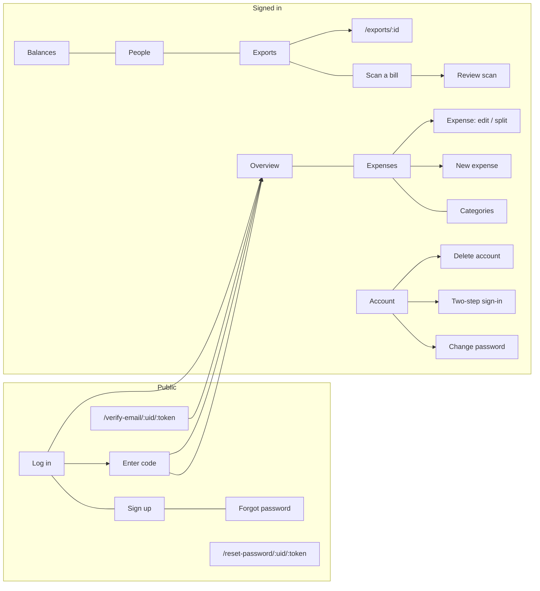
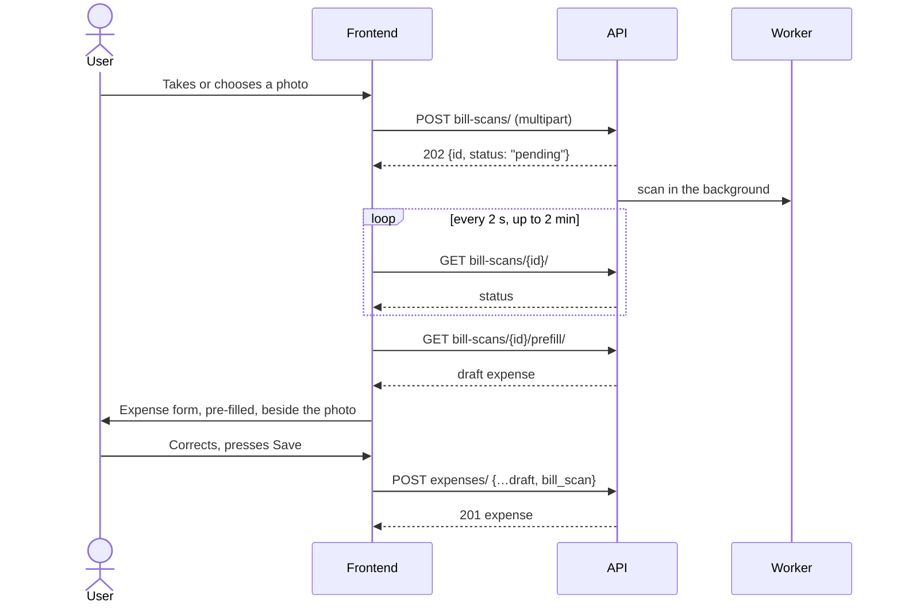

# Expense Tracker — Web Frontend

## Business Requirements and Scope of Work

| | |
|---|---|
| **Document** | Business Requirements Document (BRD) and Scope of Work (SOW) |
| **Product** | Expense Tracker — personal expenses, shared bills and settling up |
| **Deliverable** | A new web frontend (single-page application) built on the Expense Tracker API v1 |
| **Version** | 1.0 |
| **Date** | 24 September 2026 |
| **Status** | Issued for development |
| **Product owner** | Vatsal Kanojiya |
| **Audience** | The frontend developer, and anyone reviewing or accepting the work |
| **Companion documents** | [API_GUIDE.md](API_GUIDE.md) (how to talk to the API) · [API_REFERENCE.md](API_REFERENCE.md) (every endpoint with a real request and response) · [postman/](postman/) (the runnable collection) · [openapi.yaml](openapi.yaml) (the machine-readable contract) |

---

## Contents

1. [Introduction](#1-introduction)
2. [Scope](#2-scope)
3. [Users and context of use](#3-users-and-context-of-use)
4. [The domain: concepts and glossary](#4-the-domain-concepts-and-glossary)
5. [Business rules](#5-business-rules)
6. [Information architecture](#6-information-architecture)
7. [Functional requirements](#7-functional-requirements)
8. [Non-functional requirements](#8-non-functional-requirements)
9. [Technical guidance](#9-technical-guidance)
10. [Delivery plan](#10-delivery-plan)
11. [Acceptance](#11-acceptance)
12. [Change control and communication](#12-change-control-and-communication)
13. [Appendices](#13-appendices)

---

## 1. Introduction

### 1.1 Purpose of this document

This document defines **what** the new web frontend must do, and **how the work will be accepted**.
It is written to be complete: a developer who has never seen the existing application should be able
to build the frontend from this document, its companions and the API alone.

It deliberately does **not** prescribe visual design (colours, typography, layout details). Those are
the developer's to decide within the non-functional requirements in [section 8](#8-non-functional-requirements).
What it does prescribe exactly is behaviour: what each screen shows, which rules apply, which errors can
happen and what the user sees when they do. Getting those wrong produces a UI that shows wrong numbers,
which for a money application is the one failure that matters.

### 1.2 Background

Expense Tracker lets a person record what they spend, organise it by category, and split bills with
friends: evenly, or line by line from an itemised bill, including tax and tip. It keeps a running
balance of who owes whom, records when debts are settled, exports expenses to CSV, and can read a
photographed bill with a vision model to pre-fill an expense for the user to confirm.

The product exists today as a Django web application with server-rendered pages. Every action those
pages offer is now also available through a versioned JSON API (`/api/v1/`), with token
authentication and cross-origin access, so that new clients can be built independently. This
project is the first of those clients.

### 1.3 Business objectives

| # | Objective | Measured by |
|---|---|---|
| O1 | A modern, responsive web UI that people prefer to the current pages | Feature parity (section 7) and the acceptance scenarios (section 11) |
| O2 | Comfortable use on a phone, where most expenses are entered — at the table, right after paying | The responsive and touch requirements in section 8 |
| O3 | A frontend that relies only on the public API, so a mobile app can follow on the same contract | No use of the Django pages or undocumented endpoints |
| O4 | Maintainable code that another developer can pick up | The code-quality requirements in section 8 |

### 1.4 Conventions used

- **Must**, **should** and **may** have their usual specification meanings: *must* is mandatory for
  acceptance, *should* is expected unless there is a good reason, and *may* is optional.
- Requirements carry identifiers so that they can be referred to in reviews and defect reports:
  **BR** for a business rule, **FR** for a functional requirement, **NFR** for a non-functional one,
  and **AC** for an acceptance criterion.
- Amounts are Indian rupees. `code` values such as `email_not_verified` are the stable error codes
  the API returns (see [API_GUIDE.md §6](API_GUIDE.md#6-errors)).
- Endpoints are written relative to the API base, for example `POST auth/login/` for
  `https://<host>/api/v1/auth/login/`.

---

## 2. Scope

### 2.1 In scope

| # | Deliverable |
|---|---|
| D1 | A single-page web application implementing every screen in [section 7](#7-functional-requirements) |
| D2 | Authentication and session handling as specified: sign-in, token refresh, sign-out, sign-up with email verification, password change and reset, account deletion |
| D3 | Responsive layouts from 360 px phones to desktop, and accessibility to WCAG 2.1 AA |
| D4 | The three routes that emailed links open: `/verify-email/:uid/:token`, `/reset-password/:uid/:token` and `/exports/:id` |
| D5 | Source code in a Git repository with a README covering set-up, configuration (`VITE_API_BASE_URL` or equivalent), running, testing and building |
| D6 | Automated tests for business-critical logic and main flows, as set out in NFR-14 |
| D7 | A production build deployable as static files |

### 2.2 Out of scope

- Any change to the backend or the API. If a need arises, raise it through change control
  ([section 12](#12-change-control-and-communication)).
- The Django admin site, which stays as it is for operators.
- A native mobile app. The web app must, however, work well in mobile browsers.
- Changing the email address of an account. There is no endpoint for it in v1.
- Partial settlements (paying back part of a balance), unequal-weight shares in the UI, multiple
  currencies, recurring expenses, budgets, receipts other than bill scans, push notifications and
  offline data entry. These may be future work.

### 2.3 Assumptions

1. The API described in the companion documents is available: locally through the Docker stack, and
   on a hosted server with the developer's origin allowed for cross-origin requests.
2. The developer has a working account on each environment; accounts can also be created through
   sign-up.
3. On the hosted server, email delivery is configured so that verification and reset links arrive.
   Locally, emails appear in the server log.
4. The default bill-scan reader in development is a fake one that returns the same sample bill for
   any image. A real vision model may be configured on the hosted server.

### 2.4 Constraints

- The API contract in [openapi.yaml](openapi.yaml) is fixed for this project. Build against it; do
  not work around it.
- All amounts shown must be the ones the API returns. The frontend may compute a *preview* while the
  user types (FR-EXP-F-09), but anything saved or displayed afterwards comes from the server.
- Only the public API may be used — not the Django pages, and not the admin.

### 2.5 Dependencies

| Dependency | Needed for | Owner |
|---|---|---|
| Hosted API with the developer's origin in `CORS_ALLOWED_ORIGINS` | Developing against the server | Product owner |
| `FRONTEND_URL` on the server set to the deployed frontend | Emailed links opening the frontend | Product owner |
| Working email on the hosted server | Sign-up and password reset | Product owner |
| Test accounts | Development and acceptance | Product owner |

---

## 3. Users and context of use

### 3.1 The user

There is one kind of user: **an individual managing their own money**. Every user sees only their own
data. There are no teams, roles or shared ledgers.

> **Persona — Priya, 26, software engineer in Bengaluru.** Eats out with colleagues several times a
> week and shares a flat. Pays for group dinners on her card and needs to know who owes her what.
> Enters expenses on her phone right after paying; reviews spending on her laptop at the end of the
> month. Occasionally photographs a long restaurant bill rather than typing its lines.

### 3.2 The people a user splits with

Friends and flatmates are **not users**. They are names the user keeps in their own list of
**people**. Priya's "Rahul" and another user's "Rahul" are different, unrelated records, and neither
Rahul has an account or sees anything. The application is Priya's private ledger of what she and
others owe each other.

### 3.3 Context

- **Devices:** phones (primary for entry), laptops and desktops (review, exports).
- **Region:** India. Amounts are rupees with Indian digit grouping (₹1,23,456.78), and dates are
  day-first when displayed (24 Sep 2026).
- **Connectivity:** mobile data, sometimes poor. The UI must stay responsive and must never lose
  what the user typed because a request failed (NFR-09).

---

## 4. The domain: concepts and glossary



| Term | API name | Meaning |
|---|---|---|
| **Category** | `categories` | A user-defined label for spending, such as Food or Rent. Every expense has exactly one. |
| **Person** | `participants` | Someone the user splits bills with. Only a name. |
| **You (self)** | participant with `is_self: true` | The person record that stands for the user themself in splits. It is created automatically, is never shown on the People screen, and cannot be renamed or deleted. Its id is `self_participant.id` in the profile. |
| **Expense** | `expenses` | Money spent on one date, for one category, with an optional note. |
| **Paid by** | `paid_by` | The person who paid the bill. Usually the user; sometimes a friend paid. |
| **Participants** | `participants` | The people an expense is shared between. |
| **Line item** | `items[]` | One line of an itemised bill: a name and an amount. |
| **Share** | `items[].shares[]` | That a person had (part of) a line item. Every share has weight 1 in this UI, meaning equal parts. |
| **Tax, tip or other** | `misc_amount`, `misc_note` | An amount on an itemised bill beyond its lines: GST, service charge, tip. It is split in proportion to what each person had. |
| **Balanced** | `is_balanced` | Whether an itemised expense's lines plus misc add up to its amount (within ₹1). |
| **Unaccounted amount** | `unaccounted_amount` | How far an itemised expense is from adding up: positive when the lines fall short, negative when they exceed the amount. Null for expenses without line items. |
| **Split** | `expenses/{id}/split/` | How much of one expense each person consumed. |
| **Balance** | `balances/` | For each person, the net amount they owe the user (**owes you**) or the user owes them (**you owe**), after settlements. |
| **Settlement** | `settlements` | A record that a balance was paid off, in either direction. |
| **Export** | `exports` | A CSV file of the user's expenses for a date range, built in the background. |
| **Bill scan** | `bill-scans` | An uploaded photo of a bill, read in the background into a draft expense. |

---

## 5. Business rules

These rules are enforced by the API. The frontend must **reflect** them — so that users are guided
before they submit, and understand the answer when the server refuses — but must never try to
enforce a different version of them.

### Ownership and privacy

**BR-01 · Private data.** Every category, person, expense, settlement, export and scan belongs to
exactly one user, and no user can see or change another's. An id that is not the user's answers
404, exactly like an id that does not exist. The UI must treat both as "not found".

### Money

**BR-02 · Money format.** All amounts are in rupees, with exactly two decimal places. The API sends
and receives amounts as **strings** (`"1450.00"`). The frontend must:

- display amounts as `₹` with Indian grouping and two decimals, for example `₹1,23,456.78`;
- display a missing amount (`null`) as an em dash (—), which is not the same as `₹0.00`;
- send amounts as strings with at most two decimals, and never do money arithmetic in binary
  floating point (see NFR-12).

**BR-03 · Rounding never loses money.** When an amount is divided (an even split, a shared line, a
tip), the parts are rounded to the paisa so that they always add back up to the whole exactly. The
leftover paisas go to the parts that were rounded down most. Example: ₹100.00 split three ways is
₹33.34 + ₹33.33 + ₹33.33. The server computes every split. The frontend only displays them.

### Categories

**BR-04 · Category names** are required, at most 50 characters, and unique per user **ignoring
case**: `Food` and `food` are the same name.

**BR-05 · Category deletion** is only possible while a category has no expenses. Otherwise the API
answers 409 `protected` and nothing is deleted. The UI must say why, for example "Food still has 12
expenses. Move or delete them first."

### People

**BR-06 · Person names** are required, at most 60 characters, and unique per user ignoring case.

**BR-07 · The self participant** (`is_self: true`) is the user. It must not appear on the People
screen. It must appear in the expense form as "You" (or the user's name) in the **Paid by** and
**Split with** choices. It cannot be renamed or deleted (403 `self_participant`).

**BR-08 · Person deletion** is refused (409 `protected`) while the person is on any line item, or
paid for any expense. Being one of an evenly split expense's participants does not protect a
person: deleting them removes them from those splits.

### Expenses

**BR-09 · Required fields.** An expense needs a category, an amount greater than zero (at most
99,999,999.99), and a date. A note (up to 255 characters) is optional in the API but **must** be
required by the expense form, as it is on the current pages: an expense without a note is hard to
recognise later. The form heading shows the note once typed (FR-EXP-F-02).

**BR-10 · Three kinds of expense**, decided by what is filled in. Nothing stores the kind:

| Kind | When | How it is split |
|---|---|---|
| **Yours alone** | no line items, no participants other than you | Not split. Nobody owes anything. |
| **Even split** | no line items, and participants | The amount divided equally between the participants (BR-03). |
| **Itemised** | line items | Each line divided equally between the people who had it; the misc amount divided in proportion to what each person had in total. Participants do not affect the result. |

**BR-11 · Paid by** defaults to the user. When the user paid, each other person owes the user their
share. When a friend paid, the user owes that friend the user's own share, and nothing else changes
for the user.

**BR-12 · Lines nobody had.** A line item with no one selected belongs to the user alone. But if
the user is **not** among the participants, every line must name who had it (400 on the line's
`shares`). Otherwise a line would silently be charged to someone who was not there.

**BR-13 · Everyone on a line is a participant.** When a line item names someone who is not among
the participants, the server adds them. The form should do the same as the user selects them, so
that what the user sees matches what is saved.

**BR-14 · Tax, tip or other** (`misc_amount`) is allowed only on an itemised expense (at least one
line), must be greater than zero, and needs a short description (`misc_note`, up to 100 characters),
such as "GST and tip".

**BR-15 · Adding up.** For an itemised expense, lines plus misc should equal the amount. If they are
₹1 or more apart:

- the expense **still saves** — refusing a long form over one wrong figure loses the user's work;
- it is **left out of every balance** until corrected (`is_balanced: false`);
- the UI must show a clear warning with the difference, for example "₹120.00 of ₹1,200.00 is not
  accounted for by the lines or the tax/tip. This expense is left out of balances until it adds up."

Differences under ₹1 are treated as rounding and absorbed.

**BR-16 · Deleting an expense** removes it with its lines and shares. There is no undo, so the UI
must confirm first.

### Balances and settling

**BR-17 · Balances** are per person and netted: if Rahul owes the user ₹500 on one bill and the user
owes Rahul ₹200 on another, the balance is "Rahul owes you ₹300". The API returns positive amounts
in `owes_you` and `you_owe` separately, **after** settlements, and `gross` before them. Balances
cover all time unless a date range is given. Unbalanced expenses (BR-15) are not counted.

**BR-18 · Settling up** records that the **whole** outstanding balance with one person was paid, in
whichever direction it runs. There is no partial settlement in v1. Settling twice is harmless: the
second attempt answers "Nothing outstanding". The UI labels the action **Settle up** when they owe
the user, and **Mark as paid** when the user owes them.

### Dashboard

**BR-19 · Periods.** The dashboard covers a date range, by default the current calendar month. It
compares with the **previous calendar month** when the range is a whole month, and otherwise with
the equally long window just before it. The change is shown as a percentage. When the earlier
period had no spending, there is no percentage: show "—" or "No spending last period", never
"+100%" or "∞".

### Exports

**BR-20 · Exports** are CSV files with the columns `Date, Category, Amount, Note`, one row per
expense in the chosen range (both ends inclusive; the current month by default). They are built in
the background, typically in a few seconds, and the user is also emailed when one is ready. An
export and its file are **deleted automatically 7 days** after it was requested.

### Bill scans

**BR-21 · Scan input.** A JPEG, PNG or WebP photo of at most 5 MB. PDFs and other files are refused
(400 on `image`).

**BR-22 · Scans only ever produce a draft.** A scan goes `pending` → `running` → `done` or `failed`.
A finished scan provides a draft expense that the user reviews and corrects before saving. **Nothing
is saved from a model's reading without the user pressing Save.** The draft's category is filled in
only when the model's guess matches one of the user's categories exactly (ignoring case). Its date is
today when the bill's date could not be read.

**BR-23 · Once only.** Each scan can be saved as an expense once. Afterwards it links to that
expense, and a second save is refused (400 on `bill_scan`).

### Accounts

**BR-24 · Sign-up** needs a username, a unique email address and a password entered twice. Password
rules: at least 8 characters, not entirely numeric, not a commonly used password, and not too
similar to the username or email. The server reports which rule failed. A new account is
**inactive** until its email address is confirmed through the emailed link, which is valid for **24
hours** and works once. An email address or username held only by an account that never verified
counts as available: a fresh sign-up replaces it. At most 10 sign-up attempts per network address
per hour (429 `rate_limited`).

**BR-25 · Signing in** is limited to 10 failed attempts per username from one network address in
15 minutes, 50 failed attempts from one address across all usernames, and 20 failed attempts per
username from *any* address in 15 minutes (429 `rate_limited`). The last one stops guesses spread
over many addresses; it applies to the API, the web page and the admin alike, and a successful
sign-in clears it. Once it is reached, signing in with a password is refused for that account until
the window ends, **even with the right password** — so anyone can lock an account's password
sign-in for up to 15 minutes by failing 20 times (an accepted trade-off). Sign in with Google
(BR-32) and devices already signed in keep working, and the lock clears itself.
An account that has not been verified gets 403 `email_not_verified`, but only when the password
was right.

**BR-26 · Password reset** emails a link valid for **24 hours**, which works once. The request
always answers the same way, whether or not the address has an account, so that the screen reveals
nothing. At most 5 reset requests per address per hour.

**BR-27 · Password change** needs the current password. It signs the user out on **every other
device**; the current one receives new tokens and stays signed in. A reset signs out every device.
After 5 wrong current passwords in 15 minutes the account must wait (429 `rate_limited`), even
with the right one.

**BR-28 · Deleting the account** is irreversible and removes everything the user owns. The user
must confirm by typing their username.

**BR-29 · Dates.** An expense date is a calendar date without a time. "Today" means today in India
(Asia/Kolkata). Timestamps such as `created_at` are ISO 8601 with the offset, and should be shown in
the user's local time.

**BR-30 · Scan and export limits.** At most 30 bill scans and 20 CSV exports per account per hour
(429 `rate_limited`, shared by the web page and the API). Both tie up a background worker for as
long as the job takes, and a scan spends money with a real vision provider, so the limit is the
account's regardless of which device or network it uploads or requests from.

**BR-31 · Two-step sign-in (MFA)** is optional, per user, off by default. Once a user turns it on,
**every** sign-in — this API, the web pages, and the admin site, which has no login form of its own
and redirects to the web login — asks for a 6-digit code from an authenticator app, or a one-time
recovery code, after the password. No session or token is issued between the password and the
code: a signed, short-lived ticket (5 minutes) stands in for that gap, and it stops working the
moment the password changes. Five wrong codes for one account in 15 minutes lock it for 15 minutes
(429 `rate_limited`) — a limit that cannot be used to lock out someone else's account, since
reaching this step already proves the password was known. Turning it on shows ten recovery codes
**exactly once**; turning it off needs the current password **and** a current code. Either change
revokes every refresh token but the one making the request.

**BR-32 · Sign in with Google** is an alternative to a password, not a replacement for it: an
account can have either, or both. Off entirely — no button, no `auth/google/` — unless the server
has a Google OAuth client id configured. The server verifies Google's ID token itself and matches
the account by its (Google-verified) email, case-insensitively: an active account signs in; an
account that signed up but never verified its email is activated by it; an account deactivated
after being verified is refused, the same as a password login would refuse it. No match creates a
new account, active at once, with no password set. Two-step sign-in (BR-31) still applies: an
account with it on stops at the same code step, with the same ticket, whichever way the password
check was passed. At most 50 failed attempts per network address in 15 minutes — the same budget
signing in with a password shares (BR-25), since there is no username to count one against before
the token is verified.

**BR-33 · Signed-in devices.** An account can be signed in on **at most two devices at a time**
(configurable by the operator, default 2): a browser session on the server's own pages and an app
holding a refresh token each count as one, and both count towards the same limit. A third
sign-in **signs the oldest device out** (by last use); it never refuses the new one. The signed-out
app's next refresh answers 401, and it must send the user back to the login screen; its current
access token works until it expires, at most 30 minutes. A device that has gone away — expired
session or token — does not count. The user can see their devices (kind, what it calls itself,
when it signed in and was last used) and sign any of them out, from the account page on the web
and from `auth/devices/` in the API. Signing a device out, whether by the limit or by the user, is
recorded in the security trail.

---

## 6. Information architecture

### 6.1 Site map



### 6.2 Routes

The frontend **must** implement at least these routes. The three marked ✉ are opened from emails,
so their exact paths are part of the contract with the server.

| Route | Screen | Sign-in | Requirements |
|---|---|---|---|
| `/login` | Log in | no | FR-AUTH-01 |
| `/login/code` | Enter two-step code | no (mid-login) | FR-AUTH-11 |
| `/signup` | Sign up | no | FR-AUTH-05 |
| `/verify-email/:uid/:token` ✉ | Confirm email | no | FR-AUTH-06 |
| `/forgot-password` | Request a reset | no | FR-AUTH-07 |
| `/reset-password/:uid/:token` ✉ | Set a new password | no | FR-AUTH-08 |
| `/` | Overview (dashboard) | yes | FR-DASH |
| `/expenses` | Expenses | yes | FR-EXP-L |
| `/expenses/new` | New expense | yes | FR-EXP-F |
| `/expenses/:id` | Edit expense, with its split | yes | FR-EXP-F, FR-EXP-S |
| `/categories` | Categories | yes | FR-CAT |
| `/people` | People | yes | FR-PPL |
| `/balances` | Balances and repayments | yes | FR-BAL |
| `/exports` | Exports | yes | FR-XPT |
| `/exports/:id` ✉ | One export (opened from the email) | yes | FR-XPT-05 |
| `/scans` | Scan a bill, and past scans | yes | FR-SCAN |
| `/scans/:id` | Review a scan | yes | FR-SCAN |
| `/account` | Profile, password, two-step sign-in, delete account | yes | FR-ACC |
| `*` | Not found | — | FR-SYS-04 |

A signed-out user opening a signed-in route must be sent to `/login` and, after signing in, returned
to the route they asked for. Deep links such as `/expenses/42` must work after a full page reload.

### 6.3 Navigation

The primary navigation, in this order: **Overview · Expenses · Categories · Balances · People ·
Exports · Scan a bill**. **Balances** carries a small badge with the number of people who owe the
user, when there are any. An account menu shows the user's name and offers **Account** and **Log
out**. On phones the primary navigation must remain reachable within one tap (for example a bottom
bar or a menu button), and **Add expense** must be available from every signed-in screen.

---

## 7. Functional requirements

Each module lists its requirements, the API it uses (details in [API_REFERENCE.md](API_REFERENCE.md)),
and acceptance criteria. States common to every screen are in [7.12](#712-common-states-and-behaviour--fr-sys).

### 7.1 Authentication and session — FR-AUTH

**API:** `auth/login/`, `auth/google/`, `auth/refresh/`, `auth/logout/`, `auth/signup/`,
`auth/verify-email/`, `auth/password/reset/`, `auth/password/reset/confirm/`, `me/`.

| ID | Requirement |
|---|---|
| FR-AUTH-01 | **Log in** with username and password. On success, keep the tokens (NFR-06), load the profile, and go to the page the user originally asked for, or Overview. Show a clear message for each refusal: wrong username or password (401 `invalid_credentials`); email not confirmed yet, with the hint to use the emailed link (403 `email_not_verified`); too many attempts, try again in a few minutes (429 `rate_limited`). |
| FR-AUTH-02 | **Stay signed in** across page reloads for as long as the refresh token is valid (14 days), without asking for the password. |
| FR-AUTH-03 | **Refresh silently.** When a request fails with 401 because the access token expired, obtain a new pair with the refresh token, **store the new refresh token** (the old one stops working immediately), and retry the original request once. Concurrent requests must share one refresh, not start one each. If refreshing fails, sign the user out locally and go to `/login` with the message "Your session has ended. Please sign in again." See [API_GUIDE.md §3](API_GUIDE.md#3-authentication). |
| FR-AUTH-04 | **Log out** revokes the refresh token on the server (`auth/logout/`), discards both tokens and all cached data, and shows `/login`. It must succeed locally even if the server cannot be reached. |
| FR-AUTH-05 | **Sign up** with username, email, password and password confirmation. Show field errors from the server beside their fields. On success, show a "Check your email" page naming the address. |
| FR-AUTH-06 | **Confirm email** at `/verify-email/:uid/:token`: send the two parts to `auth/verify-email/` automatically on arrival. On success the user is signed in (the response is a token pair): go to Overview with "Your email is confirmed. Welcome." On 400 `invalid_link`, explain that the link is invalid or has expired, and offer Log in and Sign up. |
| FR-AUTH-07 | **Forgot password:** ask for the email, send `auth/password/reset/`, and always show the same confirmation, whatever the address. |
| FR-AUTH-08 | **Reset password** at `/reset-password/:uid/:token`: ask for the new password twice, send it with the uid and token, and on success go to `/login` with "Your password has been set." Show password-rule errors beside the fields, and handle `invalid_link` as in FR-AUTH-06. |
| FR-AUTH-09 | Signed-in users opening `/login` or `/signup` go to Overview. |
| FR-AUTH-10 | Every form that submits a password must allow showing the typed password, and must use the right `autocomplete` values (`username`, `current-password`, `new-password`). |
| FR-AUTH-11 | **Two-step sign-in (BR-31).** When `auth/login/` answers `{mfa_required: true, mfa_ticket}`, show a code-entry screen (not the tokens/profile flow) and send the ticket plus the typed code to `auth/mfa/verify/`; a right code continues exactly like FR-AUTH-01's success path. Accept a recovery code in the same box. Show "That code is wrong." on 400 with a `code` field error, "Too many attempts" on 429 `rate_limited`, and send the user back to `/login` on 400 `invalid_ticket` ("That sign-in has expired. Log in again."). |
| FR-AUTH-12 | **Sign in with Google (BR-32).** Show Google's own button on `/login` and `/signup`, in callback mode, only when the deployment names a Google client id. Send the credential it returns to `auth/google/`; the response is exactly `auth/login/`'s -- a token pair (continue as FR-AUTH-01's success path) or `{mfa_required, mfa_ticket}` (continue as FR-AUTH-11). Show "Google sign-in failed. Try again, or use your password." on 400 `google_failed`, and the same 429 handling as FR-AUTH-01. |

**Acceptance criteria**

- **AC-AUTH-1** Given a verified account, when I log in with the right password, I land on Overview
  and a reload keeps me signed in.
- **AC-AUTH-2** Given an access token that has expired, when I open Expenses, the list loads without
  any visible interruption, and the stored refresh token has changed.
- **AC-AUTH-3** When I log out and then press the browser's Back button, no private data is shown.
- **AC-AUTH-4** Given a new account, when I open the emailed link, I am signed in and see Overview.
  Opening the same link again shows the "invalid or expired" message.
- **AC-AUTH-5** Given 10 wrong passwords, the 11th attempt shows the "too many attempts" message.
- **AC-AUTH-6** Given an account with two-step sign-in on, when I enter the right password, I see
  the code screen, not Overview, and no token is stored yet.
- **AC-AUTH-7** Given the code screen, when I enter the right code from my authenticator app, I land
  on the page I originally asked for (or Overview).
- **AC-AUTH-8** Given the code screen, when I enter a wrong code five times, the sixth attempt shows
  "Too many attempts", even with the right code.
- **AC-AUTH-9** Given no account yet, when I pick an account through Google's button on `/signup`,
  I am signed in at once, with a profile whose `has_password` is `false`.
- **AC-AUTH-10** Given an account with two-step sign-in on, when I sign in with Google, I see the
  code screen, exactly as AC-AUTH-6.

### 7.2 Account — FR-ACC

**API:** `me/` (GET, PATCH, DELETE), `auth/password/change/`, `auth/mfa/`, `auth/mfa/setup/`,
`auth/mfa/confirm/`, `auth/mfa/disable/`, `auth/mfa/recovery-codes/`, `auth/devices/`,
`auth/devices/<id>/sign-out/`.

| ID | Requirement |
|---|---|
| FR-ACC-01 | Show username, email, first and last name, and date joined. First and last name are editable; username and email are read-only. |
| FR-ACC-02 | **Change password** with the current password and the new one twice. On success, store the new tokens from the response and confirm "Password changed. Other devices have been signed out." Show "current password is incorrect" on 400 `old_password`. When the profile's `has_password` (BR-32) is `false` -- a Google-only account -- show "Set a password" instead of this form, pointing to the forgot-password screen (FR-AUTH-07), which works for them since they are active with a real email. |
| FR-ACC-03 | **Delete account** in a separate, clearly dangerous section. Explain that it permanently deletes all expenses, categories, people and history. Require the username to be typed exactly before the button is enabled, then call `DELETE me/` with `confirm`. On 204, clear everything locally and show `/login` with "Your account has been deleted." |
| FR-ACC-04 | **Two-step sign-in (BR-31).** A "Two-step sign-in" section shows on/off (`GET auth/mfa/`) and, when on, how many recovery codes are left. **Turn on:** call `auth/mfa/setup/`, show the `otpauth_uri` as a QR code plus `secret` for manual entry, and a code box; on `auth/mfa/confirm/` succeeding, show the ten `recovery_codes` **once**, with a clear "save these now, they won't be shown again" and a way to copy or download them, then store the new tokens. **Turn off:** ask for the password and a code together (`auth/mfa/disable/`); show "Wrong password" or "That code is wrong" as the response says. **New recovery codes:** ask for a current authenticator code (`auth/mfa/recovery-codes/`) and show the new ten once, the same as turning on. |
| FR-ACC-05 | **Signed-in devices (BR-33).** A "Signed-in devices" section lists `GET auth/devices/` — what each device calls itself (`label`, shown as plain text), whether it is a browser or an app (`kind`), when it signed in and when it was last used — with a **Sign out** button on each (`POST auth/devices/<id>/sign-out/`, then refresh the list). Say how many devices the account can be signed in on at once and that signing in on another signs the oldest out. Signing out the device in use is allowed: discard the tokens and go to `/login`. |

### 7.3 Overview (dashboard) — FR-DASH

**API:** `GET summary/?start=&end=`.

| ID | Requirement |
|---|---|
| FR-DASH-01 | A period selector, defaulting to the current month, with quick choices **This month** and **Last month** and a custom from/to range. The chosen period should be reflected in the URL (for example `?start=2026-09-01&end=2026-09-30`) so it survives reload and can be shared. |
| FR-DASH-02 | Four figures: **Total spent**; **Versus the previous period**, as a percentage with up or down direction, plus that period's dates (BR-19); **Biggest expense**, with its amount, category and date, linking to it; and **Expenses**, the count with the average per expense. |
| FR-DASH-03 | **By category:** each category's total, its share of the period as a percentage and a proportional bar, and its count, largest first. Each row links to the Expenses list filtered by that category and period. |
| FR-DASH-04 | A link **View all N expenses in this period** to the filtered Expenses list. |
| FR-DASH-05 | Empty period: a friendly empty state with **Add expense** instead of zeros and empty charts. |

- **AC-DASH-1** For September 2026 with the sample data in Appendix C, the dashboard shows a total of
  ₹2,100.00, 2 expenses, an average of ₹1,050.00, the biggest expense ₹1,200.00 (Team lunch, Food),
  Food at 100%, and no comparison percentage, because August had no spending.

### 7.4 Expenses list — FR-EXP-L

**API:** `GET expenses/?start=&end=&category=&search=&page_size=`, then `next`.

| ID | Requirement |
|---|---|
| FR-EXP-L-01 | List the user's expenses, **newest date first**. Each row shows: date, note, category, amount, who paid when it was not the user, the people it is shared with, and a warning marker when `is_balanced` is false. |
| FR-EXP-L-02 | **Filters:** date from/to, category (the user's categories), and a text search that matches notes, line items and people. Filters are reflected in the URL. A **Clear** action appears when any filter is set. |
| FR-EXP-L-03 | Show the **count** and the **total amount** of everything matching the filters, not only the loaded page (`count`, `total_amount`). |
| FR-EXP-L-04 | Load more as the user scrolls, or with a **Load more** button, by following `next`. The API has no page numbers (see [API_GUIDE.md §7](API_GUIDE.md#7-pagination)). |
| FR-EXP-L-05 | Tapping a row opens the expense (`/expenses/:id`). |
| FR-EXP-L-06 | Empty states that distinguish "No expenses yet" (with **Add expense**) from "Nothing matches these filters" (with **Clear filters**). |
| FR-EXP-L-07 | An invalid filter value (400) is reported beside the filter, not as a broken page. |

- **AC-EXP-L-1** Searching for "lunch" in September 2026 with the sample data shows exactly Team
  lunch, and the header reads "1 expense · ₹1,200.00".

### 7.5 Expense form (create and edit) — FR-EXP-F

**API:** `POST expenses/`, `GET/PUT/PATCH/DELETE expenses/{id}/`; `GET categories/` and
`GET participants/` for the choices; `me/` for the self participant.

The form serves all three kinds of expense (BR-10). It must stay simple for the common case — an
amount, a category and a note — and reveal the splitting controls only when needed.

| ID | Requirement |
|---|---|
| FR-EXP-F-01 | **Fields:** Category (required; with an inline **New category** action), Amount (required, > 0, two decimals, numeric keypad on phones), Date (required, defaults to today, BR-29), Note (required by the form, BR-09), **Paid by** (the user and their people; defaults to the user), **Split with** (a searchable multi-select of people, the user preselected), and the line items and tax/tip section (FR-EXP-F-04). |
| FR-EXP-F-02 | The heading reads "New expense" until a note is typed, then shows the note. When editing, it shows the saved note. |
| FR-EXP-F-03 | **Even split** is the result of choosing people in *Split with* and adding no line items. Show a live preview: "₹450.00 each · 2 people". |
| FR-EXP-F-04 | **Line items** (optional): add, edit and remove lines, each with a name, an amount and **Had by**: a multi-select limited to the expense's people, with the user preselected on new lines. Plus **Tax, tip or other**: an amount and a required description, available once there is at least one line (BR-14). |
| FR-EXP-F-05 | When the user deselects themself from *Split with*, every line must name who had it, and the form shows this before submitting (BR-12). |
| FR-EXP-F-06 | Selecting someone on a line who is not in *Split with* adds them to it (BR-13). |
| FR-EXP-F-07 | **Submit exactly what is shown:** send `include_self: false` with the exact `participants` and line `shares` the form displays, the user's own id included where selected. See [API_GUIDE.md §9](API_GUIDE.md#9-writing-expenses). |
| FR-EXP-F-08 | When editing, `PUT` the whole expense. Lines are replaced by what is sent: removed lines disappear. |
| FR-EXP-F-09 | **Live totals** while typing, for itemised expenses: the sum of the lines, the tax/tip, and the difference from the amount, labelled "Unaccounted: ₹X" when short and "Over by ₹X" when over. This preview may be computed in the browser, using decimal-safe arithmetic (NFR-12). |
| FR-EXP-F-10 | **After saving**, when the response has `is_balanced: false`, show the BR-15 warning with the server's `unaccounted_amount`. The expense is saved; the warning must not read as a failure. |
| FR-EXP-F-11 | **Server errors** appear beside their fields, including errors on individual lines (`items[i].shares`, `items[i].amount`). A general error appears at the top. **Nothing the user typed is lost** when saving fails, whatever the cause. |
| FR-EXP-F-12 | **Delete** (edit mode) asks for confirmation, then returns to the Expenses list with "Expense deleted." |
| FR-EXP-F-13 | Leaving a form with unsaved changes asks for confirmation. |

- **AC-EXP-F-1** Creating "Dinner with Rahul", ₹900.00, split with Rahul and the user, saves, and
  the Split view shows ₹450.00 each.
- **AC-EXP-F-2** Creating the itemised Team lunch in Appendix C saves with `is_balanced: true`. The
  Split view shows the user ₹422.22, Aisha ₹388.89 and Rahul ₹388.89, totalling ₹1,200.00.
- **AC-EXP-F-3** Entering ₹1,200.00 with lines of only ₹900.00 and no tax shows "Unaccounted:
  ₹300.00" before saving. After saving, it shows the adds-up warning, and the expense is excluded
  from Balances.
- **AC-EXP-F-4** Entering a tax amount without a description shows the error at the description
  field, and no other field loses its value.
- **AC-EXP-F-5** Removing a line on edit and saving removes it from the Split view.

### 7.6 Expense split view — FR-EXP-S

**API:** `GET expenses/{id}/split/`.

| ID | Requirement |
|---|---|
| FR-EXP-S-01 | On the expense screen, a **Split** view (a tab or a section) shows one row per person: their share of the lines or of the even split, their share of the tax/tip, and their total. The user's row comes first, labelled "You". A totals row follows. |
| FR-EXP-S-02 | Shown for split expenses only. For an expense that is the user's alone, show "Only you — nothing to split." |
| FR-EXP-S-03 | When `is_balanced` is false, show the adds-up warning instead of the rows (the API returns none). |
| FR-EXP-S-04 | Show who paid, and what that means, for example "You paid. Rahul owes you ₹388.89 for this bill." |

### 7.7 Categories — FR-CAT

**API:** `categories/` (all methods).

| ID | Requirement |
|---|---|
| FR-CAT-01 | List categories alphabetically, each with the number of expenses, the total spent, and the date and amount of the most recent expense ("—" when unused). |
| FR-CAT-02 | Add and rename inline or in a small dialog. A duplicate name (ignoring case) is reported at the field (BR-04). |
| FR-CAT-03 | Delete with confirmation. On 409 `protected`, explain that it still has expenses, using the count from `blocking` (BR-05). |
| FR-CAT-04 | Each category links to the Expenses list filtered by it. |

### 7.8 People — FR-PPL

**API:** `participants/` (all methods).

| ID | Requirement |
|---|---|
| FR-PPL-01 | List people alphabetically, **excluding** the one with `is_self: true`, each with the number of shared expenses and line items. |
| FR-PPL-02 | Add and rename, with duplicate names reported at the field (BR-06). |
| FR-PPL-03 | Delete with confirmation. On 409 `protected`, explain that they are on line items or paid for an expense, and must be removed from those first (BR-08). |
| FR-PPL-04 | Each person links to their balance and to the Expenses list searched by their name. |

### 7.9 Balances and settling up — FR-BAL

**API:** `GET balances/`, `POST balances/{participant_id}/settle/`, `GET settlements/`.

| ID | Requirement |
|---|---|
| FR-BAL-01 | Two lists: **Owes you** and **You owe**, each with names, amounts and a total. An empty list says "Nobody owes you anything" or "You don't owe anyone". |
| FR-BAL-02 | **Settle up** (in *Owes you*) and **Mark as paid** (in *You owe*) ask for confirmation, stating the amount and direction, with an optional note ("Paid by UPI"). On 201, refresh the balances and show the recorded amount. On 200 `nothing_outstanding`, say so and refresh. |
| FR-BAL-03 | **History:** repayments recorded so far, newest first, with person, amount and direction ("Rahul paid you ₹838.89" / "You paid Aisha ₹200.00"), note and date. Filterable by person. |
| FR-BAL-04 | Explain briefly that expenses whose lines do not add up are not counted, and link to the Expenses list for finding them. |
| FR-BAL-05 | The navigation badge (section 6.3) counts the people in *Owes you*. |

- **AC-BAL-1** With the sample data in Appendix C, *Owes you* shows Rahul ₹838.89 and Aisha ₹388.89,
  a total of ₹1,227.78. Settling Rahul records ₹838.89, removes him from the list, and adds the
  repayment to History. Settling him again says there is nothing outstanding.

### 7.10 Exports — FR-XPT

**API:** `POST exports/`, `GET exports/`, `GET exports/{id}/`, `GET exports/{id}/download/`.

| ID | Requirement |
|---|---|
| FR-XPT-01 | A form with from/to dates (default: this month) and **Export to CSV**. |
| FR-XPT-02 | After requesting, show the new export at once as *Preparing…*, and poll its status every 2 seconds until `complete` or `failed`, for at most 2 minutes (see [API_GUIDE.md §10](API_GUIDE.md#10-background-jobs-exports-and-bill-scans)). |
| FR-XPT-03 | A list of exports, newest first: the period, requested time, status, number of rows, and **Download** when complete, or the error when failed. Explain that exports are kept for 7 days (BR-20). |
| FR-XPT-04 | **Download** saves the file with the name the server gives. The download needs the access token, so it cannot be a plain link; see [API_GUIDE.md §10](API_GUIDE.md#10-background-jobs-exports-and-bill-scans). |
| FR-XPT-05 | `/exports/:id`, opened from the email, shows that export with its **Download** button, and a friendly "not found" when it has expired or belongs to someone else. |

### 7.11 Scan a bill — FR-SCAN

**API:** `POST bill-scans/` (multipart), `GET bill-scans/`, `GET bill-scans/{id}/`,
`GET bill-scans/{id}/image/`, `GET bill-scans/{id}/prefill/`, `POST expenses/` with `bill_scan`.



| ID | Requirement |
|---|---|
| FR-SCAN-01 | **Upload** by taking a photo on phones (`accept="image/*"` with camera capture) or choosing a file. Check type and size (BR-21) before uploading, and show upload progress. |
| FR-SCAN-02 | After upload, show *Reading your bill…* and poll as for exports. On `failed`, show the error with **Try another photo**. |
| FR-SCAN-03 | **Review:** open the expense form (FR-EXP-F) pre-filled with the draft from `prefill/`, with the photo beside or above it (zoomable), and a clear note that the values were read automatically and should be checked. A missing category is left for the user to choose. |
| FR-SCAN-04 | **Save** sends the corrected expense with the draft's `bill_scan` id. On success, go to the new expense with "Expense added from your scanned bill." |
| FR-SCAN-05 | **Past scans:** a list with thumbnail, date and status, and **Review** for finished unsaved scans or **View expense** for saved ones (`expense` set). |
| FR-SCAN-06 | A scan already saved (409 `already_saved` on the draft, or 400 on `bill_scan` when saving) leads to the existing expense, never to a second one. |

- **AC-SCAN-1** On the development server (fake reader), uploading any photo produces a draft of
  "Test Cafe", ₹450.00, lines Coffee ₹150.00 and Sandwich ₹250.00, tax ₹50.00, category Food (when
  the user has one). Saving it creates one balanced expense. Pressing Save again, or reopening the
  review, cannot create a second one.

### 7.12 Common states and behaviour — FR-SYS

| ID | Requirement |
|---|---|
| FR-SYS-01 | **Loading:** skeletons or spinners appear within 100 ms of a slow request; buttons show progress and are disabled while submitting, so nothing is submitted twice. |
| FR-SYS-02 | **Success feedback:** a short, dismissible confirmation after every create, update, delete, settle and request. |
| FR-SYS-03 | **Errors:** server messages (`detail`) are shown in plain language. Unexpected errors (5xx, network) show "Something went wrong. Please try again." with **Retry**, and never a blank screen or a raw stack trace. |
| FR-SYS-04 | **Not found:** unknown routes and 404 answers show a not-found page with a way back. |
| FR-SYS-05 | **Offline:** when the network is lost, say so and keep the user's input. Retry when it returns. |
| FR-SYS-06 | **Rate limits:** a 429 shows "You're going a bit fast. Please wait a moment." and honours `Retry-After` when present. |
| FR-SYS-07 | **Freshness:** after any change, every screen shows current data. For example, after saving an expense, the dashboard, balances and category totals are updated when next shown. |

---

## 8. Non-functional requirements

| ID | Area | Requirement |
|---|---|---|
| NFR-01 | Responsive | Fully usable from 360 px wide phones to 1440 px desktops, in portrait and landscape, with no horizontal scrolling of the page. Tables become cards or stacked rows on small screens. |
| NFR-02 | Touch | Touch targets at least 44 × 44 px. Numeric fields open numeric keypads (`inputmode="decimal"`). Dates use the native picker on phones. |
| NFR-03 | Accessibility | WCAG 2.1 level AA: keyboard operable with visible focus, labelled form controls, errors announced to screen readers and tied to their fields, text contrast at least 4.5:1, and information never conveyed by colour alone. For example, owes-you and you-owe are distinguished by words, not only green and red. |
| NFR-04 | Performance | On a mid-range phone over 4G: first meaningful screen within 3 seconds; interactions respond within 100 ms; the initial JavaScript bundle under 300 KB gzipped, with routes loaded on demand. |
| NFR-05 | Browsers | Current and previous major versions of Chrome, Edge, Firefox and Safari (including iOS Safari), and Chrome on Android. |
| NFR-06 | Token security | The access token is held **in memory only**. The refresh token may be persisted so that sessions survive reloads (FR-AUTH-02), and must be cleared on logout. Tokens must never appear in URLs, in logs, or in error reports. See [API_GUIDE.md §3.4](API_GUIDE.md#34-where-to-keep-the-tokens). |
| NFR-07 | Content security | Never render server or user text as HTML (no `dangerouslySetInnerHTML` with API data). Notes and names can contain anything. |
| NFR-08 | Privacy | No third-party analytics or trackers without the product owner's written approval. |
| NFR-09 | Resilience | Failed requests never discard user input. Retrying a create after a network failure must not create a duplicate silently: check the list first, or ask the user. |
| NFR-10 | Consistency | Money, dates and numbers are formatted by one shared set of functions (BR-02, BR-29). |
| NFR-11 | Localisation | English (India) copy. Amounts in rupees with Indian grouping via `Intl.NumberFormat('en-IN', { style: 'currency', currency: 'INR' })`. Dates like "24 Sep 2026". Copy lives in one place, so that another language could be added. |
| NFR-12 | Money arithmetic | No binary floating-point arithmetic on amounts. Previews (FR-EXP-F-09) use integer paise or a decimal library; displayed results come from the server. |
| NFR-13 | Configuration | The API base URL comes from build-time configuration (for example `VITE_API_BASE_URL`), with no URL hard-coded in the source. |
| NFR-14 | Quality | Linting and formatting enforced (for example ESLint and Prettier). Unit tests for formatting, the token refresh logic and form validation. At least one end-to-end test of sign-in, adding an itemised expense, and settling up (for example with Playwright). |
| NFR-15 | Maintainability | A clear folder structure, typed API calls (TypeScript recommended, types generated from `openapi.yaml`), no copy-pasted API code, and a README that lets another developer run the project in 15 minutes. |

---

## 9. Technical guidance

These are **recommendations**. Alternatives are welcome if the developer explains them in the
project README.

| Concern | Recommendation | Why |
|---|---|---|
| Build | React with Vite | Fast, standard, a static build |
| Language | TypeScript | Types generated from `openapi.yaml` catch contract mistakes at compile time |
| Routing | React Router | The routes in section 6.2, including the email routes |
| Server state | TanStack Query | Caching, refetching, pagination with `useInfiniteQuery`, and invalidation after mutations (FR-SYS-07) |
| HTTP | axios with an interceptor, or a small `fetch` wrapper | One place for the base URL, the token and the refresh-and-retry logic |
| Forms | React Hook Form, with field arrays for line items | Large dynamic forms without re-render storms; server errors mapped to fields |
| UI kit | Any accessible component library (MUI, Mantine, Chakra, or shadcn/ui on Radix) | Accessibility and consistency without re-inventing controls |
| Types | `openapi-typescript` over `openapi.yaml` | See [API_GUIDE.md §13](API_GUIDE.md#13-typed-clients-from-the-schema) |
| Tests | Vitest and Testing Library; Playwright for end-to-end | NFR-14 |

A suggested structure:

```
src/
  api/          client (base URL, tokens, refresh), generated types, one module per resource
  auth/         token store, session context, route guards
  features/     dashboard/ expenses/ categories/ people/ balances/ exports/ scans/ account/
  components/   shared UI: Money, DateText, EmptyState, ConfirmDialog, ErrorMessage
  lib/          format.ts (money and dates), money.ts (paise arithmetic)
  routes.tsx
```

---

## 10. Delivery plan

The work is split into milestones that each end in something demonstrable. Estimates are for one
developer new to this codebase, and are indicative.

| Milestone | Scope | Exit criteria | Estimate |
|---|---|---|---|
| **M0 · Foundations** | Project set-up, routing, layout and navigation, the API client with token refresh, formatting utilities, CI lint and test | App shell deployed; log in and log out work against the hosted API; AC-AUTH-1 to AC-AUTH-3 | 1 week |
| **M1 · Accounts** | Sign-up, verification route, forgot and reset password, account screen, change password, delete account | FR-AUTH and FR-ACC complete; AC-AUTH-4 and AC-AUTH-5 | 1 week |
| **M2 · Reference data** | Categories and People | FR-CAT and FR-PPL complete | 0.5 week |
| **M3 · Expenses** | List with filters and totals; the expense form in all three kinds; split view; delete | FR-EXP-L, FR-EXP-F and FR-EXP-S; AC-EXP-* | 2 weeks |
| **M4 · Insight** | Overview dashboard; Balances, settling up, history, nav badge | FR-DASH and FR-BAL; AC-DASH-1 and AC-BAL-1 | 1 week |
| **M5 · Background jobs** | Exports with polling and download; bill scan to saved expense | FR-XPT and FR-SCAN; AC-SCAN-1 | 1 week |
| **M6 · Hardening** | Responsive and accessibility pass, error and empty states, performance budget, end-to-end tests, production build | NFR-01 to NFR-15; all acceptance scenarios in section 11 | 1 week |

**Working practice.** Short-lived feature branches, one pull request per requirement group,
reviewed by the product owner. A demonstration at the end of each milestone. Questions go in writing
(section 12), so that answers become part of the record.

---

## 11. Acceptance

### 11.1 Definition of done, for every feature

1. Its FR requirements are met and its AC criteria pass.
2. It works on a 360 px phone and on a desktop (NFR-01).
3. It has loading, empty and error states (FR-SYS).
4. It passes keyboard-only and screen-reader smoke checks (NFR-03).
5. Lint and tests pass in CI.
6. It uses only documented endpoints.

### 11.2 Acceptance scenarios

Run on a fresh account, in this order. The expected numbers are the API's real answers for this data
(Appendix C; also in [API_REFERENCE.md](API_REFERENCE.md)).

| # | Scenario | Expected |
|---|---|---|
| S1 | Sign up, open the emailed link | Signed in on Overview; the empty state is shown |
| S2 | Add categories Food and Home; add people Rahul and Aisha | Both lists show them; the People list does not show the user |
| S3 | Add "Electricity bill", ₹1,450.00, Home, 5 Sep 2026 | Listed; the dashboard for September shows ₹1,450.00 |
| S4 | Add "Dinner with Rahul", ₹900.00, Food, 12 Sep 2026, split with Rahul and you | Split view: ₹450.00 each |
| S5 | Add the itemised "Team lunch" (Appendix C) | Balanced; Split view: you ₹422.22, Aisha ₹388.89, Rahul ₹388.89 |
| S6 | Delete "Electricity bill" | Gone from the list; the September dashboard shows ₹2,100.00, 2 expenses, average ₹1,050.00, biggest ₹1,200.00 |
| S7 | Open Balances | Owes you: Rahul ₹838.89, Aisha ₹388.89, total ₹1,227.78; the nav badge shows 2 |
| S8 | Settle up with Rahul; then again | ₹838.89 recorded and in History; the second time says nothing is outstanding |
| S9 | Try deleting Food; try deleting Aisha | Both refused with an explanation; nothing deleted |
| S10 | Export September to CSV and download it | A CSV with 2 rows; the file name from the server |
| S11 | Scan any photo, review, save; try to save again | One new balanced expense "Test Cafe", ₹450.00; no duplicate |
| S12 | Enter an itemised expense whose lines fall ₹300.00 short, and save | "Unaccounted" shown while typing; the warning after saving; balances unchanged |
| S13 | Let the access token expire (or wait 30 minutes), then use the app | No interruption; data loads |
| S14 | Change the password in one browser while signed in to another | The other browser is signed out on its next action |
| S15 | Forgot password, then the emailed link, then a new password | Can sign in with the new password; the link no longer works |
| S16 | Delete the account | Signed out; logging in again fails |

### 11.3 Defect severity

| Severity | Meaning | Example | Blocks acceptance |
|---|---|---|---|
| Critical | Wrong money, data loss, or a security failure | A split shows a different amount from the API; a token shown in a URL | Yes |
| Major | A requirement not met, with no workaround | Settling up is impossible on a phone | Yes |
| Minor | A requirement met imperfectly, with a workaround | A missing empty state | No, if fixed in the next release |
| Cosmetic | Visual polish | Misaligned icon | No |

---

## 12. Change control and communication

- **Questions** about behaviour: in writing to the product owner, referring to requirement ids.
  Answers are added to this document as a new version, recorded in the version history below.
- **API change requests:** describe the need, the screen, and the missing or awkward endpoint.
  The API is versioned (`/api/v1/`); changes are additive within v1, and anything breaking would be a
  new version.
- **The API documentation is generated.** When the API changes, the reference, the schema and the
  Postman collection are regenerated from a real run, so they cannot drift from it. Always use the
  versions in the repository at the matching commit.

### Version history

| Version | Date | Change |
|---|---|---|
| 1.0 | 24 Sep 2026 | First issue |
| 1.1 | Oct 2026 | BR-24, BR-25, BR-27: the limits added by security pass 1 |
| 1.2 | Oct 2026 | BR-30: the scan and export limits added by security pass 2 |
| 1.3 | Oct 2026 | BR-31, FR-AUTH-11, FR-ACC-04: multi-factor sign-in (roadmap L2) |
| 1.4 | Oct 2026 | BR-32, FR-AUTH-12, FR-ACC-02: Sign in with Google |
| 1.5 | Oct 2026 | BR-25, BR-33, FR-ACC-05: the per-account wrong-password cap, and at most two signed-in devices |

---

## 13. Appendices

### Appendix A — Screens and their endpoints

| Screen | Reads | Writes |
|---|---|---|
| Log in | — | `POST auth/login/`, `POST auth/google/` |
| Enter two-step code | — | `POST auth/mfa/verify/` |
| Sign up | — | `POST auth/signup/`, `POST auth/google/` |
| Verify email | — | `POST auth/verify-email/` |
| Forgot / reset password | — | `POST auth/password/reset/`, `POST auth/password/reset/confirm/` |
| Account | `GET me/`, `GET auth/mfa/`, `GET auth/devices/` | `PATCH me/`, `POST auth/password/change/`, `DELETE me/`, `POST auth/mfa/setup/`, `POST auth/mfa/confirm/`, `POST auth/mfa/disable/`, `POST auth/mfa/recovery-codes/`, `POST auth/devices/<id>/sign-out/` |
| Overview | `GET summary/` | — |
| Expenses | `GET expenses/`, `GET categories/` | — |
| Expense form | `GET expenses/{id}/`, `GET categories/`, `GET participants/`, `GET me/` | `POST expenses/`, `PUT expenses/{id}/`, `DELETE expenses/{id}/`, `POST categories/` |
| Split view | `GET expenses/{id}/split/` | — |
| Categories | `GET categories/` | `POST`, `PATCH`, `DELETE categories/…` |
| People | `GET participants/` | `POST`, `PATCH`, `DELETE participants/…` |
| Balances | `GET balances/`, `GET settlements/` | `POST balances/{participant_id}/settle/` |
| Exports | `GET exports/`, `GET exports/{id}/` | `POST exports/`; `GET exports/{id}/download/` for the file |
| Scan a bill | `GET bill-scans/`, `GET bill-scans/{id}/`, `GET bill-scans/{id}/image/`, `GET bill-scans/{id}/prefill/` | `POST bill-scans/`, `POST expenses/` |
| Every screen | `GET me/` on start; `POST auth/refresh/` when needed | `POST auth/logout/` |

### Appendix B — Error codes

The complete catalogue, with the UI response for each code, is in
[API_GUIDE.md §6.3](API_GUIDE.md#63-error-codes).

### Appendix C — Sample data

The data used by the acceptance scenarios, the API reference and the Postman collection:

| | |
|---|---|
| Categories | Food; Home (renamed to "Home & utilities") |
| People | Rahul; Aisha (renamed to "Aisha K.") |
| Electricity bill | ₹1,450.00 (later ₹1,520.00), Home, 5 Sep 2026, yours alone — deleted in S6 |
| Dinner with Rahul | ₹900.00, Food, 12 Sep 2026, you paid, split evenly between you and Rahul |
| Team lunch | ₹1,200.00, Food, 18 Sep 2026, you paid, participants you, Rahul and Aisha. Lines: Pizza ₹600.00 (you, Rahul, Aisha); Drinks ₹300.00 (Rahul, Aisha); Dessert ₹180.00 (you). Tax/tip ₹120.00 "GST and tip" |

How the Team lunch splits (BR-10, BR-03):

| | Pizza | Drinks | Dessert | Lines | Tax/tip (by share of lines) | Total |
|---|---|---|---|---|---|---|
| You | 200.00 | — | 180.00 | 380.00 | 42.22 | **422.22** |
| Rahul | 200.00 | 150.00 | — | 350.00 | 38.89 | **388.89** |
| Aisha | 200.00 | 150.00 | — | 350.00 | 38.89 | **388.89** |
| **Total** | 600.00 | 300.00 | 180.00 | 1,080.00 | 120.00 | **1,200.00** |

Rahul therefore owes ₹450.00 (the dinner) + ₹388.89 = **₹838.89**, and Aisha owes **₹388.89**.

### Appendix D — Open questions

None at issue. Record new ones here with a date and an owner.
